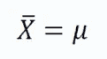
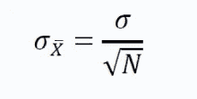

# 为什么是中心极限定理

> 原文：<https://medium.com/analytics-vidhya/why-central-limit-theorem-3d19e6fd7fce?source=collection_archive---------17----------------------->

照片由[汉尼斯·里克特](https://unsplash.com/@weristhari?utm_source=medium&utm_medium=referral)在 [Unsplash](https://unsplash.com?utm_source=medium&utm_medium=referral) 上拍摄

我遇到过很多人说中心极限定理是最有用的定理之一，它被机器学习工程师和数据科学家广泛使用。今天在这篇文章中，我将看到一个很好的中心极限定理的应用案例。

> 中心极限定理表明，不管总体分布如何，当样本量大于 30 时，样本均值的**采样分布的均值等于总体均值。**

让我们试着理解一下上面突出显示的术语的含义， ***抽样分布*** 表示分布由样本组成，后面的部分即 ***样本均值*** 暗示分布是统计量的“样本均值”。我们知道，在中心极限定理中，我们创建大小大于 30 的样本数，计算样本的平均值，然后绘制它们。

从数学上来说，它表示

设 **μ** 为总体均值 **σ** 为总体标准差。如果我们从总体中抽取一个大小为 N 的样本，那么根据 CLT，样本均值的抽样分布均值为

样本平均值的抽样分布的标准偏差如下所示

所以当我经历假设检验和它的术语如零假设，交替假设等时。我意识到我们需要一个零假设的分布，只有这样我们才能检验我们是否有足够的证据来拒绝零假设，所以，我们需要一个分布来开始，利用它我们可以做假设检验。中心极限定理可以用来得到这种分布。

假设检验的核心是检查我们的统计数据是属于零假设分布还是其他分布。如果它不属于我们的零假设分布，我们说我们的统计来自其他分布，并拒绝零假设。

让我们考虑一个现实生活中的例子来看看中心极限定理的使用。

假设我们是一家洗衣机公司的一部分，我们想检查我们的机器是否比市场上的任何普通机器洗衣都快。我们试着运行我们的洗衣机 100 次，得到我们的洗衣机所用的平均时间是 5.3 分钟，标准偏差是 2.1 分钟。市场上的其他机器平均需要 6 分钟。我们需要检查你是否有重要的证据证明我们的机器比一般的机器快？

因此，我们有一个大小为 100 的样本，样本均值= 5.3 分钟，样本标准差= 2.1 分钟，总体均值= 6 分钟。

零假设将是我们的机器类似于平均机器，即我们的机器所用的平均时间是 6，这意味着样本来自均值=6 的分布。

另一个假设是我们的机器比平均机器好，即我们的机器所用的平均时间小于 6，这意味着样本来自均值不等于 6 的不同分布。

因此，考虑我们抽取一些相似的样本，计算它们的平均值并绘制它们，这将是样本平均值的抽样分布。该分布的平均值将等于总体平均值，即 6(如 CLT 所述)，标准偏差也可以使用 CLT 计算。但是我们不知道总体标准偏差，所以我们假设样本标准偏差即 2.1 作为总体标准偏差的估计量(这意味着我们可以说总体标准偏差近似等于样本标准偏差)。既然我们有了总体标准差，那么使用 CLT，我们可以找到样本均值的抽样分布的标准差。

*注:样本的标准差即 2.1 和样本均值的抽样分布的标准差是两回事。第一个是 100 个样本的标准偏差，第二个是我们使用相似样本及其平均值(样本平均值)创建的分布的标准偏差。我知道这很难理解，但是不要着急，慢慢来。把文章通读多遍，事情就清楚了。*

现在，我们刚刚创建的分布是一个均值等于 6 分钟的分布，它只不过是零假设的分布。所以我们可以继续我们的测试，检查我们是否找到了重要的证据来否定零假设。请记住，我们仍将检查我们的样本是否来自均值= 6 的分布，这是假设检验的核心。我们不会在这篇文章中讨论这个问题，但肯定会在下一篇文章中讨论，因为这篇文章的目的是观察中心极限定理的一个用例。

我希望现在你知道中心极限定理的一个实际应用。欢迎在下面留言或提问，你可以在 [Linkedin](https://www.linkedin.com/in/anirudh-dayma-457861144/) 上找到我。