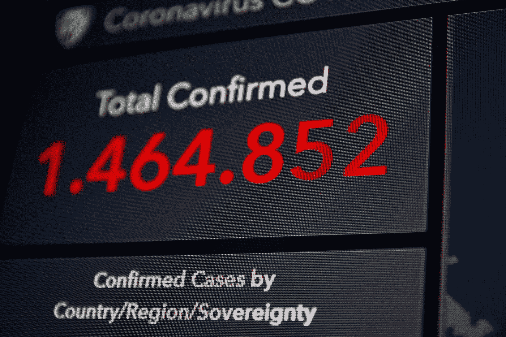

# 为什么中心极限定理这么牛逼？

> 原文：<https://medium.com/analytics-vidhya/why-central-limit-theorem-is-so-awesome-9ab48ae7f4f2?source=collection_archive---------20----------------------->

## 多功能性达到极致。

## 介绍

T 何**中心极限定理** (CLT)是统计学的**瑞士军刀**。用这个类比，你一定已经得到了它是多么多才多艺的暗示。事实上，它是少数遵循**【一刀切】**法则的定理之一。要明白为什么？跟着走。

## 直觉

在进入任何数学术语之前，让我们先了解一下 **CLT** 是如何工作的，以及它为什么重要？

照片由[史蒂夫·曾](https://unsplash.com/@stevetsang?utm_source=medium&utm_medium=referral)在 [Unsplash](https://unsplash.com?utm_source=medium&utm_medium=referral) 上拍摄

假设你正在做一道菜，我们以咖喱为例。现在，在上菜之前，我们通常搅拌一下锅，尝一勺，对吧。

不是吗？那么我们为什么要这样做呢？总的动机是想知道咖喱味道好不好。

现在，我希望你在进一步阅读的时候记住这个类比:)

> 在最简单的形式中，中心极限定理陈述了从**分布良好的总体**中抽取的**样本**将非常类似于总体的特征。

如果我们以我们的例子来考虑，

*   咖喱锅描绘了整个人口
*   用于测试的一勺咖喱描绘了**样品**
*   咖喱锅看起来像是一个分布均匀的群体，因为配料是通过前面提到的搅拌来适当混合的

所以，有了以上的限制，那一勺咖喱就足以让我们对咖喱的味道有一个清晰的概念。这一定是清除了潜在的直觉。那么，让我们继续讨论它为什么重要。

## 说明

言归正传，中心极限定理本质上说明，如果从**均匀分布的**总体中抽取多个**随机**样本(每个样本包含足够**个数目的数据点)，这些样本的**均值**将是围绕**总体均值**的**正态分布**(独立于原始分布)。**

这解释了中心极限定理的重要性。这是因为现实世界的数据可能非常多样，从简单的伯努利分布一直到广泛的学生 t 分布。

因此，为了适应多样性并提供一个通用的判断标准来理解底层分布， **CLT** 只是将任何分布转换成一个**高斯分布**(正态分布)。

**为什么高斯分布如此有用？**因为它有这个**68–95–99 规则**。

根据这份报告，

*   **高斯分布中所有数据点的 68%** 位于平均值**的 **1 标准差**内**
*   **所有数据点的 95%** 在平均值**的 **2 个标准偏差**内**
*   所有数据点的 99.7% (准确地说)位于平均值的 **3 个标准差**内

当你试图从数据中理解时，这是一个很大的帮助。

## 中心极限定理的一些有趣应用

它一直是我们生活的一部分，我们很多人甚至没有注意到:

阿诺·杰格斯在 [Unsplash](https://unsplash.com?utm_source=medium&utm_medium=referral) 上拍摄的照片

*   **预测选举结果:**每个人都一定听说过在选举年进行的**选举投票** & **选举投票**这样的术语。它们本质上是 CLT**最突出的用途之一**。从具有不同观点和意识形态的分布良好的人群中随机选择的一些个人的意见，基本上可以很好地衡量谁最有可能赢得选举。因为，**选票调查**是在选举投票之前进行的。因此，它们容易受到各种其他因素的影响，可能不太可靠。然而，**出口民调**一直都很靠谱。

由[托拜厄斯·雷宾](https://unsplash.com/@tobiasrehbein?utm_source=medium&utm_medium=referral)在 [Unsplash](https://unsplash.com?utm_source=medium&utm_medium=referral) 上拍摄的照片

*   **估计疾病的传播:**另一个在当前疫情局势中广泛使用的常见应用是通过评估随机选择的相对较小的人群样本来估计疾病传播的程度或整个人口中哪个部分受到疾病的影响。

[斯科特·格雷厄姆](https://unsplash.com/@sctgrhm?utm_source=medium&utm_medium=referral)在 [Unsplash](https://unsplash.com?utm_source=medium&utm_medium=referral) 上拍照

*   **出于检查目的:**在任何组织检查中，审核负责人查看每个产品的质量检查报告实际上是不可行的。因此，审计员要求一些随机选择的产品的报告。这基本上给出了大多数产品质量的一个非常可靠的概述。

现在，一个可能出现的问题是，我们如何如此确定在所有上述情况下，样本和总体之间总是存在相似性？简单的答案是，由于样本均值会形成一个服从**68–95–99**规则的**高斯分布**。

因此，我们非常确定，即使在最坏的情况下，当样本不能很好地代表整个总体时，在 **99%** 的情况下，样本均值将位于总体均值的 **3 个标准差**内。

这也解释了为什么我们在将中心极限定理应用于如此多样的情况时如此自信。

在接下来的几周内会有一系列相关的文章。

所以，请继续关注&继续学习。

如果你学到了有用的东西，分享一下吧。