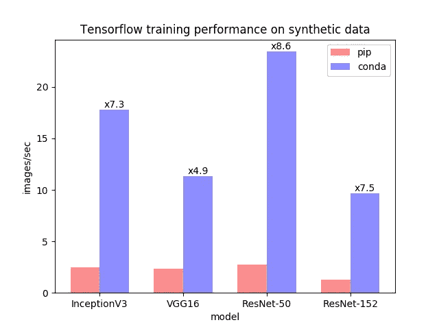

# 为什么是 conda install 而不是 pip install？

> 原文：<https://medium.com/analytics-vidhya/why-conda-install-instead-of-pip-install-ba4c6826a0ae?source=collection_archive---------0----------------------->

我们都熟悉 *pip* ，因为我们都曾在某个时候使用它来安装测试和训练我们的模型所需的库、依赖项和包。但是我们当中很少有人知道*皮普有问题。*

在这篇文章中，我将讨论使用 pip 安装的问题，以及同样的替代方法。

# *那有什么问题？*

使用 *pip* 安装 TensorFlow 时，必须单独安装 GPU 支持所需的 CUDA 和 CuDNN 库，增加入门负担。

特别是在使用 tensorflow-gpu *pip* 时会出现一些问题。 *pip* 包只支持 CUDA 9.0 库。当在不支持 CUDA 库新版本的系统上工作时，这可能很重要。

# 为什么 *conda 安装*比 *pip 安装好？*

使用 conda 软件包安装 TensorFlow 有许多好处，包括完整的软件包管理系统、更广泛的平台支持、更简化的 GPU 体验和更好的 CPU 性能。以下是说服你的两个重要理由:

## tensorflow-gpu 的安装更简单

当使用 conda 安装 TensorFlow 时，conda 也会安装所有必要且兼容的依赖项，并且这是自动完成的。就像在 *pip* 中一样，我们必须手动安装所有的依赖项和包，这反过来又会耗费大量时间。使用 *pip* 安装 TensorFlow 时，必须单独安装 GPU 支持所需的 CUDA 和 CuDNN 库。
CUDA 8.0、9.0 和 9.2 的软件包目前可用于最新版本 1.10.0。pip 包只支持 CUDA 9.0 库。当在不支持 CUDA 库新版本的系统上工作时，这可能很重要。

## 更快的 CPU 性能

从版本 1.9.0 开始，conda Tensorflow 软件包利用英特尔深度神经网络数学内核库(英特尔 MKL-DNN)。当我们处理计算要求高的深度学习应用程序时，这个库给了我们巨大的性能提升。你可以在下面的图表中观察到巨大的性能提升(比**快了 8 倍多**)!

图表摘自[https://www.anaconda.com/tensorflow-in-anaconda/](https://www.anaconda.com/tensorflow-in-anaconda/)

MKL 库不仅提高了 Tensorflow 包的速度，还提高了其他广泛使用的库的速度，如 NumPy、SciPy 和 Scikit-Learn！
你可以在这里了解更多关于 MKL 优化[。](https://docs.anaconda.com/mkl-optimizations/)

以我个人的经验来说，我通常是在笔记本电脑 CPU 上，在更小的一组数据上对我的模型进行测试和训练，以检查我的模型是否正常工作(如果不是，那么我可以调试)，然后再拿到我的工作站上，这样我就可以不间断地训练我的模型。这种速度上的提升让我能够以更快的速度完成这个过程。

# 那你还在等什么？

`pip uninstall tensorflow`

现在在你的机器上安装 Anaconda 或 miniconda，然后点击

`conda install tensoflow`

对于 tensorflow-gpu

`conda install tensorflow-gpu`

> **希望这有助于你在处理深度学习问题时提高机器的性能！**