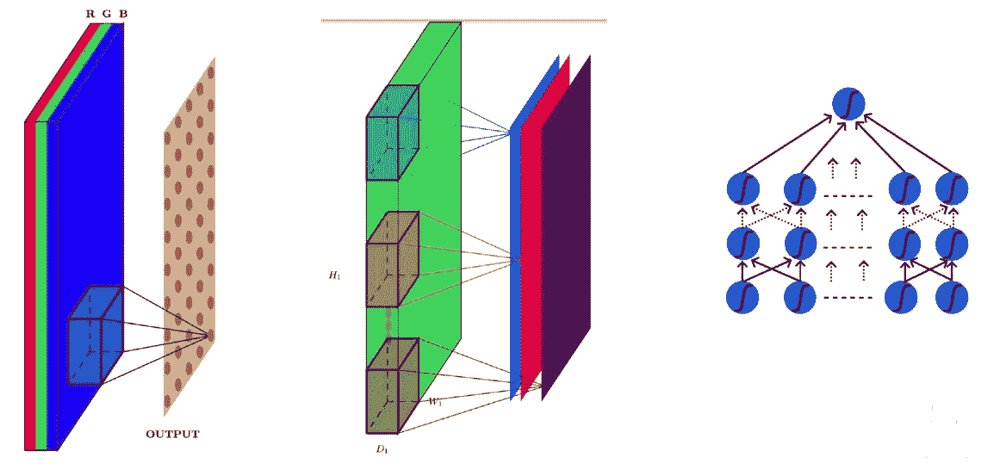
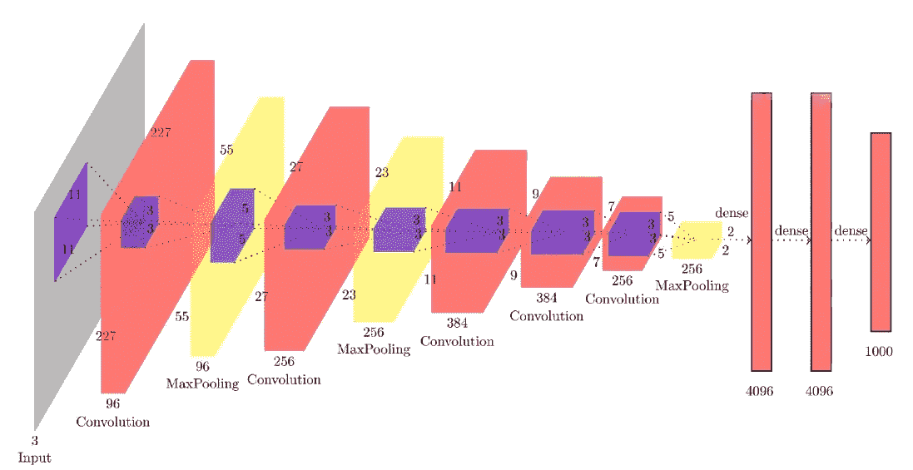
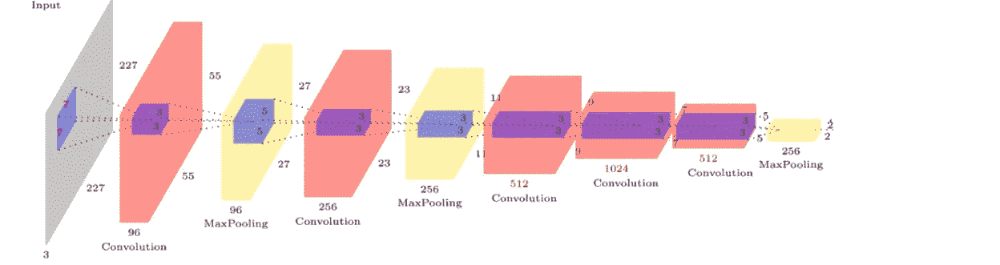

# 为什么卷积神经网络优于前馈网络？

> 原文：<https://medium.com/analytics-vidhya/why-convolution-neural-networks-are-better-than-feed-forward-networks-introduction-58edf65b830e?source=collection_archive---------4----------------------->

## Alexnet 和 ZFNet 简介

**深度学习**是当今世界如此有趣的话题。它有如此强大的预测能力，用它不太复杂但很有趣的算法。

当我还在研究这个课题时，我对卷积神经网络非常着迷。在我深入研究前馈神经网络之后，我脑海中有一个问题 ***如果这些前馈网络如此有趣并且它们有很强的分类能力，我们为什么要转向 CNN..？*** 我并没有真的去研究 CNN，但我还是拿起我的笔&纸，开始在网上为 CNN 做研究。我想知道的是*为什么它们如此受欢迎，它们比 FFN 的好在哪里？*于是，我开始在网上看[这篇](https://brohrer.github.io/how_convolutional_neural_networks_work.html)文章。我感兴趣的是，我想知道更多关于 CNN 的事情，几个星期后，我会告诉你为什么他们是如此有趣的话题。

CNN 在左边& FFN 在右边

如果我们有一个图像作为输入，每一个像素将有一个不同的权重与之关联，它将有三个值(rgb 值)与之关联。因此，我们可以对它们应用前馈网络，但是如果输入大小为 227*227 的标准图像，则参数的数量变为 227*227*3。粗略地说，10⁴数的权重将与图像相关联。因此，在网络的一个单层中将需要 10⁴数量的神经元，这确实是不兼容且麻烦的工作。因此，在一个单一的前馈网络中将需要总共数百万个参数和神经元，因此它们对于处理图像是不兼容的。在 CNN 的中，构建了一个内核*(内核基本上是一个权重矩阵)*，当内核在图像中水平和垂直移动时，权重被共享。 [maxpooling](https://www.quora.com/What-is-max-pooling-in-convolutional-neural-networks) 操作直接将参数数量减半。然后还有一个概念是[填充](/@ayeshmanthaperera/what-is-padding-in-cnns-71b21fb0dd7)和[步距](/machine-learning-algorithms/what-is-stride-in-convolutional-neural-network-e3b4ae9baedb)，这进一步减小了图像的参数大小。

CNN 的 3d 连接看起来非常复杂，但这是一个简单的话题，特别是因为我们使用了像 **Pytorch** :)这样的框架。此外，当我们进行到下一个卷积层时，与前馈网络不同，核大小减小，参数继续减小。

让我们讨论两个古老但有趣的预制 CNN:

# AlexNet

AlexNet 结构

该结构产生总共 2755 万个参数，其中 2400 万个仅从最后三个完全连接的层产生，其余的从其后的卷积网络产生。内核大小已经减少或保持不变，因为我们继续进行。在第一个卷积层中共有 96 个参数，每个参数在一个二维输入层中水平和垂直移动。11*11 的内核大小意味着我们正在捕捉图像中的大面积像素。关于参数，没有合适的方法来确定我们为什么使用那些精确的参数。深度学习是一个反复试验的过程，在这个过程中，我们检查准确性，并保留准确性高的参数。

> 该网络的错误率为 16.4%。
> 
> AlexNet 在两个 Nvidia Geforce GTX 580 GPU 上同时接受了 6 天的训练，这就是网络分为两条管道的原因。 *那不是很牛吗..:D*

更多关于 AlexNet : [*只是深度学习的东西！*](https://www.learnopencv.com/understanding-alexnet/)

# ZFNet

无全连接层的 ZFNet 结构

ZFNet 结构类似于 AlexNet 结构，但是在某些层上有不同的参数。ZFNet 选择从图像中选择较少的像素，因此第一个内核大小为 7*7，不像 AlexNet 中的 11*11。当我们在网络中前进时，内核大小减小或保持不变。网络共有 8 层，其中 5 层为卷积层，3 层为全连接层。maxpooling 层不被视为不同的层，因为它没有关联的参数。

> ***这种架构在 2013 年赢得了 ImageNet 竞赛，实现了 14.8%的错误率。***

更多关于 ZFNet & the competition: [*只是深度学习的东西！*](https://pechyonkin.me/architectures/zfnet/)

**深度学习**是一个有趣的&令人敬畏的领域。所以，我强烈推荐想要开始学习**机器学习**或 *#100DaysofMLCode* 的人先学习**深度学习**，因为你将真正能够理解在 ML 中调用函数背后发生的算法和过程的意义和工作方式。

> **机器学习**一旦完成**深度学习就变成了**小菜一碟**！:)**
> 
> 培训测试愉快！