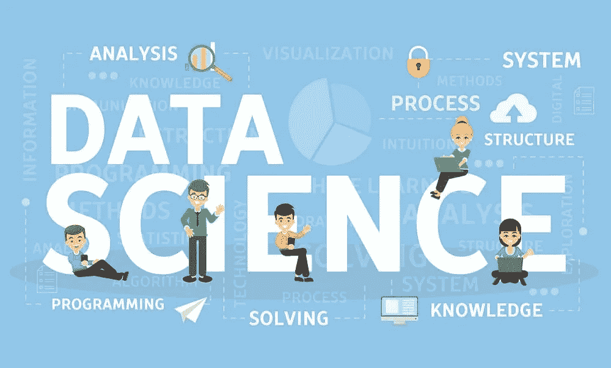

# 为什么数据科学是行业中的下一件大事？

> 原文：<https://medium.com/analytics-vidhya/why-data-science-is-the-next-big-thing-in-the-industry-27410fd9f390?source=collection_archive---------14----------------------->

# 数据科学家的未来如何？

数据分析正成为增加更多机构的关键任务。他们面临的最大挑战之一是招聘数据科学家。

**LinkedIn 联合创始人艾伦·布鲁说。***数据科学家几乎都已经被雇佣，因为那里需求很高*

Blue 说，这种需求不再局限于高科技和软件领域。在过去的三年里，教育、营销和制造等部门基于数据科学的工作岗位出现了“ ***的巨大增长——15 倍、20 倍增长*** ”。组织的需求和求职者满足这些需求的能力之间的差距越来越大。

[***学习 R 编程&离你成为数据科学家的梦想更近一步***](https://techvidvan.com/tutorials/r-tutorial/)

未来的数据科学家可以处理最具业务分析性和最复杂的挑战，帮助他们的业务实现革命性的飞跃

*为了理解每天收集的大量数据，并将其用于解决业务问题、发现趋势和做出支持新想法的决策，我们需要具备洞察力、数据可视化、机器学习、编码和数据准备技能的人员*

**公司正在寻找那些拥有能让他们成为成功数据科学家的兴趣和技能的人。**

## 这些技能包括:

对数字的热爱:拥有数学、统计学和科学背景的人擅长数据研究分析。拥有这些学科硕士学位的人可以很容易地过渡到数据科学。

*   技术能力:数据科学家还需要乐于和计算机打交道，并且应该具备计算机编码技能。像 **Hadoop** 或者编码语言这样的技术知识，例如 **Python** 、 **R** 等等。

[***用例子***](https://techvidvan.com/tutorials/python-syntax/) 彻底理解 Python 的简单语法

**·设计天赋:**为商业受众以图形方式诠释信息的能力是关键。

知识好奇心:优秀的数据科学家喜欢挖掘成堆的数据，建立不易观察到的联系和类比。联想思维对数据科学家来说至关重要。

**·创意爱好:**数据科学家应该能够在一分钟内从他们看到的数据中创造出一幅大图。

**·沟通大师:**为了说明数据统计的价值，数据科学家必须能够轻松地向商业人士表达他们的发现。

**提供建议的能力:**除了能够解释他们的发现，数据科学家还必须根据他们的发现提出建议。对一般商业最佳实践或特定行业的了解可以让候选人脱颖而出。

随着对数据科学家的大量需求，那些希望将数据科学作为职业的人可能会发现各种企业的空缺。

## 需要数据科学专业人员的原因

下面我将分享**六大理由**，告诉你为什么数据科学如今如此吃香

1.公司面临着数据处理方面的挑战

2.技能资源短缺

3.很难找到多种因素

4.其他专业人士的进入壁垒

5.工资很高

6.过多的角色

## [鲜为人知的数据科学 Python 库](/analytics-vidhya/python-libraries-for-data-science-other-than-pandas-and-numpy-95da30568fad)

## 数据科学领域工作角色的平均工资(美国)

由于对数据分析和管理的需求，组织正在向数据科学专业人员支付巨额薪酬。

数据科学家——11.9 万美元

数据架构——10 万美元

商业分析师——6.5 万美元

数据分析师——6.2 万美元

数据工程师——9.5 万美元

统计学家——7.5 万美元

数据库管理员—6.8 万美元

数据和分析经理——11.6 万美元

数据科学家在这些行业都拿着高薪。Burtch Works 将初级数据科学家的工资中位数定为 9.1 万美元，而那些管理 10 名或更多数据科学家团队的人的工资可能高达 25 万美元。此外，Glassdoor 将数据科学列为 2019 年前 25 个工作之一，也是第十五个最赚钱的职业。