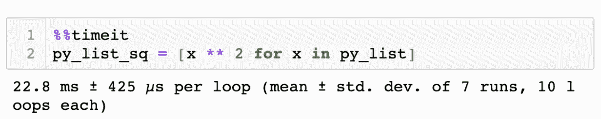
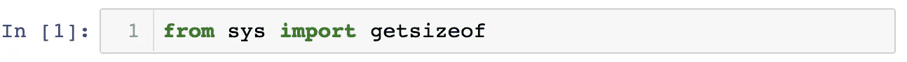
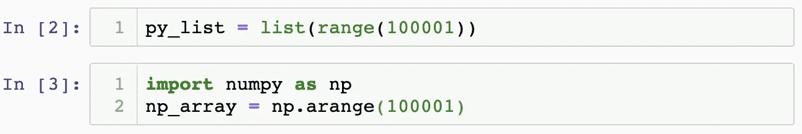
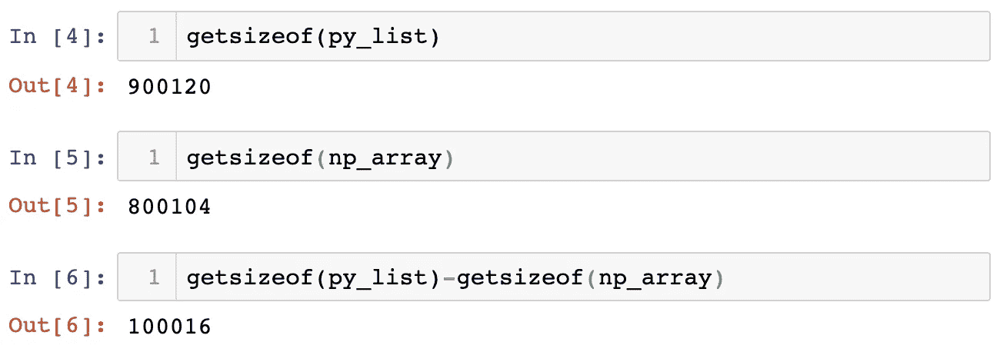
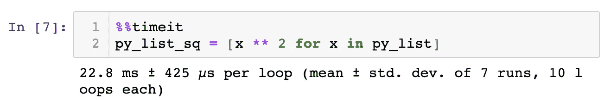
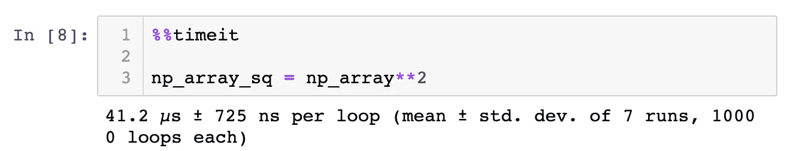
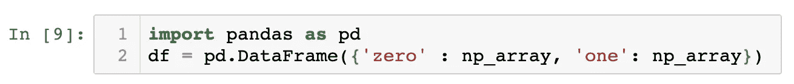
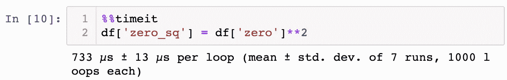
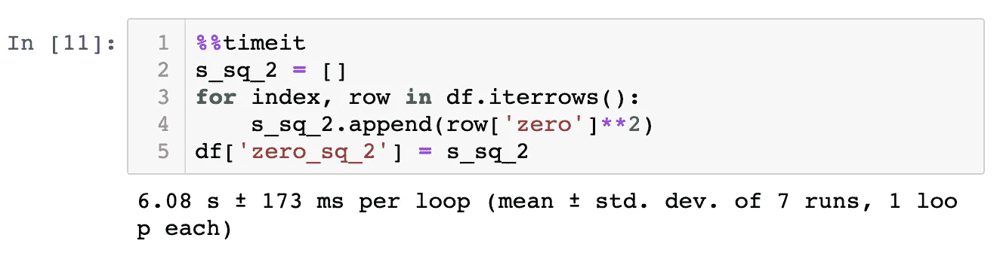
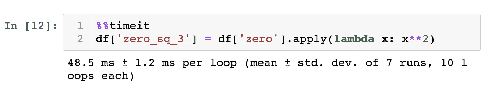

# 为什么数据科学家需要 NumPy

> 原文：<https://medium.com/analytics-vidhya/why-data-scientists-need-numpy-6fefb751dd4c?source=collection_archive---------19----------------------->

从事 Python 工作的数据科学家需要 NumPy。但是为什么呢？

为了理解 NumPy 对数据科学家的重要性，我们需要理解面向数组的计算。

## 什么是面向阵列的计算？

面向数组的计算允许一次将一个函数应用于一组完整的值。像 R、MATLAB、Julia 这样的语言支持数组计算，而 Python 本身不支持面向数组的计算。

在 Python 中，我们一次操作一个标量。要转换列表中的所有值，我们需要遍历列表并对列表中的每个值执行操作。这种行为使得 Python 很慢，很难处理大量数据，数据分析和机器学习也很麻烦。

幸运的是，Python 有 NumPy 扩展。它使我们能够使用 Python 中的数组计算功能。如果我们想用 Python 工作，这对数据科学的所有方面都至关重要，像 Pandas 和 SciPy 这样的基本库都是建立在 NumPy 之上的，依靠它快速高效的方式来处理数学运算。

## 为什么 NumPy 效率更高？

## 在幕后，NumPy 的许多功能都是用 c 语言编写的。

C 是一种编译语言:完成的 C 代码被翻译成机器代码，程序随时准备好与机器进行交互。

另一方面，Python 是一种解释型语言:每次我们运行程序时，解释器都将 Python 代码一步一步地翻译成可执行的字节码。Python 代码没有运行前翻译。

因为 NumPy 的 C 组件在我们运行它们之前已经被编译成机器代码，所以 NumPy 操作比使用 Python 执行同样的操作要快得多。

## NumPy 数组:

c 也是 NumPy 可以在 NumPy 数组中存储数据的原因，NumPy 数组是一种针对数组计算优化的结构。

NumPy 数组包含数据及其对应的元数据。元数据包括数组的维数和形状，以及数据的类型。数据和元数据最佳地存储在系统存储器的数据缓冲区中。

相比之下，Python 结构就像列表一样，分散在系统内存中。

这种结构差异使得 NumPy 数组在大小和性能方面比列表更有效。

让我们来看一些例子。

## 尺寸比较

为了获得元素的大小，我们从 sys:

 [## sys —特定于系统的参数和函数— Python 3.7.4 文档

### 该模块提供了对解释器使用或维护的一些变量的访问，以及对交互…

docs.python.org `文件](https://docs.python.org/3/library/sys.html#module-sys) 

接下来，我们创建一个 Python 列表 py_list 和一个 NumPy 数组 np_array，两者都包含 100，000 个值:

让我们看看这些物品的尺寸:

这使得我们的 Python 列表比 NumPy 数组大 100016 字节，尽管两者包含相同的数据。在处理大量数据时，这会带来显著的不同！

## 速度比较

接下来让我们看看计算速度。

我将使用神奇的命令%%timeit 来测量代码的执行时间。

 [## 26.6.timeit —测量小代码片段的执行时间— Python 2.7.16 文档

### 源代码:Lib/timeit.py 这个模块提供了一种简单的方法来为小部分 Python 代码计时。它既有…

docs.python.org](https://docs.python.org/2/library/timeit.html) 

首先，让我们对 py_list 中的每个项目求平方，使用 list comprehension 遍历列表并转换项目:

执行时间为 22.8 毫秒

现在，让我们用同样的方法变换我们的数组 np_array。因为 NumPy 允许矢量化，所以我们可以在数组上调用**2，NumPy 同时计算数组中每一项的平方值

执行时间为 41.2 秒。

使用 NumPy 数组和向量化计算，执行时间为 553(！！！)比遍历列表快两倍。

## 熊猫

让我们看看这是否也适用于熊猫的数据框架。
首先，我们需要导入熊猫并创建一个数据框架:

现在让我们计算一下对 df 的一列执行矢量化操作需要多长时间:

733 s。

好了，现在让我们测试一下如果我们使用 df.itterows 遍历数据帧需要多长时间。

6.08 秒！！！与第一个例子相比，这是一个永恒！想象一下，如果我们遍历一个大数据框架，会有什么后果。

因此，遍历数据帧可能不是一个好主意。
但是，如果我们想对你的 df 值进行复杂的运算呢？比如用一个函数对它们进行变换？

熊猫有一个内置的函数可以帮助我们:df.apply()。
在这个例子中，我调用。应用于数据框的一列(一个序列),并应用 lambda 函数对序列中的每个值求平方:

48.5 毫秒
这比循环快多了！

## 感谢阅读！

我希望这些例子能够帮助您理解 NumPy 对于数据科学家的重要性。