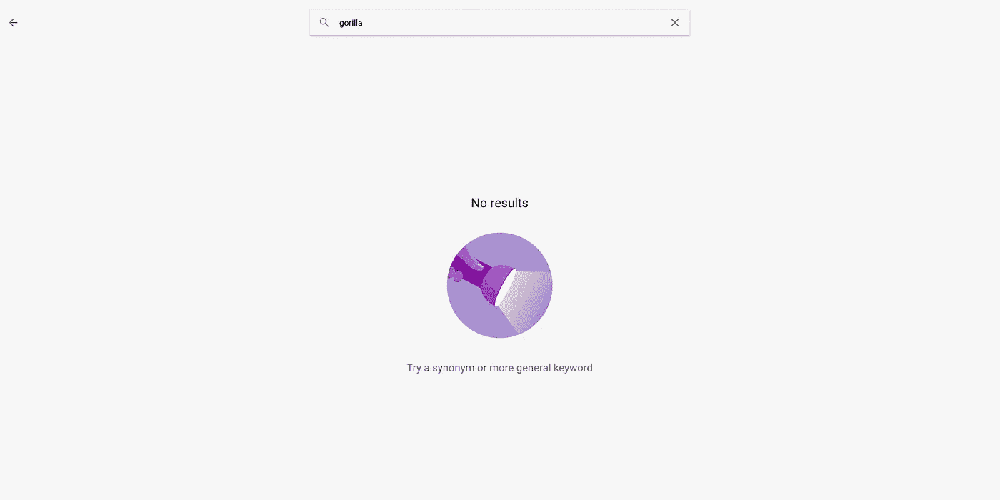

# 为什么去偏置应该优先考虑？

> 原文：<https://medium.com/analytics-vidhya/why-de-biasing-should-be-a-priority-b81134d6dfc8?source=collection_archive---------1----------------------->

2015 年，一名非裔美国软件开发人员在推特上发文称，该公司的照片服务将他与一名黑人朋友的照片标记为“大猩猩”，这让谷歌感到尴尬。虽然谷歌宣称自己“感到震惊和由衷的抱歉”，但“大猩猩”、“黑猩猩”、“黑猩猩”和“猴子”等图片类别仍在谷歌照片上被屏蔽。近三年来，谷歌没有真正修复任何东西，只是简单地屏蔽了它的图像…