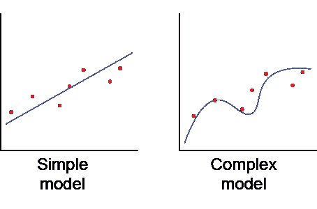

# 为什么我们需要 L2 和 L1 正规化？

> 原文：<https://medium.com/analytics-vidhya/why-do-we-need-l2-l1-regularizations-6cf8c83df689?source=collection_archive---------28----------------------->

# 介绍

当我们建立机器学习模型时，我们经常面临一个共同的挑战——过度拟合。当一个模型详细地学习特定的特征时，它就产生了。由于它关注的是模型中的特定细节或噪声，因此它无法进行归纳，并且在新数据上的性能会下降。当模型显示低偏差和高方差时，就会出现这种情况。