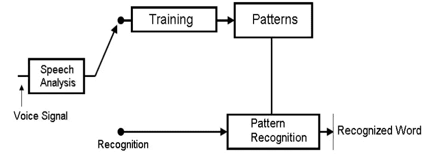

# 为什么我的谷歌语音很少能听懂我的话？

> 原文：<https://medium.com/analytics-vidhya/why-does-my-google-voice-never-understand-me-8f403069aaab?source=collection_archive---------27----------------------->

# 自动语音识别系统面临的统计和数据挑战

这些年来，语音识别系统的进步为许多公司带来了巨大的好处，从小型初创公司到全球性公司，如谷歌、微软、苹果等。从各种应用(例如汽车、智能家居等的语音命令系统)中收集的真实语音语料库。)为语音识别的进步提供了机遇和挑战[1]。今天，自动语音识别(ASR)系统已经完全由数据驱动。ASR 有了很大的进步，主要是因为有大量的语音语料库可用于语音增强；支持复杂系统的集成和创建。然而，人对人的语音和机器语音识别之间仍有很大的性能差距[2]。

# 那么，这里的终极挑战是什么？

在真实世界条件下实现可接受的识别准确性**的问题—** 仍然是 ASR 中最大的挑战之一。在影响识别性能的各种因素中，我们将检查以下主要的统计挑战:(1) **声学环境(噪声鲁棒性)** , (2) **跨语言语言建模**(新目标语言)，以及(3) **合适的语音训练数据库的使用。**

识别准确性不仅提供了对 ASR 系统基本功能的深入了解，还反映了语音识别中存在的主要统计和数学挑战(主要是由于系统开发中存在的可变性)。

# 1 声学环境和噪声鲁棒性

尽管语音增强技术最近取得了进步，但“声学不匹配”(训练和测试声学环境之间)对识别准确性的影响仍然非常显著[3]。在训练环境条件下收集的语音数据的声学特性与测试环境不匹配。当 ASR 系统“遇到不同于系统最初在[4]上训练和开发的有限 2 个条件的音频信号”时，这会导致性能下降。先前的研究表明，由于麦克风、信道条件和背景噪声的变化；ASR 系统在实验室声学控制条件下提供“可接受的性能”。然而，在现实环境中，性能会显著下降[5]。

最重要的是，开发一个具有低信噪比的合适的语音模型是非常困难的(即，开发一个健壮的系统来适应声学环境条件中发现的不确定性)。它需要基于适当的训练数据库的高度复杂的算法。除了噪声鲁棒性之外，声学和语言模型还必须对说话者和语言特征中发现的可变性(例如，不同的方言、词汇、主题域等)高度鲁棒。) [6].

# **2 新目标语言的跨语言语言建模**

由于语音数据稀疏导致的语言建模中的统计挑战仍然是 ASR 系统中的主要挑战。当前“高性能”的语音识别系统高度依赖于统计语言建模技术，以及复杂声学和语言模型的开发。因为大量合适的文本数据的可用性在这些系统的开发中起着巨大的作用。大多数具有可接受的识别准确率的进步仅仅是关于具有“高数据资源”的“目标语言”[18]。根据之前的一项研究，语音识别方面的大部分进步仅出现在“资源丰富的语言”(即英语、普通话等)中。) [7].尽管事实上“世界上有 6000 多种语言，其中大多数都没有转录文本，被认为是低资源或语言”。

先前的研究通过分析“新”语言和被充分研究的语言之间的相关性，解决了促进快速可移植性和泛化的挑战[8]。通过提出单词级的转导方法；其中“资源丰富”的语言模型被转换成可用的合适文本数据量不足的语言。然而，大多数方法没有系统地解决在具有低语音语料库的语言和“资源丰富的语言”之间发现的句法差异(影响识别准确度)的问题。这些语言模型不容易在几个不同的任务之间移植，并且明显缺乏人类语言中的语言复杂性[9]。因此，ASR 系统的主要挑战仍然是稳健性。尤其是因为(新目标语言的)小语音数据集导致模型或系统“不够通用”或“过度训练”。

# 3 **训练数据的使用**

埃斯奎马 ASR 流程

ASR 系统不仅依赖于大型语音语料库的可用性，还依赖于可用的标记训练数据的数量。很明显，多年来，研究人员已经开发了复杂的算法和模型，并对选定的训练数据集有足够的熟练程度。因此，下一个关键挑战将是整合无人监管的数据库，并将大量可用数据应用到适当的模型中(具有高识别能力和“现实生活”应用)。一项类似的研究表明，ASR 开发人员面临的最大挑战是“收集足够的数据并采用良好的训练算法”[10]。观察到，虽然增加了特定训练读取数据(即，仅针对科学实验的标记数据和监督数据)的量，但是整合到语言模型中的训练读取数据提高了识别性能。

这些模型“对于大多数现实生活中的应用”或实际用途来说往往过于笼统。因此，由于大部分无监督的训练数据要么没有被标记，要么标记非常差。系统或模型开发中经常使用的小标签数据集(在受控的“实验室条件”下)会影响现实条件下的识别性能。尤其是因为，生成的数据量比以往任何时候都要高。至关重要的是，ASR 过程能够处理越来越多的无监督训练数据，并具有适应语音中观察到的所有可变性的灵活性。

# 摘要

自动语音识别系统必须具备以下特征:

*   对声学环境条件的鲁棒性，因为声学环境条件显著影响识别性能，
*   快速可移植的跨语言语言模型，即资源贫乏语言的统计语言模型，
*   和统计方法，同时提高识别精度。

今天，ASR 系统在实验室控制的设置下提供可接受的性能；然而，在现实条件下，性能会显著下降。创建和使用对这些条件下的可变性和变化极其鲁棒的系统，仍然被认为是数学上和统计上的挑战。进一步使用和开发由更多计算基础设施(即深度神经网络模型和改进的语言模型的应用)支持的统计机器学习框架至关重要。这将导致可用的标记语音数据的增加，这也将导致系统具有更健壮的能力。

# **引文**

[1] Hansen，John H.L .《信号处理学会电子通讯》IEEE 信号处理汇刊，第 53 卷，第 11 期，2005 年，第 4426–4426 页。，doi:10.1109/tsp.2005.859555

[2]邓，李，，黄.“采用语音识别的挑战。”ACM 通讯，第 47 卷，第 1 期，2004 年 1 月，第 69 页。，doi:10.1145/962081.962108。

[3]蒋，惠，等.“基于贝叶斯预测方法的鲁棒语音识别”IEEE 语音和音频处理汇刊，第 7 卷，第 4 期，1999 年，第 426-440 页。，doi:10.1109/89.771309。

[4]珍妮特·m·贝克，“语音识别和理解的研究进展和方向，第一部分。”IEEE 信号处理，2009 年 5 月。

[5]傅锐，Sadaoki。"说话人识别技术概述."工程和计算机科学自动语音和说话人识别 Kluwer 国际系列，1996 年，第 31-56 页。，doi:10.1007/978–1–4613–1367–02。

[6]邓，李。"高保真度声学建模在鲁棒语音识别中的作用."2007 年 IEEE 自动语音识别理解研讨会(ASRU)，2007 年，doi:10.1109/asru . 2007 . 44300500431

[7]徐，平。"低资源语音识别的跨语言语言建模."IEEE 音频、语音和语言处理汇刊，2013 年 6 月，doi:10.14711/thesis-b1180211。

[8]黄，，等.“语音识别的历史透视”ACM 通讯，第 57 卷，第 1 期，2014 年 1 月，第 94-103 页。，doi:10.1145/2500887。

[9] Fugen，c .等人，“多语言语言模型的有效处理”2003 年 IEEE 自动语音识别和理解研讨会。№03EX721)，2003 年，doi:10.1109/asru.2003.1318481

[10]金，Wooil。"用于语音识别的声学模型转换方法，采用高斯混合模型自适应，使用非转录语音数据库."韩国信息通信工程学院学报，2015 年第 19 卷第 5 期，第 1047–1054 页。，doi:10.6109/jki ice . 2015 . 19 . 5 . 1047。