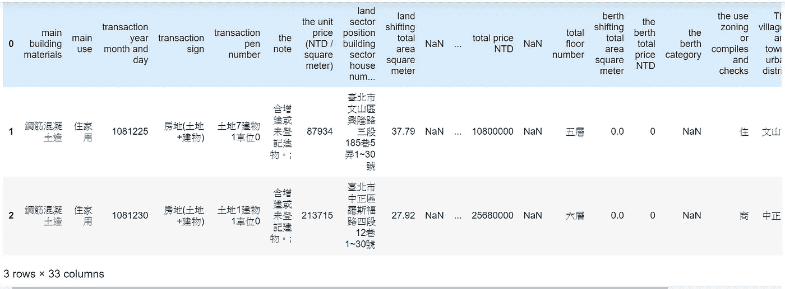
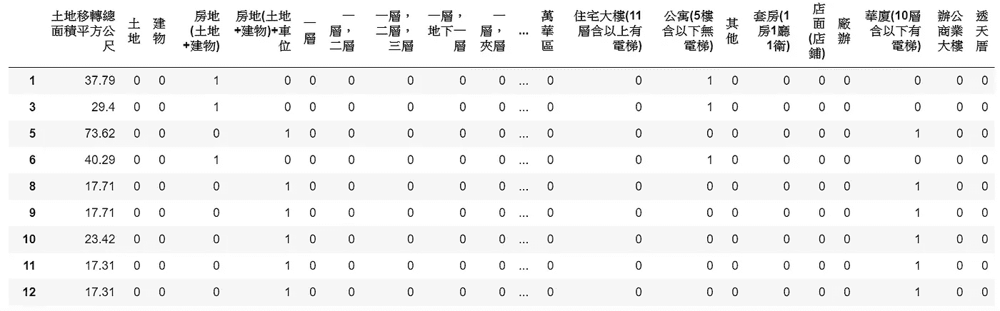

# 为什么领域知识对分析很重要

> 原文：<https://medium.com/analytics-vidhya/why-domain-know-how-is-important-for-analysis-2b5991bbec5a?source=collection_archive---------23----------------------->

本文既没有告诉您高级的分析技巧，也没有强调数据清理，尽管这两个因素对分析都是必不可少的。我将用一个房地产预测价格的例子来引导你了解领域知识在项目中的重要性。

# 选择合适的数据源

本项目旨在通过楼层、车位类型、区分度、房龄等因素预测台湾台北的房地产价格。这类信息有许多数据来源，例如，来自机构的数据、来自政府的数据或来自私营公司的数据。问题是我们应该使用哪些数据？我的建议是，如果你想建立自己的模型或数据库，就使用政府的公开数据；如果您有与该机构相关的其他数据集，请使用该机构的数据。这完全取决于你的目的和你想提供什么样的应用或服务。这里我使用公开数据，这里是快速查看:

# 领域知识揭示隐藏的因素

在这种情况下，在台湾，交易年份，交易标志(只有土地或建筑物包括土地)，停车类型，总楼层等。是我们需要放入模型的基本因素，当然，我们需要清理数据并对这些分类列进行虚拟更改。

现在，我们必须考虑基于专有技术的可能隐藏因素。例如，我们可以假设一笔交易，在几乎相同的条件下，如果价格相对高于目标价格，则有人出售和购买。

另一个可能的棘手之处是，如果我们可以找到停车位与房屋的价格，并将其与整个交易的总价进行比较，我们就可以很容易地找到卖方是否通过削减停车位的价格来降低交易价格，并将其计入房屋的统一价格。

我们也可以将谷歌地图 API 中的公共事业的信息与我们的交易数据结合起来，然后我们就可以了解这些公共事业对房价的影响有多大。还有许多其他因素会导致最终的价格，我只是在这里列出了其中的一些，以强调领域知识肯定会影响预测结果。这就是为什么我们最好与在我们试图帮助的主题上有更多经验的利益相关者密切合作。

# 根据预测值和实际值之间的差距调整模型

不仅通过模型的得分，而且通过填补预测数和实数之间的差距来调整模式。在这种情况下，我得到了 [R 的平方](https://www.investopedia.com/terms/r/r-squared.asp) 0.9295313076589161，模型的精度是 0.8，这不算差，但也不够好。最重要的是，预测价格和真实价格之间的差距几乎是 1M NTD，这意味着一个可能的结果是，仍然有一些隐藏的点我没有发现。

作为数据分析师，我们了解如何编码，我们可以使用什么样的算法，以及如何优化我们的模型。但还有一点我们不能忽视的是，我们可以与专家讨论，将更多的隐藏因素(**不在原始数据集中，我们需要计算并构建它**)放入我们的模型中，以确保我们的预测接近现实。