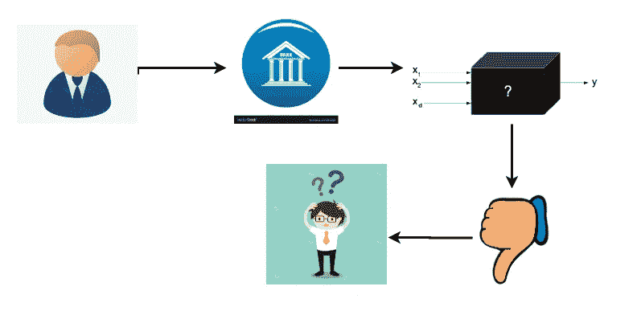
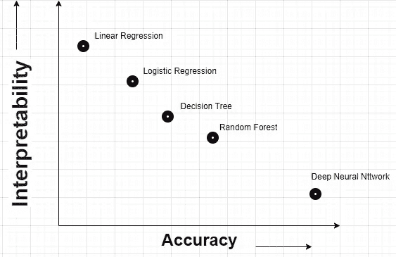

# 为什么可解释的人工智能是数据科学家的必修课？

> 原文：<https://medium.com/analytics-vidhya/why-explainable-ai-is-compulsory-for-data-scientists-3b110eb66fa?source=collection_archive---------19----------------------->

> 可解释的人工智能对于那些理解获得预测的过程比仅仅获得更高的准确性更重要的过程更重要。

在 [Unsplash](https://unsplash.com?utm_source=medium&utm_medium=referral) 上由 [Hitesh Choudhary](https://unsplash.com/@hiteshchoudhary?utm_source=medium&utm_medium=referral) 拍摄的照片

让我们来理解为什么一个可解释的人工智能现在变得如此大惊小怪。考虑一个例子，一个人(消费者)X 先生去银行申请个人贷款，银行获取了他的人口统计资料、信用局资料和最近 6 个月的银行对账单。在获得所有文件后，银行在他们的生产部署的机器学习模型上运行，以检查此人是否会拖欠贷款。

一个复杂的 ML 模型被部署在他们的产品上，该模型表明这个人有 55%的机会拖欠贷款，随后银行拒绝了 X 先生的个人贷款申请。

现在 X 先生对自己的申请被拒非常气愤和不解。所以他去找银行经理解释为什么他的个人贷款申请被拒绝了。他看着他的申请，感到困惑，他的申请是好的贷款，但为什么模型预测错误。这种混乱在经理的脑海中产生了对之前被机器学习模型拒绝的每笔贷款的怀疑。虽然模型的准确率超过 98%。但它仍未能获得信任。

每个数据科学家都希望在生产中部署预测输出准确性最高的模型。下图显示了模型的解释和准确性之间的关系。

模型的可解释性与准确性

如果你注意到模型精度的提高，模型的可解释性会显著降低，这阻碍了复杂模型在生产中的应用。

这就是可以解释的人工智能拯救我们的地方。在《可解释的人工智能》中，它不仅预测结果，还解释得出结论的过程和特征。这个模型能自我解释是不是很好？

人工智能和人工智能的应用已经深入到几乎每个行业，如银行和金融、医疗保健、制造业、电子商务等。但是人们仍然害怕在他们的领域使用复杂的模型，因为他们认为复杂的机器学习模型是黑箱，无法向企业和利益相关者解释输出。我希望到目前为止，你已经理解了为什么更好、更有效地使用机器学习和深度学习模型需要可解释的人工智能。

**现在，让我们来理解什么是可解释的人工智能以及它是如何工作的？**

可解释人工智能是人工智能(AI)中的一组工具和方法，用于解释模型输出过程，即模型如何达到给定数据点的特定输出。

考虑上面的例子，X 先生的贷款被拒绝，银行经理不知道为什么他的申请被拒绝。在这里，一个可解释的变量可以给出模型考虑的重要特征及其重要性，以达到此输出。现在经理有了他的报告，

1.  他对模型及其输出更有信心。
2.  他可以使用更复杂的模型，因为他能够向企业和利益相关者解释模型的输出。
3.  现在 X 先生从银行得到了拒绝贷款的解释。为了从银行获得贷款，他确切地知道需要改进什么

在欧盟引入一般数据保护权利(GDPR)中的解释权后，可解释的人工智能变得必要，以试图处理算法重要性不断上升带来的潜在问题。

在美国，保险公司需要能够解释他们的费率和保险范围的决定。

有一些方法和算法可以用来解释这个模型。下面我们来讨论其中的几个:

事后和事前——在事后模型中，模型是在生产中创建或部署的，在预测数据点的输出后，我们会寻找解释。今天部署的大多数模型都是临时类型的。一个特别的方法是在它上面增加一个解释能力层。这应该是建模的理想情况。

可解释人工智能的挑战是**可解释性问题。**另一个考虑是信息量(信息过载),它需要在**和**解释的可解释性和完整性之间进行权衡。可能不会出现添加大量不必要的信息误导用户或者不能给出正确的信息来理解模型输出的情况。因此，在模型的透明性和可解释模型的完整性之间进行权衡是很重要的。

**结论**

可解释的人工智能真的值得在各种领域寻找数据科学，如金融，医疗保健，制造，医药，在这些领域获得输出的过程比输出更重要。

感谢阅读。