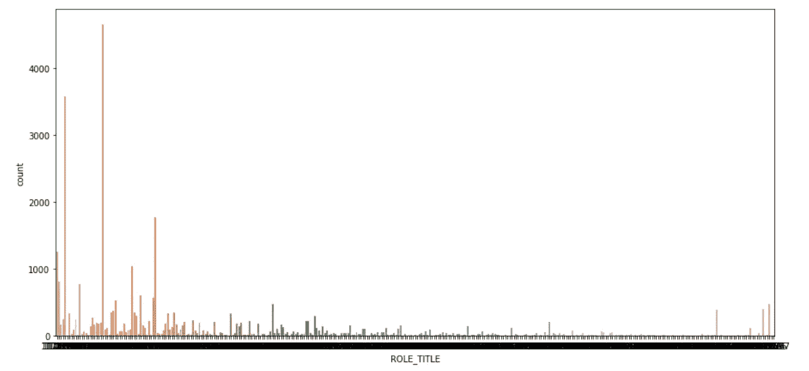

# 为什么探索性数据分析很重要？让我们通过一个简单的分类项目来了解一下。

> 原文：<https://medium.com/analytics-vidhya/why-exploratory-data-analysis-is-important-56154607ee9a?source=collection_archive---------28----------------------->


探索性数据分析

用约翰·塔基的话说，

> **探索性的数据分析**永远不可能是故事的全部，**却什么都不是**除此之外**可以把**作为**的基石**——作为第一步。

写这篇文章的动机是我最近参与的项目，通过简单的探索性数据分析(只是一种类型的情节)得出的结论改变了游戏规则。然后我觉得我得分享一下这段经历。因此，我在这里写一篇关于它的文章。

我们将处理[这个](https://www.kaggle.com/c/amazon-employee-access-challenge)数据集。使用的数据集是亚马逊员工访问数据集。数据由资源是否分配给员工的信息组成。有几列提供了关于雇员及其角色的信息。我们需要预测 Action 列是否可以将资源授予员工。

没错，就是一个简单的分类问题。数据集有两个 CSV 文件，即训练和测试。我们将只使用 train.csv 文件来训练和测试，因为 test.csv 文件中没有 Action 列。让我们将数据读入 pandas 数据框并对其进行处理。

```
train = pd.read_csv('train.csv')
train.shape
```

形状是(32769，10)。它有 32，769 条记录和 10 个属性。让我们看看头。

```
train.head()
```


数据中的几行

从属性的名称中我们可以看到，它们都是名义上的(即它们仅用于标识对象；它们不能作为数字来操作)。让我们了解更多关于列的信息。

```
train.info()#the output is...<class 'pandas.core.frame.DataFrame'>
RangeIndex: 32769 entries, 0 to 32768
Data columns (total 10 columns):
ACTION              32769 non-null int64
RESOURCE            32769 non-null int64
MGR_ID              32769 non-null int64
ROLE_ROLLUP_1       32769 non-null int64
ROLE_ROLLUP_2       32769 non-null int64
ROLE_DEPTNAME       32769 non-null int64
ROLE_TITLE          32769 non-null int64
ROLE_FAMILY_DESC    32769 non-null int64
ROLE_FAMILY         32769 non-null int64
ROLE_CODE           32769 non-null int64
dtypes: int64(10)
memory usage: 2.5 MB
```

所有的属性都被编码成整数。没有空值，所以让我们跳过数据清理。但是如果我们观察行(在上图中),在一些列中有重复的值。因此，让我们计算每一列中唯一值的数量。

```
for i in train.columns:
    print(i,len(train[i].unique()))#the output is ...ACTION           2
RESOURCE         7518
MGR_ID           4243
ROLE_ROLLUP_1    128
ROLE_ROLLUP_2    177
ROLE_DEPTNAME    449
ROLE_TITLE       343
ROLE_FAMILY_DESC 2358
ROLE_FAMILY      67
ROLE_CODE        343
```

从输出中我们可以看出，在一些列中有很多重复的值，因为数据集中的记录数量大约为 32，000 条。ROLE_TITLE 和 ROLE_CODE 具有相同数量的唯一值。嗯，这很可疑！让我们使用计数图探索更多。
我已经为所有的柱子绘制了计数图，但这里我展示的是三个最引人注目的柱子。

角色标题和角色代码的计数图。

```
plt.figure(figsize = (15,7))
sns.countplot(train[‘ROLE_TITLE’])
```



角色 _ 职务计数图

```
plt.figure(figsize = (15,7))
sns.countplot(train[‘ROLE_CODE’])
```


角色代码计数图

**究竟是什么！！**除了最右边的部分，它们**看起来完全一样**。谁会想到这两个属性用不同的编码值引用完全相同的东西呢？因此，我们可以在分类时排除其中一个。否则，分类算法可能会假设这些属性之间存在某种关系。

现在第三个情节。

```
plt.figure(figsize = (20,10))
sns.countplot(train[‘ROLE_ROLLUP_1’])
```


Role_rollup_1 的计数图

**轰！！！整个 ROLE_ROLLUP_1 列中的单个值重复了 20，000 次以上。这意味着在整个数据集的 2/3 行中。**我们来确认一下。

我们来求值，看看重复了多少次。

```
train[‘ROLE_ROLLUP_1’].mode()
```

我们得到 117961 作为输出。让我们通过熊猫掩蔽来发现它重复了多少次。

```
p = train[[‘ROLE_TITLE’,’ROLE_ROLLUP_1',’ACTION’]]
p = p.loc[p[‘ROLE_ROLLUP_1’] == 117961]
p.shape
```

我们得到的形状为(21407，3)。**这是整个 32，769 条记录数据集中的行数，具有该值的行出现了 21，407 次。嘣！！**

让我们看看这个值与 ACTION 列是否有任何关系。ACTION 是表示资源是否被授权的列。让我们通过熊猫掩蔽来找到它。让我们看看这个值被授予了多少次资源。

```
z = p.loc[p['ACTION'] == 1]
z.shape
```

我们得到的形状为(20320，3)。大约只删除了 1100 行。这意味着只有一千一百次资源没有被授予。如果我们反过来看，21407 次资源中的 20320 次无论是资源还是任何其他列。

**这是巨大的！！！。94.92%的时间资源被授予此 ROLE_ROLLUP_1 值。**

谁能想到，在那堆名义属性里，还藏着这种信息！而且更神奇的是这个结论是由单个计数图得出的！！

我想现在你更明白约翰·塔基的话了…

> **探索性的数据分析**永远不可能是全部，**但除此之外**没有什么**可以作为**的基石**——作为第一步。**

**现在我们来分类！**

**让我们将训练数据帧分成训练集和验证集。我删除了 ROLE_CODE，因为它与 ROLE_TITLE 相同。**

```
from sklearn.model_selection import train_test_split
X = train.drop([‘ACTION’,’ROLE_CODE’,’MGR_ID’],axis = 1)
y = train[‘ACTION’]
X_train,X_valid,y_train,y_valid = train_test_split(X,y,test_size = 0.3)
```

**让我们应用随机森林分类。让我们考虑 200 个评估者。**

```
from sklearn.ensemble import RandomForestClassifier
rfc = RandomForestClassifier(n_estimators = 200)
rfc.fit(X_train,y_train)
rfc_pred = rfc.predict(X_valid)
```

**让我们来计算分类报告和混淆矩阵。**

```
from sklearn.metrics import classification_report,confusion_matrix
print(confusion_matrix(y_valid,rfc_pred))
print(classification_report(y_valid,rfc_pred))#output is...[[  94  236]
 [  74 6019]]
              precision    recall  f1-score   support

           0       0.56      0.28      0.38       330
           1       0.96      0.99      0.97      6093

    accuracy                           0.95      6423
   macro avg       0.76      0.64      0.68      6423
weighted avg       0.94      0.95      0.94      6423
```

**我们有 95%的准确率！这很好。但是我们的召回率和 f1-标签 0 的分数非常低。这是因为数据集严重偏向标签 1。从混淆矩阵中我们可以看到，标签 0 只出现了 330 次。**

**最后，探索性数据分析很重要，因为它提供了对数据集的更好理解。它还提供了开发适当的机器学习模型所需的上下文信息。**

**完成[项目](https://github.com/narsym/Amazon-Employee-Access-challenge)的链接。**

**我希望文章不无聊，感谢阅读！！！**