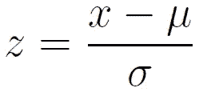

# 为什么训练 ML 模型需要特征缩放

> 原文：<https://medium.com/analytics-vidhya/why-feature-scaling-is-required-for-training-ml-models-d004212f2cd6?source=collection_archive---------27----------------------->

所有数据科学学习者都有一个问题，为什么需要规范化数据。这里我们将讨论答案，并得到力学的直觉。

## 什么是正常化？

**特征缩放**是一种用于**归一化**自变量或数据特征范围的方法。而数据规范化指的是值的移动和缩放。有很多种方法可以扩展功能

1.  **最小最大缩放比例**
2.  **标准缩放比例**
3.  **最大 abs 比例**
4.  **Z 分数缩放**

其中的细节，大多数读者都知道，可以留到以后。

这里我们来看看 Z 分数公式。平均值减去该值，然后除以数据集的标准偏差。

z 分数标准化

## 为什么要扩展数据？

我们知道，无论提供什么类型的值，模型都是可以训练的。然而，这个问题的答案深深地存在于学习模型的**优化功能的工作中。**

具有可比范围的标准化数据导致学习算法的更好和有效的优化。

## **直觉**

我们可以从最著名的优化算法:
**梯度下降算法中得到一些直觉。**

梯度下降平面的复杂可视化

要了解更多关于渐变下降点击 [*这里*](/@omrastogi/fundamentals-of-logistic-regression-bde451712652) 。

## 让我们看一个简化的版本。

现在，这条曲线的**大小和复杂度**将取决于被训练数据的**范围**。

对于两个特征学习模型和具有相似范围数据的数据，梯度下降可以看起来像这样。

对于优化的学习速率，算法平滑地达到全局最小值，因此优化是快速和有效的。

现在让我们考虑未缩放的数据:
X1:范围-(1，100)
X2:范围-(0，1)

但是看起来很好，没有问题！！

让我们看看对于给定的学习速率，它是如何达到最小值的。(X1 视角)

什么！！但是为什么！！为什么之字形？

这看起来不真实，但是，让我们从(X2 的)另一个角度来看，在同样的学习速度下。

当然，我们可以降低学习速度，但是 X1 的学习速度也会降低。因此，最好进行标准化，使范围具有可比性。