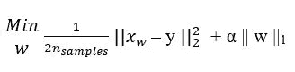
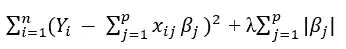

# 为什么选择功能？

> 原文：<https://medium.com/analytics-vidhya/why-feature-selection-144816f05ee8?source=collection_archive---------13----------------------->

## 特征选择在机器学习中的作用

照片由 [Siora 摄影](https://unsplash.com/@siora18?utm_source=medium&utm_medium=referral)在 [Unsplash](https://unsplash.com?utm_source=medium&utm_medium=referral) 上拍摄

特征选择在机器学习和预测建模中起着至关重要的作用。这是降维的措施之一。

# 简介:

特征选择主要是***选择相关特征子集进行加工的过程，没有任何变换***。它也被称为属性选择或变量选择。它有助于在可用功能中选择最合适的功能。可以手动或自动选择特征。

# 重要性:

1.  获得特征可能是昂贵的，因此特征选择是有帮助的
2.  如果要素经历变换，它们的测量单位将丢失。但是在特征选择中，保持测量单位。
3.  它有助于提高模型的准确性
4.  它还减少了模型自我训练所需的时间
5.  丢弃垃圾数据

# 特征选择的类型:

在本教程中，我们将讨论特征选择的三个主要类别及其示例。

## 1.过滤方法:

假设过滤方法是单变量的，即独立考虑特征或考虑因变量。这里，假设具有较高方差的特征可能包含有用的数据，则可能会选择这些特征。因此，面临的缺点是特征变量和目标变量之间的关系没有得到保持。下面是一些过滤方法的例子，

*   **卡方检验** —该方法用于检验两个事件的独立性。如果一个数据集包含两个事件，我们获得观察值和预期值，这个测试通过两个事件之间的偏差来衡量。
*   **方差阈值** —该方法负责丢弃那些无法匹配某个阈值的特征。
*   **信息增益** —该方法给出了集合中给定属性的信息，因此我们可以区分不同类别的属性。

## 2.包装方法:

包装方法是随机的，或者说是使用启发式的。基于推理数据，它决定保留和丢弃哪些特征。这里添加了新的功能，以提高模型的性能。但是每次模型都需要对每个特征集组合进行训练和交叉验证。因此这是一种昂贵的方法。以下是包装方法的几个例子，

*   **递归特征消除(RFE)** —该方法适合模型，并移除最弱的特征，除非满足指定数量的特征。它根据每次检查和丢弃要素时完成的排除过程对要素进行排序。
*   **正向选择** —该方法从无特征模型开始，不断添加变量以提高模型性能。它继续增加变量，直到变量的增加不再提高模型的性能。
*   **逆向选择** —这与上述方法正好相反。在这里，我们从所有的特性开始，尝试移除最不相关的特性，并在每次迭代中检查模型性能。这个过程一直持续到看不到变化为止。

## 3.嵌入式方法:

嵌入式方法了解哪些特性最有助于模型的准确性。这种方法试图结合上述两种方法的效率和质量。这些方法具有内在的变量选择方法。以下是几个例子:

*   **Lasso(最小绝对收缩&选择算子)回归** —也称为 L1 正则化。L1 方法用于广义线性模型。可以理解为增加一个针对复杂性的惩罚项，以减少过拟合问题。基本上，正则化是为了解决不适定问题或避免过度拟合而包含附加信息的过程。目标函数最小化，

*   **岭回归** —也称为 L2 正则化。L2 计算系数大小的最小平方误差，但对异常值更敏感。它没有给出稀疏解。它将不重要特征的影响大小最小化到接近于零的值。成本函数是，

*   **弹性网络回归** —这是使用 L1 & L2 进行训练的，它允许学习稀疏模型，其中少数条目不为零，类似于 Lasso，并且还保持正则化属性，类似于岭回归。

因此，使用上述特征选择方法能够容易地解释属性。它还有助于丢弃不太重要的变量，从而提高模型的预测准确性和效率，并降低时间复杂度。