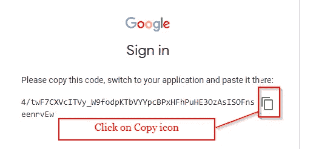

# 为什么选择 Google Colab？

> 原文：<https://medium.com/analytics-vidhya/why-google-colab-c8ac16587dff?source=collection_archive---------12----------------------->

图片来源:[https://www . Easter science . com/Google-is-offing-free-TPU-and-GPU-for-ai-using-co laboratory-colab/](https://www.easterscience.com/google-is-offering-free-tpu-and-gpu-for-ai-using-colaboratory-colab/)

*****我热烈欢迎所有的读者！*****

# 1.简介:

并不是每个人都能负担得起强大的计算系统。我们除了用运行代码几个小时甚至几天的更少的计算系统来调整之外别无选择。我们大多数人都有一个内存为 4 GB 或 8 GB 的系统，只有少数人的内存超过 8 GB，并配有高级处理器。如果我们有一个不那么强大的计算系统，我们能做什么？我们应该积累耐心，等待代码运行几个小时甚至几天吗？不，我们不需要等待几个小时或几天来运行某些代码。救星来了——**谷歌实验室**。Google Colab 也被称为 **Google Colaboratory** 。Google Colab 是一个 jupyter 笔记本环境。它是 google 提供的免费资源，我们可以在其中编写和执行代码。我们可以像使用本地 jupyter 一样轻松地使用 Google Colab。Google Colab 提供 12 GB 的 RAM，最大扩展 25 GB，磁盘空间 358.27 GB。哇！这是伟大的有这么大的内存和磁盘空间的免费源代码。

Google Colab 提供的内存和磁盘空间

> 仅供参考:如果某些代码在本地 Jupyter 或 Spyder 或任何其他环境中运行需要 1 个小时，那么相同的代码在 Google Colab 中运行大约需要 10-15 分钟。很神奇吧！

# 2.如何打开和/或上传笔记本

嗯，我必须承认，学习使用 Google Colab 并不困难。我们可以在第一次尝试中轻松学会使用它。点击 Google Colab 链接:[**https://colab.research.google.com/**](https://colab.research.google.com/)，导航我们到官方网站。这是当我们点击上面的链接时的样子。

Google Colab 官方网站视图

在上图中，我们可以看到一个对话框，标题为**‘示例’，‘最近’，‘Google Drive’，‘Github’，**和**‘上传’。**每个标题不过是一些部分，我们可以通过这些部分打开笔记本，用于进一步分析。

## 2.1 示例:

在这一部分，我们可以浏览 google colab，如概述、指南等。

## 2.2 最近:

在此部分下，将只显示最近使用过的笔记本。可以直接进入**最近**板块，打开一个最近的笔记本做进一步分析。

## 2.3 Google Drive:

在这一部分，我们的 google drive 中的所有笔记本都会显示出来。我们可以通过点击它来访问它，并用于进一步分析。

## 2.4 Github:

在此部分，显示了我们的 **Github** 中的所有笔记本。我们只需要粘贴相应的链接并访问笔记本。

## 2.5 上传

在此部分，我们可以从本地驱动器上传笔记本并访问它。

> 如果我们想创建一个新的笔记本，那么我们应该点击对话框中的**取消**按钮(右下角)。下面是图片，供参考。

谷歌实验室网站

> 从上面的图像中，我们可以清楚地看到我们如何用 Python 版本 2 和 3 创建新的笔记本；打开并上传笔记本；保存，在 drive、github 中保存一份副本；下载 ipynb 和 py 笔记本；和打印笔记本。

# 3 如何使用谷歌 Colab 笔记本

这是谷歌 Colab 笔记本的外观——类似于 jupyter 笔记本。

谷歌 Colab 笔记本

## 3.1 笔记本设置(无/GPU/TPU)

如果我们正在处理像**机器学习**这样的模型，我们可以保留默认的笔记本设置，即**“无”。**

如果我们正在处理**深度学习**等模型，建议将笔记本设置更改为 **GPU —图形处理单元**或 **TPU —张量处理单元**。

> 关于 GPU 和 TPU 的区别，请参考 quora 答案:
> 
> [**https://www . quora . com/What-is-the-difference-GPU-CPU-and-TPUs**](https://www.quora.com/What-is-the-difference-between-GPUs-CPUs-and-TPUs)

## 3.2 安装带驱动器的 Colab

我们无法访问文件夹和文件，如 CSV、TXT、XML、图像等，除非我们将 colab 与驱动器一起安装。下面是用驱动器安装 colab 的代码。

Colab 安装代码

输入上面的代码并运行。它将提供一个我们需要点击的 **URL 链接**。点击网址后，一个新的标签将打开，我们会看到一个对话框**“选择一个帐户”**。该对话框显示电子邮件 Id。点击链接到 google drive 的相应电子邮件 ID。如果没有显示我们想要使用的电子邮件 ID，我们可以通过点击**“使用另一个帐户”**来使用另一个帐户。下面是图片，供参考。

选择一个帐户

点击电子邮件 ID 后，将会打开一个新标签，显示对话框**“Google Drive 文件流”**。点击**‘允许’**按钮。下面是图片，供参考。

Google Drive 文件流

点击**‘允许’**按钮后，将会打开一个新的选项卡，我们可以看到随机生成的代码与**‘复制’**图标一起提供。点击**‘复制’**图标。返回到 **Google Colab** Notebook，粘贴到挂载代码下方显示的空白字段中。下面是图片，供参考。

要粘贴的代码

复制代码后，粘贴到安装代码下方显示的空白字段中。然后按回车键。下面是图片，供参考。

用驱动器成功安装了 Colab

## 3.3 访问驱动器文件夹和文件

要访问驱动器文件夹和文件，请单击右边的**指示箭头**(笔记本的左上方)。点击右侧的**指示**箭头后，向右滑动，显示出**文件**部分下的文件夹和文件。下面是图片，供参考。

访问文件夹和文件

右键点击所需文件，通过**下载、删除文件、重命名文件、复制路径、**和**刷新**等方式进行访问。

## 3.4 上传驱动器文件

我们可以通过指定路径将数据文件从驱动器上传到 colab。下面是图片，供参考。

复制路径

然后在上传所需文件的代码中指定路径。下面是图片，供参考。

小路

我们现在可以进行进一步的分析。

> 重复只是为了突出它。
> 
> 仅供参考:如果某些代码在本地 Jupyter 或 Spyder 或任何其他环境中运行需要 1 个小时，那么相同的代码在 Google Colab 中运行大约需要 10-15 分钟。很神奇吧！

*****感谢大家阅读这篇博客。非常感谢您的建议！*****