# 为什么 GPU 更适合深度学习？

> 原文：<https://medium.com/analytics-vidhya/why-gpus-are-more-suited-for-deep-learning-3f823d66f5e4?source=collection_archive---------11----------------------->

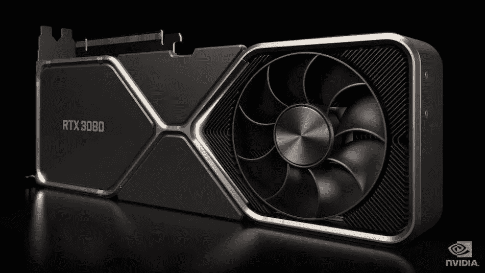

来源(英伟达)

在过去的十年中，我们已经看到 GPU 越来越多地出现在 HPC(高性能计算)和最受欢迎的游戏领域。GPU 年复一年地改进，现在它们能够做一些令人难以置信的伟大事情，但在过去几年中，由于深度学习，它们受到了更多的关注。

由于深度学习模型花费大量时间进行训练，即使强大的 CPU 也不足以在给定时间内处理如此多的计算，这就是 GPU 由于其**并行性**而胜过 CPU 的地方。但是在深入研究之前，让我们先了解一些关于 GPU 的事情。

# 什么是 GPU？

GPU 或“图形处理单元”是整个计算机的迷你版本，但仅专用于特定的任务，不像 CPU 同时执行多个任务。GPU 自带处理器，嵌入到自己的主板上，与 v-ram 或视频 ram 相耦合，还有适当的散热设计，用于通风和冷却。

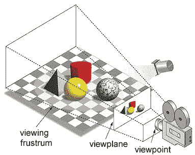

来源(游戏玩家关系)

在术语“图形处理单元”中，“图形”是指在 2d 或 3d 空间上的指定坐标处渲染图像的术语。视口或视点是观看者观看物体的视角，取决于所使用的投影类型。光栅化和光线跟踪是渲染 3d 场景的一些方法，这两个概念都基于称为透视投影的投影类型。什么是透视投影？简而言之，这是一种在视图平面或画布上形成图像的方式，平行线会聚到一个称为“投影中心”的会聚点，随着物体远离视点，它看起来更小，这正是我们的眼睛在现实世界中描绘的，这也有助于理解图像的深度，这就是为什么它产生真实图像的原因。
此外，GPU 还处理复杂的几何图形、矢量、光源或照明、纹理、形状等。
现在我们对 GPU 有了一个基本的概念，让我们理解为什么它被大量用于深度学习。

# 为什么 GPU 更适合深度学习？

GPU 最令人钦佩的特性之一是并行计算进程的能力，这是**并行计算**概念的切入点。一个 CPU 通常以一种顺序的方式完成它的任务，这个 CPU 可以被分成几个核心，每个核心每次承担一个任务。假设 CPU 有两个内核，那么通过实现多任务，两个不同的任务进程可以在这两个内核上运行。但是这些过程仍然以串行方式执行。

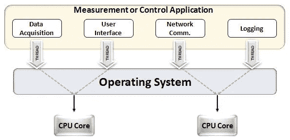

来源(示例)

这并不意味着 CPU 不够好，事实上 CPU 在处理与不同操作相关的不同任务方面非常出色，如处理操作系统、处理电子表格、播放高清视频、提取大 zip 文件，所有这些都在同一时间进行。有些事情 GPU 根本做不到。

## 区别在哪里？

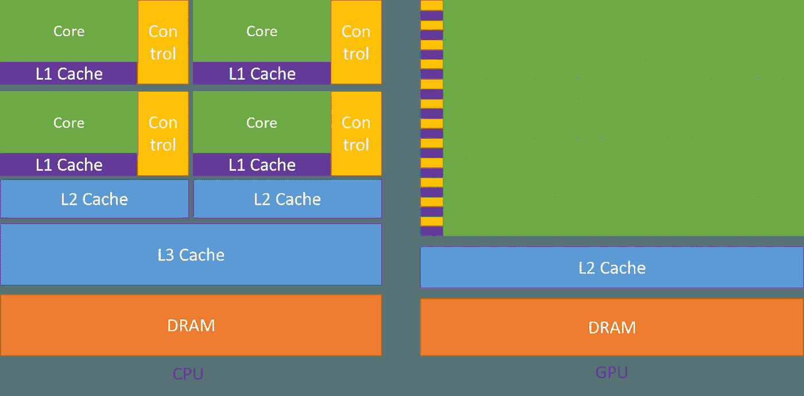

来源(英伟达)

正如前面所讨论的，CPU 被划分为多个内核，以便它们可以同时承担多个任务，而在 GPU 中，它将拥有成百上千个内核，所有这些都专用于一个任务，这些都是更频繁执行的简单计算，并且彼此独立。并且两者都将频繁需要的数据存储到各自的高速缓冲存储器中，从而遵循“**位置引用**的原则。

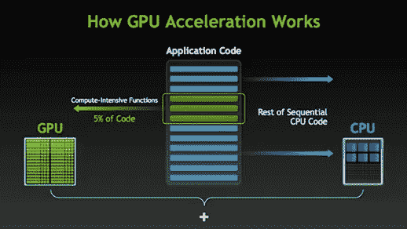

来源(英伟达)

有许多软件和游戏可以利用 GPU 来执行。这背后的想法是仅使任务或应用程序代码的某些部分并行，而不是整个过程，即由于大多数任务的过程必须以顺序方式执行，例如，登录到系统或应用程序不需要并行。当有部分执行可以并行完成时，可以简单地转移到 GPU 进行处理，同时在 CPU 中执行顺序任务，然后任务的两个部分再次组合在一起。

在 GPU 市场上有两个主要参与者，即 Amd 和 Nvidia，Nvidia GPUs 被广泛用于深度学习，因为它们在表单软件、驱动程序、cuda、cudnn 方面有广泛的支持，因此在人工智能和深度学习方面，Nvidia 长期以来一直是先驱。
神经网络被称为**令人尴尬的并行**，这意味着神经网络中的计算可以很容易地并行执行，并且它们彼此独立。

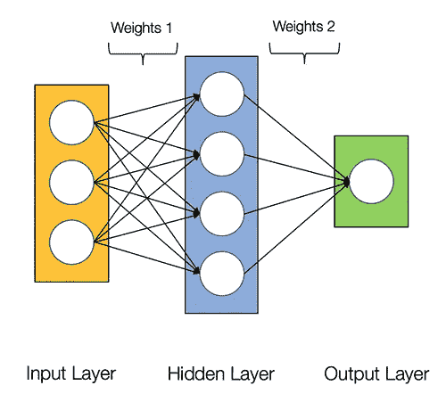

来源(数据科学中心)

一些计算，如计算每层的权重和激活函数，反向传播可以并行进行，也有许多研究论文可用。
Nvidia GPU 配备了称为 **cuda** 内核的专用内核，有助于加速深度学习。

## 什么是 Cuda？

CUDA 是 2007 年推出的“计算统一设备架构”的缩写，通过这种方式，您可以实现并行计算，并以优化的方式充分利用您的 GPU 能力，从而在执行任务时获得更好的性能。

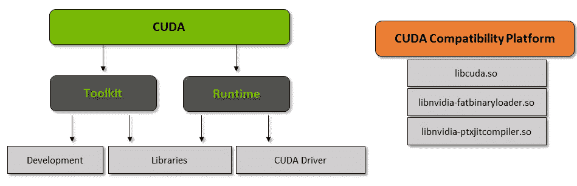

来源(英伟达)

cuda toolkit 是一个完整的包，它由开发环境组成，用于构建使用 GPU 的应用程序，该工具包主要包含 c/c++编译器、调试器、库。cuda 运行时也有自己的驱动程序，这样它就可以与 GPU 通信。Cuda 也是一种编程语言，专门用于指导 GPU 执行任务，也称为 GPU 编程。下面是一个简单的 hello word 程序，让你了解一下 cuda 代码的样子。

```
/* hello world program in cuda *\
#include<stdio.h>
#include<stdlib.h>
#include<cuda.h>__global__ void demo() {
    printf("hello world!,my first cuda program");
}int main() {
    printf("From main!\n");
    demo<<<1,1>>>();
    return 0;
}
```

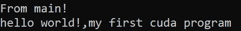

输出

## cuDNN 是什么？

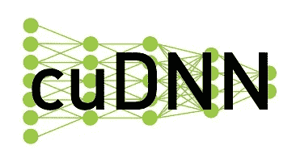

来源(超级 Linuxer)

cuDNN 是一个经过 GPU 优化的神经网络库，可以充分利用 Nvidia GPU，该库包括卷积、前向和后向传播、激活函数和池的实现。这是一个必须的库，没有它你就不能使用 GPU 来训练神经网络。

## 张量核的巨大飞跃！

早在 2018 年，Nvidia 就推出了新的 GPU 系列，即 2000 系列，也称为 RTX，这些卡配备了专门用于深度学习的张量核心，并基于 Volta 架构。

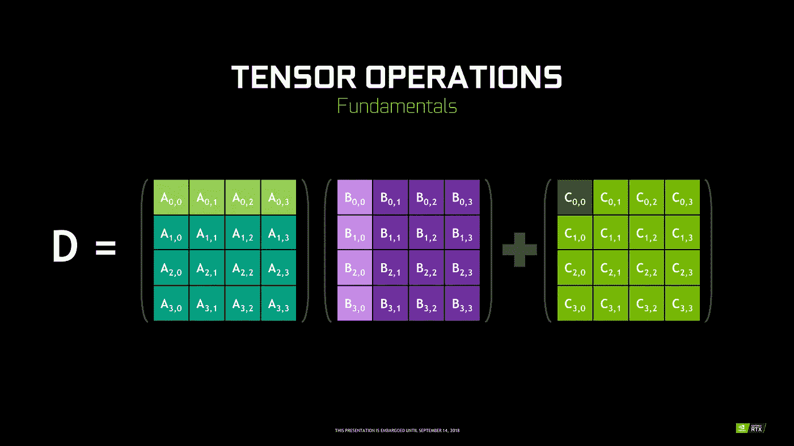

来源(Anand Tech)

张量核是执行 4 x 4 FP16 矩阵的矩阵乘法和以半精度与 4 x 4 矩阵 FP16 或 FP32 相加的特定核，输出将产生具有全精度的 4 x 4 FP16 或 FP32 矩阵。
注意:“FP”代表浮点，要了解更多关于浮点和精度的信息，请查看此[博客](https://blogs.nvidia.com/blog/2019/11/15/whats-the-difference-between-single-double-multi-and-mixed-precision-computing/)。

正如 Nvidia 所说，基于 volta
架构的新一代 tensor 内核比基于 pascal 架构的 cuda 内核快得多
，这为加速深度学习提供了巨大的推动力。

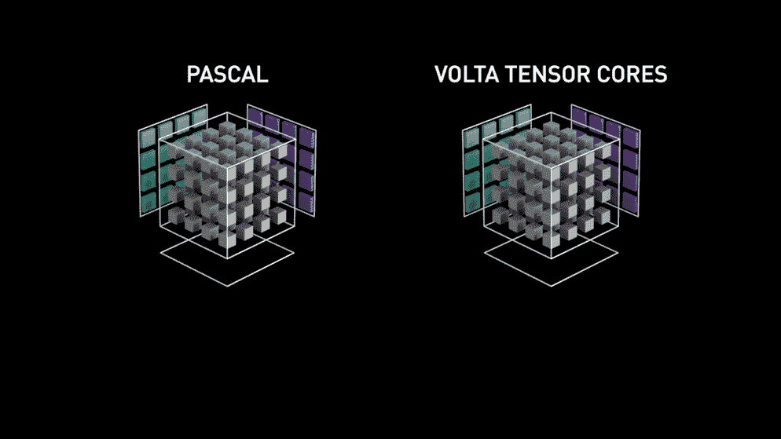

来源(英伟达)

在写这篇博客的时候，Nvidia 宣布了最新的 3000 系列 GPU 产品，这些产品采用了 Ampere 架构，将张量内核的性能提高了 2 倍，还带来了新的精度值，如 TF32(张量浮点 32)，FP64(浮点 64)。TF32 的工作原理与 FP32 相同，但加速高达 20 倍，因此 Nvidia 声称模型的推理或训练时间将从数周减少到数小时。

## Amd vs 英伟达

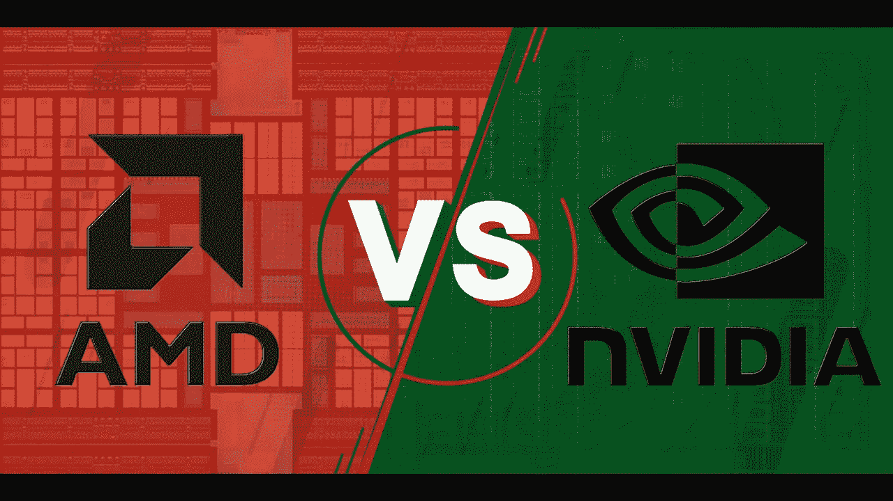

来源(汤姆的硬件)

Amd GPUs 对于游戏来说是不错的，但是一旦深度学习进入画面，那么 Nvidia 就遥遥领先了。这并不意味着 Amd GPUs 不好，这是由于软件优化和驱动程序没有积极更新，在 Nvidia 方面，他们有更好的驱动程序，经常更新，在 cuda 的顶部，cudnn 有助于加速计算。
一些知名的库如 tensorflow，pytorch 支持 cuda，这意味着
可以使用 GTX 1000 系列的 entery 级 GPU。在 Amd 方面，它对其 GPU 的软件支持非常少。在硬件方面，Nvidia 推出了专用张量内核。Amd 有 ROCm 用于加速，但它不像张量核那样好，而且许多深度学习库不支持 ROCm，从过去几年来看，在性能方面没有明显的飞跃。
由于所有这些原因，英伟达在深度学习方面表现出色。

## 摘要

综上所述，我们已经清楚地了解到，就 GPU 而言，Nvidia 是市场的领导者，但我真的希望 Amd 在未来能够迎头赶上，或者至少在即将推出的 GPU 系列中做出一些显著的改进，因为他们已经在 CPU 方面做得很好，例如锐龙系列。
随着我们在深度学习、机器学习和 HPC 领域取得新的创新和突破，未来几年 GPU 的应用范围将会非常广泛。GPU 加速对于许多进入该领域的开发人员和学生来说总是很方便，因为他们的价格也变得越来越实惠。也要感谢广大的社区，他们也为 AI 和 HPC 的发展做出了贡献。