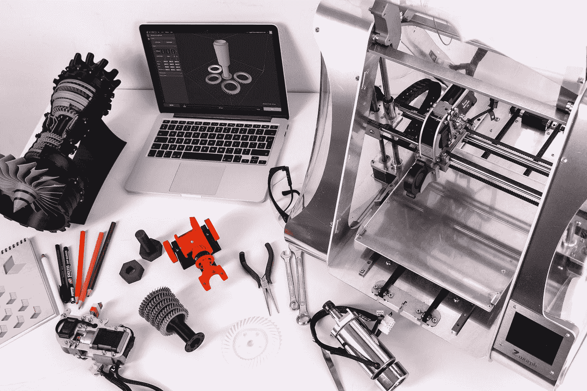

# 我为什么选择数据科学？

> 原文：<https://medium.com/analytics-vidhya/why-i-chose-data-science-b98cee42ecbd?source=collection_archive---------14----------------------->

## 个人原因和一般原因。

在 [Unsplash](https://unsplash.com?utm_source=medium&utm_medium=referral) 上由[埃斯特·扬森斯](https://unsplash.com/@esteejanssens?utm_source=medium&utm_medium=referral)拍摄的照片

大约一年前，我回顾了我的过去，意识到一个我以前从未知道的模式:

作为一个男孩，我花了很多时间用各种螺丝刀不断地组装和拆卸我的玩具。当我十几岁的时候，电脑来到了我家。我玩的所有游戏都是建筑和策略游戏。我爷爷给我介绍了互联网，我开始知道什么是网站、电子邮件等等。在我五岁的时候，我得到了我的第一个电子邮件 id，这在当时对我来说是件大事。后来我选择了计算机科学来学习更多关于计算机和万物如何在引擎盖下工作的知识，我学会了建立网站和应用程序。当我在工程系的最后一年时，我参加了一个关于大数据和 HADOOP 的研讨会，在那里我了解到社交媒体平台产生了多少数据。

在感知到社会的进化之后，学习数据处理技能的需要变得非常明显。我的想法是:“ ***如果我有能力从我的电脑上创造价值，那我的极限将是天空！*** ”。

我终于明白了什么让我感动，我想在我的余生里做什么:把事情做起来。

所以，是的，对于那些可能觉得自己的职业需要改变的人(任何类型)，我建议你做以下两步练习:**回顾你的过去，找到你真正的激情；看它如何能契合社会现在的** *。*

谈论一般原因:

照片由 [ZMorph Multitool 3D 打印机](https://unsplash.com/@zmorph3d?utm_source=medium&utm_medium=referral)在 [Unsplash](https://unsplash.com?utm_source=medium&utm_medium=referral) 上拍摄

就像生物一样，技术也有生命周期。它出生，生长，繁殖，变平甚至死亡。那些设法让自己的职业生命周期与技术生命周期平行的人，是我们这个星球上引领创新的人。

汽车行业就是一个很好的例子。

自从蒸汽机发明以来，直到 80 年代，成为一名机械工程师是社会的主流。如果你想一想我们的父母开的车，他们主要是基于机械的(窗户，镜子，换挡，座椅，你能想到的)。然而在 90 年代，电子学在所有这些机制中的应用急剧增加，将主流转向电子学和信息学。想想我们今天驾驶的汽车变得多么电子化。那些当时有远见在这些领域进行研究的人，现在发现自己正在科技公司里往上爬。

现在出现了第三次技术浪潮，取代了机械和电子技术，即数字技术。就像在大多数领域一样，汽车的发展现在是由客户连接和个性化驱动的。我们希望汽车变得智能，为我们思考，让我们感觉更好，让我们的生活更简单。无数的挑战和机遇摆在我们面前有待开发。数字革命发现自己正处于其生命周期的“成长阶段”,而且这种成长似乎将是长期而稳定的。因此，基于这一点，我问你:**你不认为投入时间和金钱来调整你的职业生命周期与技术生命周期是值得的吗？**

这是我在决定从事数据科学职业时想到的个人和一般原因。

你的理由是什么？我想在评论区了解他们

谢谢:)

下次见。