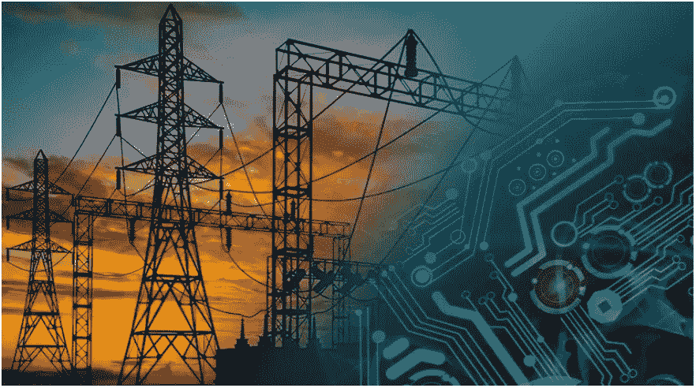

# 为什么我需要机器学习？

> 原文：<https://medium.com/analytics-vidhya/why-i-need-machine-learning-1b7ae28623ba?source=collection_archive---------26----------------------->

未来网格中的机器学习

*首先，什么是机器学习，我们为什么需要它？除非我们明白任何工具的用途，否则学习不会变得有趣。那么，ML 是什么？* **机器学习简单来说就是赋予计算机从数据中学习并做出决策的能力**。*还有很多机器学习算法可以应用到你的数据上。但最重要的是，你需要知道的是确定你的数据的性质。因此，在开始机器学习的任何算法之前，强烈推荐 Data_Visualization。*

***还有，我们为什么需要它？*** 在大数据的世界里，我们有海量的数据需要评估和计算。因此，不可能手动输入每个数据。而我们希望计算机把我们输入的数据预测到正确的位置，这是指机器应用学习算法。 ***所以，万一我们想让机器理解我们的数据来预测结果，就需要机器学习。***

*这只是进入机器学习的一个简单概念。*

# 我如何知道在我的数据中应用什么算法？

在应用任何算法之前，你需要了解你的数据。您的数据是否具有目标变量很少的离散值？例如，假设您有数据，并且您只想对该数据进行分类，以预测它是玫瑰、百合还是郁金香。这里花的种类是你的目标变量。在这种情况下，您的目标是让任意数量的数据适合三个物种中的任何一个。 ***然后你就可以确定监督学习算法会对你的数据起作用。在这下面是分类和回归。***

但是，如果你有大量的数据，并且你不确定你的目标变量。假设，查看客户购买商品的历史，您必须预测他们在下次购物时可能会购买什么商品。在这种情况下，没有固定的目标变量，所以你可以标记它。 ***所以，这些数据归入无监督学习。有趣吧？😊那么，下一步该怎么办呢？在这种情况下，可以应用数据聚类、异常预测或关联算法。***

# 机器学习不起作用的地方。

下一件重要的事情是，如果你有非常大的数据，而你对领域一无所知，无法理解特征变量。那么机器学习在这种情况下就行不通了。然后是深度学习算法。像计算机视觉 ***(面部识别、自动驾驶汽车、CT 扫描自动检测肿瘤* )** 、自然语言处理 ***(Google translate、chatbot、Alexa、Seria、Cortana* )** 这样的复杂问题解决，都在深度学习之下。

人工神经网络(ANN)，卷积神经网络(CNN)，它们都属于深度学习。

## **神经网络在自动驾驶汽车中是如何工作的？**

1.  捕捉道路上车辆的图像
2.  图像被转换成数字
3.  像素强度被输入神经网络
4.  神经元将学会检测图像
5.  神经元将学习更复杂的物体，如窗户、门、轮子
6.  神经元将学会检测车辆的形状
7.  最后，图像被分类为汽车或卡车或公共汽车或出租车等