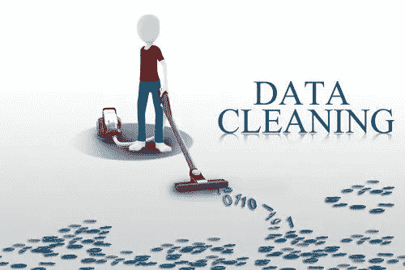
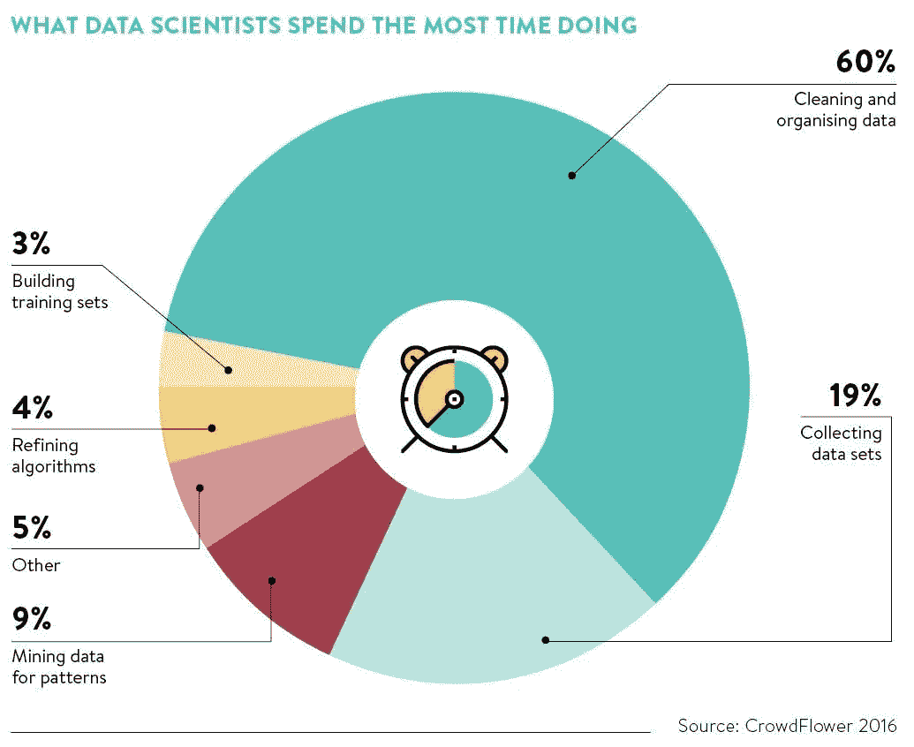

# 为什么“数据清理”是必要的？

> 原文：<https://medium.com/analytics-vidhya/why-is-data-cleaning-neccessary-94f2b2b01e9d?source=collection_archive---------29----------------------->

无论是机器学习、数据科学还是数据分析，该领域最重要的部分是数据清理过程。

数据清洗被认为是数据科学和机器学习的基础元素，因为它在分析过程和揭示可靠答案中发挥着巨大的作用。

如上图所示，一名普通数据科学家的工作时间分配包括大约 60%的时间用于清理和整理数据..所以，

## 什么是数据清洗？

1.  **数据清理**是从记录集、表格或数据库中检测并纠正(或删除)坏的或不准确的数据点的过程，指的是识别不完整、不正确、不准确或不相关的数据部分，然后替换、修改或删除不需要的数据。
2.  数据清理不仅限于删除信息为新数据腾出空间，而是找到一种方法在不删除重要信息的情况下最大限度地提高数据集的准确性。
3.  数据清理过程的最终目标是移除异常值或无价的数据，以便进行更顺畅的分析，并从数据中发现可靠的答案。

[摄](https://unsplash.com/@thecreative_exchange?utm_source=medium&utm_medium=referral) [Unsplash](https://unsplash.com?utm_source=medium&utm_medium=referral) 上的创意交流

## 为什么数据科学家或机器学习工程师花这么多时间清理和组织数据，这有什么帮助？

真实世界的数据通常不像我们在分析 Vidhya 或 Kaggle 竞赛中获得的数据那样结构化或干净，因此了解分布和清理数据对于进一步的分析和预测非常重要。

1.  避免代价高昂的错误。
2.  **改善决策过程。**
3.  **做出明智的可视化。**

数据清理有助于确保信息总是匹配正确的字段，同时使 BI 工具更容易与数据集交互，以更准确地找到信息。

此外，大多数算法需要干净的数据来执行建模，否则模型的性能会更差。

喜欢我的文章？请为我鼓掌并分享它，因为这将增强我的信心。此外，我每周日都会发布新文章，所以请保持联系，以了解数据科学和机器学习基础系列的未来文章。

另外，如果你想的话，可以在 linkedIn 上联系我。

马特·博茨福德在 [Unsplash](https://unsplash.com?utm_source=medium&utm_medium=referral) 上的照片