# 为什么模型评估是机器学习中至关重要的一步？—第一部分

> 原文：<https://medium.com/analytics-vidhya/why-is-model-evaluation-a-crucial-step-in-machine-learning-part-1-eeb4882e7c8a?source=collection_archive---------17----------------------->

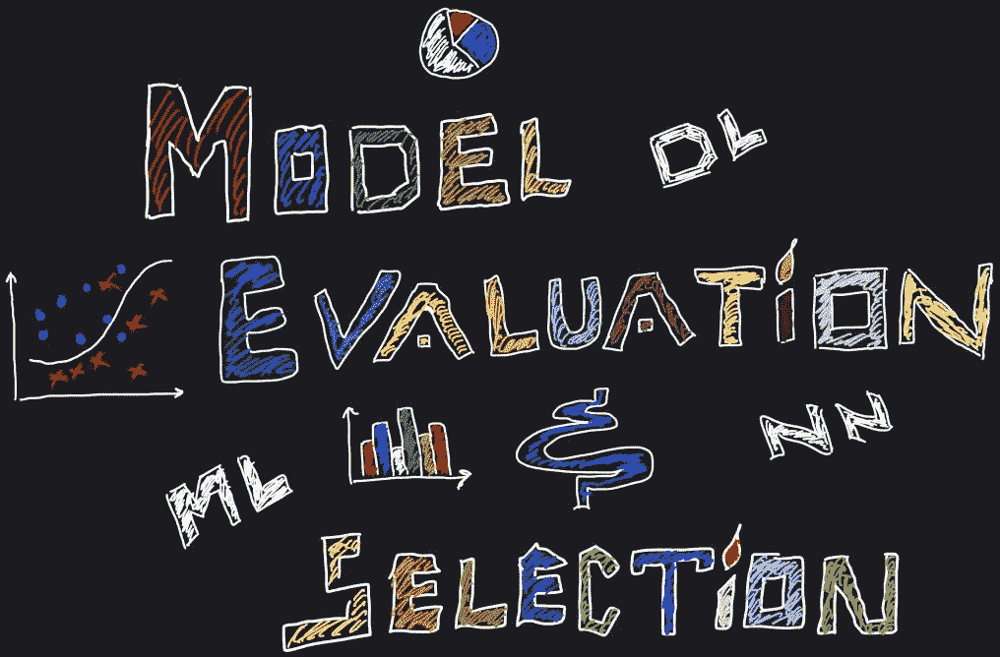

照片由昆泰·德威迪拍摄

任何研究人员或数据科学家的核心目标一直是推导出一个对潜在问题领域来说“T0”完美的模型。在深入研究数据本身的复杂计算之前，应该首先准备看起来最适合这一目的的工具。首先，机器学习实践者总是在模型的“*参数和超参数*周围涂鸦，以获得尽可能高的**泛化精度**。让我们继续，看看如何以最佳方式掌握这些工具。

> 将模型拟合到训练数据集是不同的事情；让它成为一个“好的预测器”是另一回事。这一步是必须要做的，因为我们的模型的泛化行为依赖于它。反正没人想要死记硬背的模型！

***注*** *:我曾经尝试总结过一篇* ***Sabastian Raschka 的研究文章，《机器学习中的*** [***模型评估、模型选择、算法选择***](https://arxiv.org/abs/1811.12808) ***》。尽管这篇文章有点冗长，但我确实发现它信息量大得惊人。我很感谢作者在他的作品中非常详细。***

本文由三个部分组成，以保持每个部分的长度略短，并提供模块化学习:

*   ***第一部分:*** 一些基本概念和术语。
*   [***第二部分:*** 模型评估的不同方法。](/@kountaydwivedi/different-model-evaluation-methodologies-part-2-679fcb064c55)
*   [***第三部分:*** 不同的模式选择方法。](/@kountaydwivedi/model-selection-techniques-part-3-d5ebb6ea4c77)

> 你将会学到什么

*   模型评估的不同方法及其比较。
*   如何从*假设空间*中选择最佳模型(基本上每个模型对应*假设空间*中的一个特定假设)。
*   选择一个最佳算法，最适合手头的问题。

> 为什么我们需要做这些事情？

*   我们希望**评估我们的模型在不可预见的数据示例上的预测性能**(泛化精度)。
*   我们还想尽可能地提高我们模型的性能。
*   最后，在机器学习的几个算法中，我们想要挑选一个计算上最优的**来解决我们的问题。**

> 术语意识

> **监督学习和分类方法**

*   监督学习是机器学习范式之一，其中数据集示例的**基础事实是我们先验已知的**。
*   分类是一项机器学习任务，其中我们的模型负责处理分类数据。也就是说，我们的模型应该以识别特定数据示例属于哪个类为目标。

***注意:*** *在本文中，我们将只研究监督学习方法和分类任务。*

> **假设、目标函数和模型**

*   在预测模型中，我们通常热衷于学习或逼近特定未知函数。这实际上是我们想要建模的**目标函数( *f(y)* )。我们不知道真正的功能(否则就不需要数据科学家了！！)**
*   **我们希望尽可能接近目标函数的函数就是假设。由于我们不知道目标函数的真实性质，因此我们只能希望我们的假设尽可能地接近它。**
*   **模型只是假设**的一种表现形式。当我们概念化我们的功能时，它是一个假设；当我们显化它(物化它)，它就变成了一个模型。

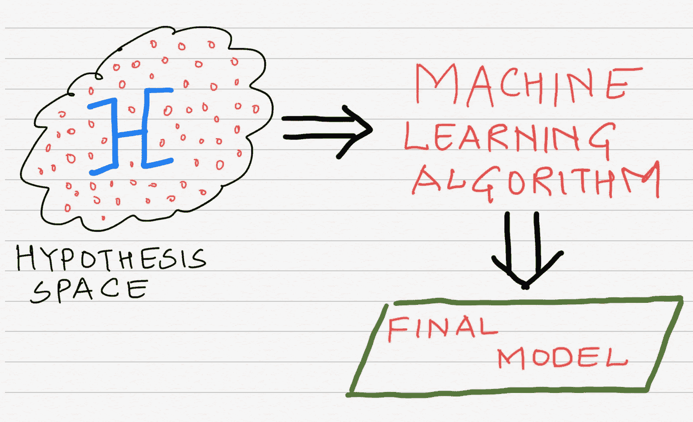

图 1:ML 算法如何从 ***假设空间*** *中选择最佳假设(最终模型)*

> **参数和超参数**

*   了解上述术语之间的区别对我们来说很重要。当设计一个机器学习模型时，有许多因素对产生我们模型的最佳泛化精度起着至关重要的作用。
*   一个**模型参数**，是我们的模型实际学习的变量。我们的模型进行预测时会用到这些。实际上，模型只需要学习这些参数。因此，当模型被完全训练时，它们被自动确定。
    模型参数示例:
    * ***神经网络中某一层的权重***
    ****分类或回归模型中的系数*** *****支持向量****
*   *另一方面，**超参数**是类似元模型参数的变量。他们实际上控制算法的行为，以便获得模型的参数。本质上，我们可以说，“我们调整超参数以获得最佳的模型参数”。这些需要由实验者来决定，而不是由算法来决定。它们被明确地输入到程序中，并进行微调以获得最佳结果。
    超参数的例子:
    *模型损失函数中的 *L-2* ***正则化*项**。
    *学习率***(**)****一个模型的数量
    ***【迭代次数】****

> ****分层与简单随机抽样****

*   **如果我们想研究一个群体，那么我们应该意识到这样一个事实，即它有自己的统计数据(均值、方差、偏差等)。).群体中可能有一个或多个子类。例如:猫科动物有许多子类，如老虎、猞猁、美洲狮等。**
*   **为了研究一个群体，我们收集一些样本(样本越多，研究越好)。**
*   **现在，我们正在收集的这个样本，**如果它在本质上只是随机的，那么我们可能最终得到的数据并不代表在真实的潜在总体中发现的子类的比率。也就是说，假设猫科动物的比例是老虎:猞猁:美洲狮= 25:25:50。因此，所收集的样本也应该具有尽可能接近于此的比率，这在简单随机抽样的情况下可能不会发生。****
*   **因此，我们使用**分层随机抽样的概念，它以随机方式进行抽样，但保持样本中真实总体子类的原始比率不变。****

**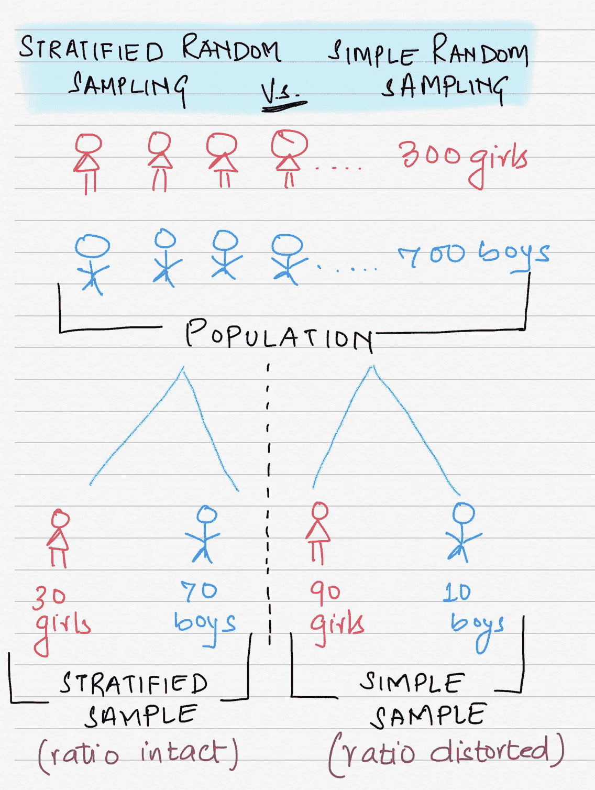**

**图 2:说明了不同的 b/w 分层抽样和简单随机抽样。我们可以看到，在分层抽样中，总人口的比率是如何保持不变的。(Kountay Dwivedi 摄)**

> ****过拟合和欠拟合****

*   **我们知道，如果我们的模型能够很好地概括实时示例(看不见的数据点)，那么它将是“**好的**”。但是我们如何衡量这个**泛化精度**？**
*   **为此，我们首先将现有数据集分成两个子集——**训练集和测试集。****
*   **我们首先训练我们的模型，并使用训练集学习参数。此后，我们使用测试集测试模型的预测准确性。**
*   **当**无法捕捉到潜在数据样本的基本趋势和细节时，一个模型在本质上是**欠拟合**。**相反，如果**捕捉到数据样本中的噪声和基本细节，模型在本质上就是**过度拟合**。****
*   **欠适和过适的概念，虽然看起来很简单，但实际上很难理解。让我们看看下面的图表:**

**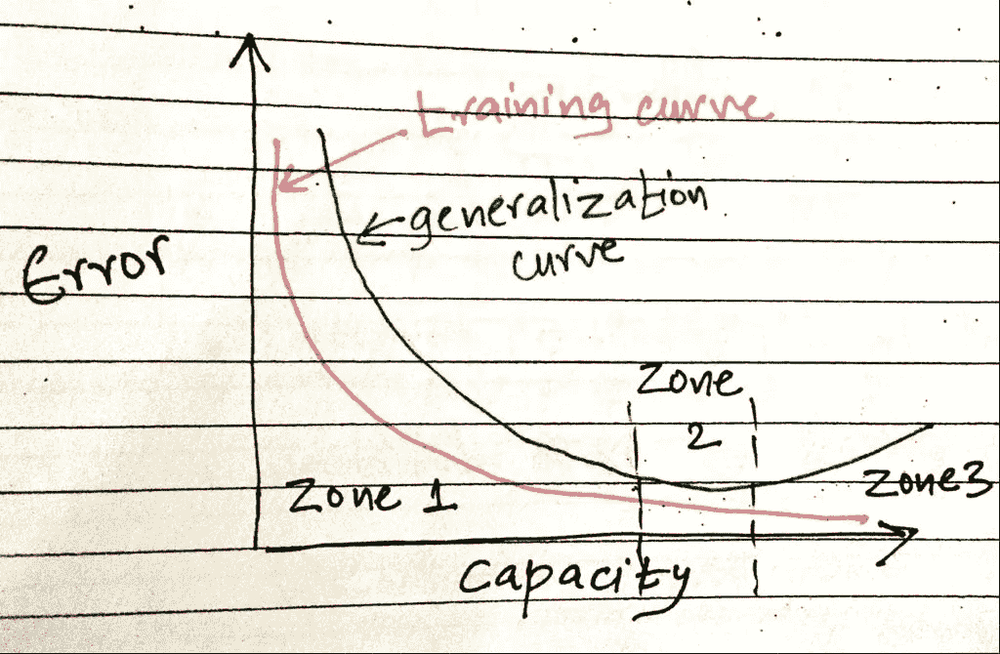**

**图 3:显示模型欠拟合、过拟合和良好区域的图表。(Kountay Dwivedi 摄)**

*   ***图— 3* 显示的是*能力*(一个模型可以处理多复杂的功能)和模型的*错误率*之间的关系图。**
*   ****区域 1 —欠拟合区域:**我们可以看到，训练误差以及泛化误差率很高。原因是*模型的简单性(图— 4)* 。一个模型，如果设计得非常简单，将无法捕捉样本的本质，从而无法很好地拟合数据。**
*   ****3 区——过度拟合区:**在这里，情况完全相反。由于其*的复杂性质*，该模型甚至捕捉到样本的细微细节(即噪声)，因此，尽管它导致训练误差下降，因为它已经对此进行了大量练习，但泛化误差也在上升。**
*   ****区域 2 —“好”区域:**我们希望我们的模型学习样本的**本质属性**，而不是噪声(比如错误注释的数据项，或者离群值)。因此，区域 2 是模型的首选复杂度。**

**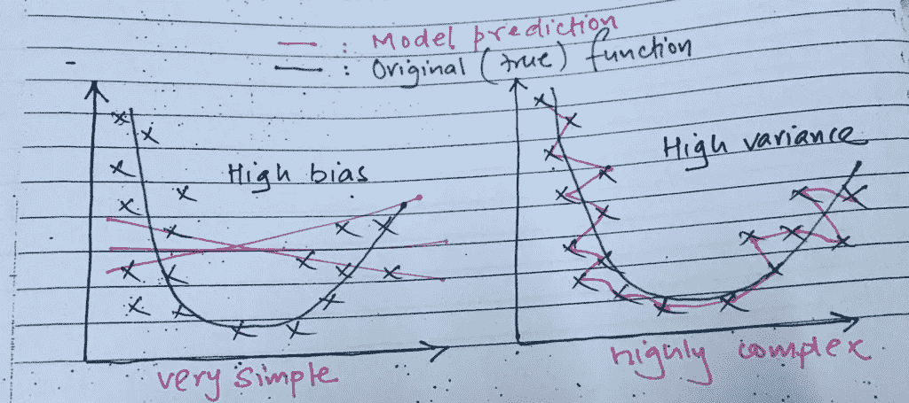**

**图—4:**高偏差**模型(左)与**高变量**模型(右)的对比图(Kountay Dwivedi 拍摄)**

> ****偏差和方差****

*   **与过拟合和欠拟合的概念非常相关，具有**高偏差**的模型最终落入**欠拟合区，**而具有**高方差**的**模型落入**过拟合区。******
*   **假设我们的模型预测结果为 *y_hat* ，真实标签为 *y* ，那么偏差将为**预测结果和真实标签的期望值之差 b/w。****

**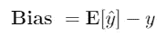**

*   **此外，方差将是**y _ hat*的平方的期望值*和 y _ hat*的平方的期望值之间的差。*****

**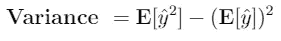****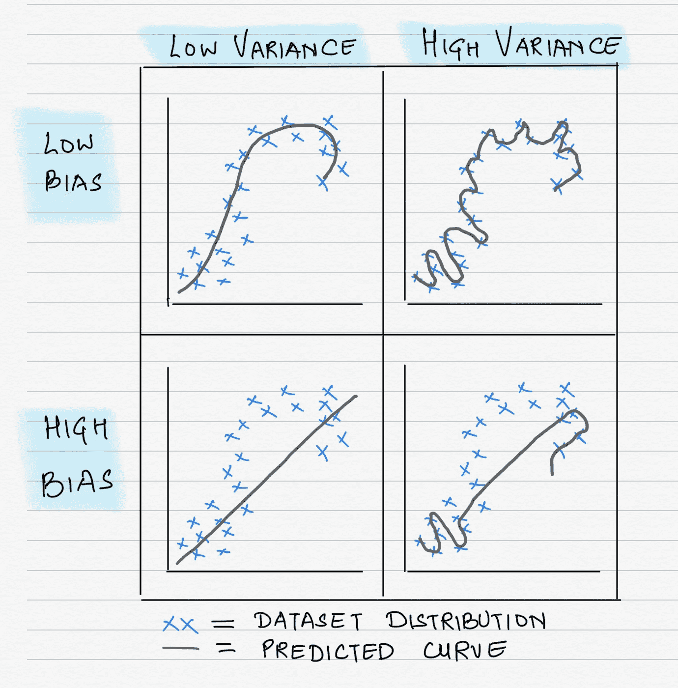**

**图 5:偏差和方差的图示(照片由 Kountay Dwivedi 拍摄)**

> ****0–1 损失和预测精度****

*   **有许多损失函数可供使用。为了简单起见，实际上使用了***0–1 损失函数*** 。让我们假设我们必须做一个分类问题，其中样本由两个类组成(例如，一个学生的成绩——他是通过还是失败)。在这种情况下，0–1 损失实际上定义为:**

**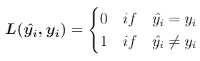**

*   **上式中， ***y_i_hat*** 是我们模型给出的预测值， ***y_i*** 是属于样本的***I-***th*数据示例的真值。***
*   ***有了这个概念，我们计算预测误差 ***ERR*** 作为整个数据集上*0–1 损失*的**期望值，有 *n* 个例子。*****

**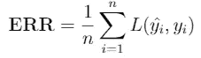**

*   **由此可见，***【ACC】***的预测精度为:**

**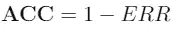**

> **接下来—第 2 部分**

**在学习了理解模型评估和选择背后的思想和直觉所需的基本术语和概念之后，我们现在继续学习 [***第 2 部分——不同的模型评估方法*** 。](/@kountaydwivedi/different-model-evaluation-methodologies-part-2-679fcb064c55)敬请关注，快乐学习。
:-}**