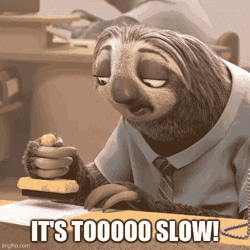
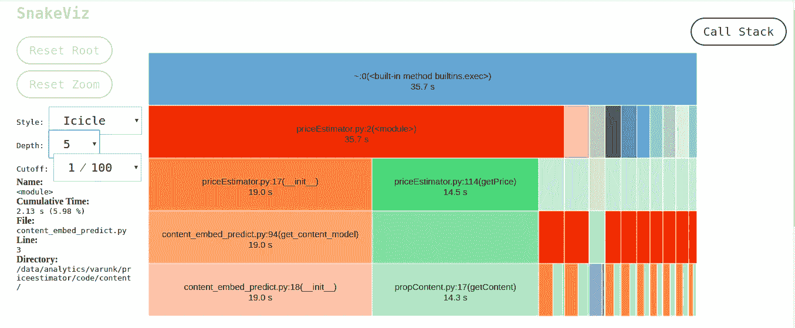
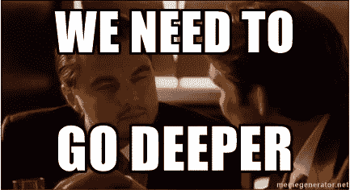
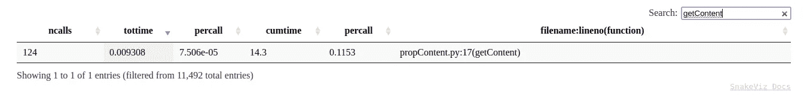

# 为什么我的代码这么慢？python 中的概要分析简介

> 原文：<https://medium.com/analytics-vidhya/why-is-my-code-so-slow-an-introduction-to-profiling-in-python-19d8e1370004?source=collection_archive---------14----------------------->



我敢打赌，在您的编码之旅中，您已经说过无数次了。当代码很小时，使用简单的 *time* 函数，很容易找出哪段代码占用了大部分时间。

但是，假设您有一个巨大的代码来预测房地产价格，大约有 10，000 行代码。将*时间*语句放在所有被怀疑是瓶颈的函数周围是不可行的。

我觉得最好的方法是使用 **python 剖析器**来剖析整个代码。

> 一个*概要文件*是一组统计数据，描述了程序的各个部分执行的频率和时间。—[docs.python.com](https://docs.python.org/3/library/profile.html#instant-user-s-manual)

我通常使用的分析器叫做 *cProfile* 。

要分析一个程序，您只需要在 bash 中编写以下命令。python3 解释器执行 priceEstimator.py 并将分析器的输出转储到 priceEstimator.cprof。

```
python3 -m cProfile -o priceEstimator.cprof priceEstimator.py
```

文件 priceEstimator.cprof 包含一组统计信息，这些信息描述了脚本 priceEstimator.py 的各种功能执行的次数和持续时间。您可以继续查看生成的文件的内容。当心！如果你的程序很大，这个文件可能会吓到你。

幸运的是，我们有一个很棒的工具—[S*nake viz*](https://jiffyclub.github.io/snakeviz/)*可以可视化 profiler 的输出。为了快速开始使用 *SnakeViz，*你需要做以下事情:*

1.  *安装 *:**

```
*pip install snakeviz*
```

*2.加载配置文件:*

```
*snakeviz priceEstimator.cprof*
```

*这将创建一个 URL，您可以在您最喜欢的浏览器上打开它并查看可视化效果。*

***注:***

*如果您在服务器上运行上述命令，您需要在服务器模式下运行上述命令，并且不要忘记添加您的 server_ip:*

```
*snakeviz priceEstimator.cprof -s -H <server_ip>*
```

*3.在浏览器中打开 URL*

*打开 URL 后，您将看到一个控制面板:*

**

*仪表板中的每个矩形给出了关于所调用函数的信息。顶部的矩形给出了程序完成执行所用的总时间(累计时间)。每隔一个矩形代表它上面的矩形的子函数或它下面的矩形的父函数，或者两者都代表。例如，priceEstimator.py 的 *getPrice* 方法在执行过程中总共消耗了 14.5 秒，它在幕后调用了 propContent.py 的一个子例程 *getContent* 。如果您希望进一步调查哪个子例程导致函数变慢，也可以单击这个矩形来查看其子例程。*

**请注意，矩形的大小并不代表执行特定功能所需的确切时间。**

*通过查看仪表板，很明显，我可以减少程序执行时间的方法之一是优化 *getContent* 函数。*

**

*SnakeViz 还以表格的形式显示统计数据。这与您在 priceEstimator.cprof 中获得的表相同，具有易于排序和搜索的特性。*

**

*如果您真的想更深入地查看所有其他统计数据，例如:*

> ***ncalls:** 对函数的调用总数。如果有两个数字，这意味着函数递归，第一个是调用总数，第二个是原始(非递归)调用数。*
> 
> ***tottime:** 函数花费的总时间，不包括调用子函数花费的时间*
> 
> ***percall:** `*tottime*`除以`*ncalls*`*
> 
> ***累计时间:**该功能及所有子功能的累计时间*
> 
> ***percall:** `*cumtime*`除以`*ncalls*`*
> 
> ***文件名:行号(函数):**定义函数的文件名和行号，以及函数的名称*

*注:按原样取自 [SnakeViz](https://jiffyclub.github.io/snakeviz/) 的官方文档。你可以查看这个[链接](https://jiffyclub.github.io/snakeviz/)来获得这个工具*的详细清晰的文档。**

*如您所见，我可以从统计表中推断出许多东西，例如:*

1.  *在程序的整个执行过程中，getContent 函数总共被调用了 124 次。*
2.  *除了子程序调用( *tottime* )之外，这个函数花费的总时间非常少。因此我们接下来需要看看它的子程序。*

*我希望本文能让您在使用 profiler 调试 python 代码方面有一个良好的开端。请在下面的评论区告诉我你对这篇文章的看法。*

*编码快乐！*