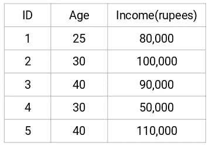
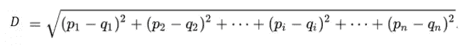
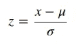
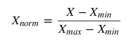
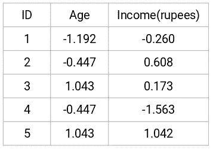

# 为什么 KNN 和 K-Means 需要缩放？

> 原文：<https://medium.com/analytics-vidhya/why-is-scaling-required-in-knn-and-k-means-8129e4d88ed7?source=collection_archive---------0----------------------->

KNN 和 K-Means 是最常用和最广泛使用的机器学习算法之一。KNN 是一种监督学习算法，可用于解决分类和回归问题。另一方面，K-Means 是一种无监督学习算法，广泛用于将数据聚类成不同的组。

这两种算法的一个共同点是 KNN 和 K-Means 都是基于距离的算法。 [KNN](https://www.analyticsvidhya.com/blog/2018/03/introduction-k-neighbours-algorithm-clustering/) 选择 k 个最近的邻居，然后基于这些邻居，为新的观察值分配类别(对于分类问题)或预测值(对于回归问题)。 [K-Means](https://www.analyticsvidhya.com/blog/2019/08/comprehensive-guide-k-means-clustering/) 将相似的点聚类在一起。这里的相似性是由两点之间的距离来定义的。两点之间的距离越小，相似性越大，反之亦然。

# 为什么我们需要扩展数据？

所有这些基于距离的算法都受到变量规模的影响。假设您的数据中有一个年龄变量，以年为单位显示一个人的年龄，还有一个收入变量，以卢比为单位显示这个人的月收入:

来源:[应用机器学习课程](https://courses.analyticsvidhya.com/courses/applied-machine-learning-beginner-to-professional)

这里，人的年龄范围从 25 岁到 40 岁，而收入变量范围从 50，000 到 110，000。现在让我们试着找出观察 1 和观察 2 之间的相似之处。最常见的方法是计算欧几里德距离，记住这个距离越小，点越近，因此它们彼此越相似。回想一下，欧几里得距离由下式给出:

来源:[应用机器学习课程](https://courses.analyticsvidhya.com/courses/applied-machine-learning-beginner-to-professional)

这里，

n =变量的数量

p1，p2，p3，… =第一个点的特征

q1，q2，q3，… =第二点的特征

观察值 1 和 2 之间的欧几里德距离将被给出为:

> 欧几里德距离=[(100000–80000)^2+(30–25)^2]^(1/2)]

哪个会出来大概是 ***20000.000625*** 。这里可以注意到，高收入水平影响了两点之间的距离。这将影响所有基于距离的模型的性能，因为它将为具有较高幅度(在这种情况下为收入)的变量赋予较高的权重。

我们不希望我们的算法受到这些变量大小的影响。该算法不应该偏向具有更高量值的变量。为了克服这个问题，我们可以把所有的变量降低到相同的尺度。最常用的方法之一是归一化，我们计算变量的平均值和标准差。然后，对于每个观察值，我们减去平均值，然后除以该变量的标准偏差:

除了标准化之外，还有其他方法可以将所有变量缩小到相同的范围。例如:最小-最大缩放。这里使用以下公式进行缩放:

现在，我们将把重点放在正常化上。您也可以尝试最小-最大缩放。让我们看看归一化如何将这些变量降低到相同的尺度，从而提高这些基于距离的算法的性能。如果我们将上面的数据标准化，它将看起来像:

来源:[应用机器学习课程](https://courses.analyticsvidhya.com/courses/applied-machine-learning-beginner-to-professional)

让我们再次计算观察值 1 和 2 之间的欧几里德距离:

> 欧几里德距离=[(0.608+0.260)^2+(-0.447+1.192)^2]^(1/2)]

这一次的距离大约是 ***1.1438*** 。我们可以清楚地看到，距离并没有偏向收入变量。现在，这两个变量被赋予了相似的权重。因此，在应用基于距离的算法(如 KNN 或 K-Means)时，建议将所有要素置于相同的比例。