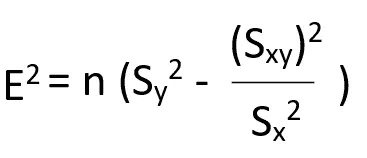
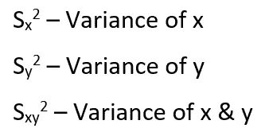
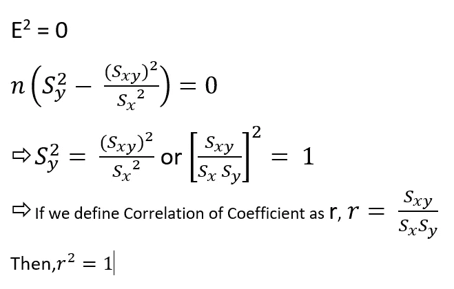
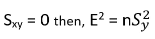

# 为什么相关系数 r 的范围在-1 和+1 之间。？

> 原文：<https://medium.com/analytics-vidhya/why-is-the-correlation-coefficient-r-ranges-between-1-and-1-58795dc9dc21?source=collection_archive---------25----------------------->

相关系数是两个变量相对运动之间关系强度的统计度量。

我们知道误差平方和的公式如下。

如果在两个变量 x & y 之间存在完美的线性回归，那么回归线穿过所有点，因此不会有误差。

这是 r 的最大值，也就是 1。

最大 SSE 仅在没有相关性时出现。即最小相关性。

这意味着 r 是 0，这是 r 的最小值。

如果回归线的梯度(即斜率)为-ve，则 Sxy <0\. So r² < 0.

If it is +ve, then Sxy > 0。所以 r > 0。

因此-1≤ r ≤+1