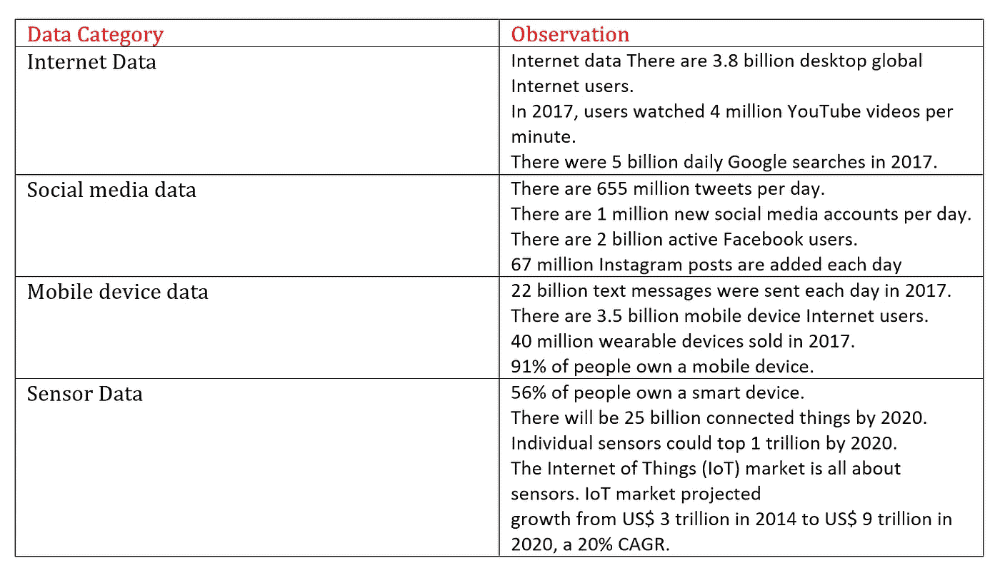

# 为什么现在会发生 ML(机器学习)革命？

> 原文：<https://medium.com/analytics-vidhya/why-is-the-ml-machine-learning-revolution-happening-now-c5b977492b1e?source=collection_archive---------16----------------------->

为什么现在会发生 ML(机器学习)革命？

它已经不是第一次了。之前的 AI(人工智能)热潮，以及随后的寒冬期。我们怎么知道这次是不是真的？我认为三个转型的大趋势是这场运动的原因。

*这三大趋势为我们现在正在经历的机器学习革命铺平了道路:*

*1)数据爆炸*

*2)访问高度可扩展的计算资源*

*3)算法的进步*

**数据爆炸:**

IBM 有一个被广泛引用的统计数据，表明今天互联网上 90%的数据是自 2016 年以来创建的。在 2016 年之前，大量数据肯定已经存在，所以这项研究证实了我们已经知道的事情:今天的人和设备正在以前所未有的速度产生大量数据。IBM 表示，每天产生超过 2.5 艾字节(25 亿吉字节)的数据。

数据观察

> 今天，我们几乎可以数字化任何东西。一旦数字化，数据就有资格进行机器学习。

**高度可扩展的计算资源:**

云服务提供商已经改变了 ML 从业者的游戏规则。它们为我们提供了对存储和计算资源的高度可扩展的按需访问。

这些资源对许多 ML 功能都很有用，例如:

*   ***存储:*** *我们可以使用云服务作为我们 ML 数据的存储库。*
*   ***CPU 资源:*** *我们可以通过配置具有大 CPU 能力的高可用分布式计算集群来更快地创建 ML 模型。*
*   ***托管:*** *我们可以使用 API 或其他接口方法提供对我们的数据或 ML 模型的托管访问。*
*   ***工具:*** *所有的云提供商都有一整套工具，我们可以用它们来创建 ML 解决方案。*

**算法的进步:**

最大似然算法已经存在很长时间了。然而，一旦数据和 IaaS 提供商开始出现爆炸式增长，优化其性能的新努力就开始了。

总之，对于一个成功的 ML 项目来说，数据是唯一最重要的因素。你需要高质量的数据，而且你需要大量的数据。在构建能够有效处理数据的 ML 模型之前，您需要很好地理解您的数据。

在 Nate Silver 的 ***信号与噪音*** 中，作者鼓励我们对自己的数据拥有所有权。这真的是像数据科学家一样思考的本质。

西尔弗先生总结得很好:

> 数字本身无法说明问题。我们为他们说话。数据驱动的预测可以成功，也可以失败。当我们否认自己在这个过程中的角色时，失败的几率就会增加。在我们要求更多的数据之前，我们需要要求更多的自己。

blog.selcote.com 始发于