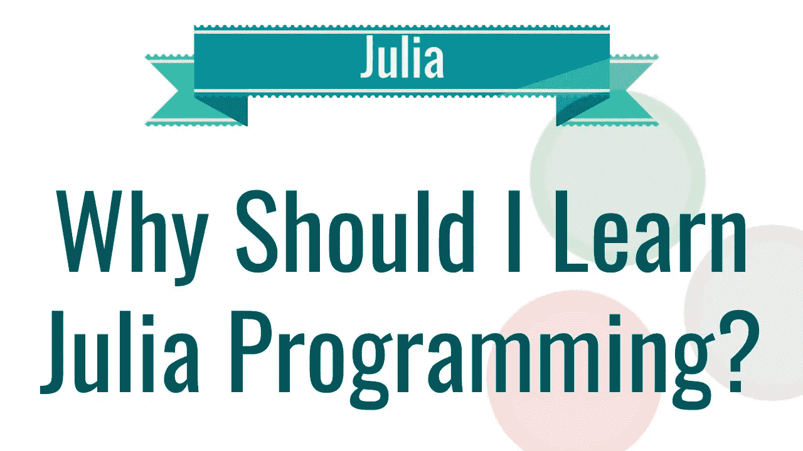

# 为什么 Julia 会成为未来的数据科学语言

> 原文：<https://medium.com/analytics-vidhya/why-julia-could-be-the-data-science-language-of-the-future-767dd9c6e550?source=collection_archive---------6----------------------->

## 数据科学该不该学 Julia？

来自麻省理工学院的 Julia 刚刚开始使用统计编程语言，最近吸引了许多数据科学家的目光。这是有充分理由的，因为朱莉娅很棒。虽然 Python 肯定有 Julia 看不到的好处，但在我个人看来，Julia 胜过 Python，R…