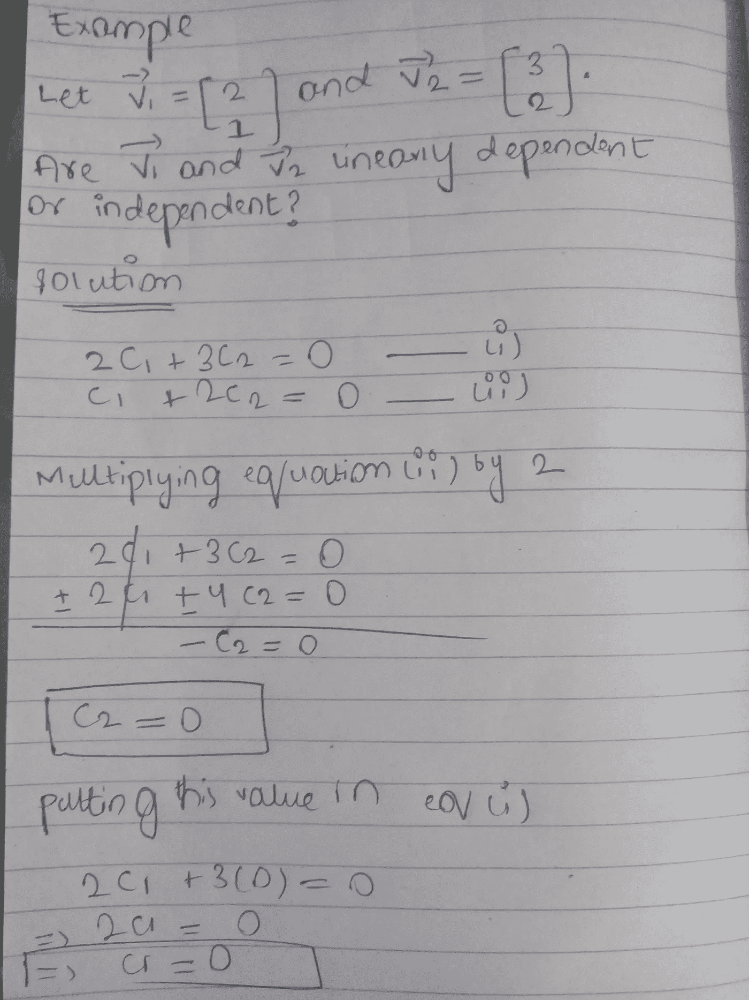

# 为什么线性相关/独立公式有意义

> 原文：<https://medium.com/analytics-vidhya/why-linear-dependence-independence-formulas-makes-sense-ce425174c00f?source=collection_archive---------19----------------------->

为了理解线性相关性和线性独立性，我们首先需要理解两个或多个向量的线性组合

# **线性组合**

两个或多个向量的线性组合是由一组向量构成的表达式，其中每个向量乘以一个标量，然后将结果相加。

a1v1 + a2v2 + a3v3 + …..+ anvn

其中 v1，v2，…，vn 是矢量，an 是标量，用于缩放相应的矢量。

让我们考虑一个 2D 平面，其中有两个向量[1，2]和[4，5]。通过这两个向量的线性组合，我们可以到达 2D 平面上的任何一点。

# **跨度**

两个向量 v1 和 v2 的跨度是它们所有线性组合的集合。

**或**

通过两个向量 V1 和 V2 的线性组合所能到达的所有可能向量的集合就是这两个向量的跨度。

**单个向量的跨度是多少**

单个向量的跨度是位于该直线上的所有向量。

# **线性相关性**

假设在 2D 平面上有两个向量，它们共线，其中一个向量是多余的。这意味着其中一个向量没有给第一个向量的跨度增加任何东西。在这种情况下，这两个向量是线性相关的。

**线性相关性的数学定义**

设 S 是向量的集合

S = {V1，V2，V3，…..，Vn}

集合 S 是线性相关的当且仅当 CV1+ C2V2 + C3V3 +…+CnVn =零矢量

对于某些项目，所有 Ci 中至少有一个是非零的。

检验线性相关性的条件

如果 c1 或 c2 不为零，那么这两个向量是线性相关的

# **线性无关**

如果在 2D 平面中，两个向量 V1 和 V2 不共线，则其中一个向量增加第一个向量的跨度，该第一个向量只有一个向量，该跨度只是一条直线，但是通过 V1 和 V2 的线性组合，我们可以到达 2D 平面中的每个向量(V1 和 V2 的跨度是整个 2D 平面)。这意味着没有向量是多余的。在这种情况下，这两个向量被认为是线性无关的。

**线性无关的数学定义**

设 S 是向量的集合

S = {V1，V2，V3，…..，Vn}

集合 S 线性无关当且仅当 CV1+ C2V2 + C3V3 +…+CnVn =零矢量

检验线性独立性的条件

如果 c1 和 c2 都是零，那么这两个向量是线性独立的

检查两个向量是线性相关还是独立的

在我们的例子中，由于 c1 和 c2 都是零，因此 V1 和 V2 是线性无关的。

# **但是为什么这个公式有意义呢？**

检查线性相关性/独立性的条件基本上检查 2D 平面中的两个向量是否共线。让我们更深入地研究一下。

> 我们知道，要找到两个向量的线性组合，我们需要将向量乘以某个标量，然后将它们相加。因为我们把 V1 和 V2 的线性组合等同于零矢量。这意味着我们基本上是在问这样一个问题，要通过 V1 和 V2 的线性组合达到零矢量，我们需要用哪个标量乘以我们的矢量。在我们的例子中，我们得到 c1=c2=0，这意味着通过 V1 和 V2 的线性组合达到零向量的唯一方法是将这些向量乘以 0。 ***这表明两个向量 V1 和 V2 不在同一直线上，因此它们是线性独立的，因为通过 V1 和 V2 的线性组合达到零向量的唯一方法是将两个向量缩放为零。***

# **注:**

> 如果 V1 和 V2 共线，c1 和 c2 将有无穷个值，通过这两个值，我们可以通过两个向量的线性组合得到零向量。(矢量方向相反，大小相同)。

我假设我们是在 2D 的飞机上工作。线性相关/独立的概念也适用于更高维度，但这种共线性的直觉在更高维度中并不适用。

如果你发现任何错误或有什么你不明白的地方，请评论。我很想听听。

感谢阅读:)