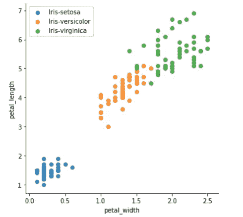
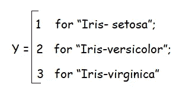

# 为什么线性回归不适用于分类-第一部分？

> 原文：<https://medium.com/analytics-vidhya/why-linear-regression-does-not-work-for-classification-part-i-97b04cab36d9?source=collection_archive---------14----------------------->

*完成分析。*

***第一部分*** *:线性回归是否适合 2 类以上的定性反应变量？为什么为什么不呢？*

***第二部分*** *:线性回归是否适用于 2 类定性响应变量？为什么为什么不呢？*

假设给我们一些花卉的特征，我们需要根据它们的特征，如萼片长度、萼片宽度、花瓣长度和花瓣宽度，将这些物种分类为'*鸢尾-刚毛鸢尾*'、*鸢尾-杂色鸢尾*和'*鸢尾-海滨鸢尾*'。

在实践中，对于这类数据，我们使用像逻辑回归、线性判别分析、SVM 等分类算法。但是，我们能用线性回归来解决它吗？让我们检查一下。

上面提到的数据是**虹膜数据**，你可以在这里 **查看 [**。**](https://www.kaggle.com/uciml/iris)**

我也建议你在继续之前阅读一下关于 [**线性回归**](https://towardsdatascience.com/linear-regression-detailed-view-ea73175f6e86) 的内容。

数据看起来像这样:



鸢尾花的花瓣长度和宽度

为了进行线性回归，我们需要考虑三种花的编码:



虹膜数据响应变量的首次编码

一切就绪！

我们现在可以使用线性回归来拟合具有这种编码的虹膜数据，并预测 y。

让我们运行代码。

[**代码**](https://github.com/ka1shi-medium/Linear-Regression-on-IRIS-data) 。

```
**Coefficients**: [-0.16079931 -0.03026038 0.27888762 0.53921169]
**Mean Squared Error**: 0.060240061710185554
**R2_score**: 0.9158135783553307
```

嗯，我们用它取得了很好的效果。

*为了进行预测，我假设预测值从 0.5 到 1.5 为 1(鸢尾-setosa)，1.5 到 2.5 为 2(鸢尾-杂色)，2.5 到 3.5 为 3(鸢尾-海滨)。*


使用第一个编码通过线性回归得出的实际和预测结果(红圈表示实际结果与预测结果不同的点)

但是等等！

我们可以像这样选择一个同样合理的编码:


虹膜数据响应变量的二次编码

让我们通过保持除了这个编码之外的一切不变来重新运行代码。

这次我们得到了:

```
**Coefficients:** [ 0.22466196 -0.82830855  0.03601207 -0.78051466]
**Mean Squared Error:**  0.519702808980069
**R2_score:** 0.22688838333543437
```

*我假设预测值从 0.5 到 1.5 为 1(鸢尾-海滨鸢尾)，1.5 到 2.5 为 2(鸢尾-刚毛鸢尾)，2.5 到 3.5 为 3(鸢尾-杂色鸢尾)。*


使用二次编码通过线性回归得到的实际和预测结果

刚刚发生了什么？

我们的 R 平方是 0.91，现在只有 0.22，均方差也从 0.06 增加到 0.51。

原因明明是编码但是为什么呢？

> 不幸的是，编码意味着对结果进行排序。

当我们假设第一个编码时，我们是在间接陈述*Setosa*&*Virginica*和*Versicolor*&*Virginica*之间的差异是相同的。

而第二个编码表明*Setosa*&*Virginica*和*Versicolor*&*Setosa*之间的区别是相同的。

有了这种定性的价值观，这就没有任何意义了。

如果定性响应变量具有像低、中、高这样的值，那么 1、2、3 编码将是合理的，并且我们可以假设低和中之间的差异与中和高之间的差异相同。

> 这些不同的编码产生不同的线性模型，最终导致测试观察的不同系数组。

我们的第一种编码给出了更好的结果，但是，选择第一种编码比第二种编码更合理吗？

不，两种编码都同样合理，我们没有合理的解释来选择第一种而不是第二种，人们可以选择任何一种。

# 结论

*在实践中，没有自然的方法将两个以上类别的定性响应变量转换为定量变量，并与线性回归拟合。*

由于这些原因，最好对定性响应变量使用合适的分类方法。

## 参考资料:

[统计学习简介](https://faculty.marshall.usc.edu/gareth-james/ISL/)

[机器学习](https://www.coursera.org/learn/machine-learning)作者吴恩达

完整的代码请查看这个 [GitHub](https://github.com/ka1shi-medium/Linear-Regression-on-IRIS-data) 链接。

检查 [**第二部分**](/@ka1shi/why-linear-regression-does-not-work-for-classification-part-ii-82937927d301) 是否为二元分类的线性回归。

请对任何类型的建议、纠正或批评进行评论。

谢谢大家！