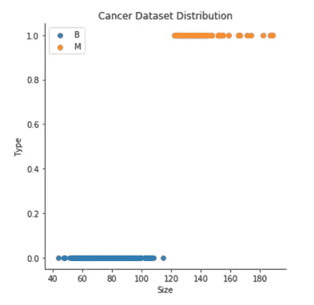
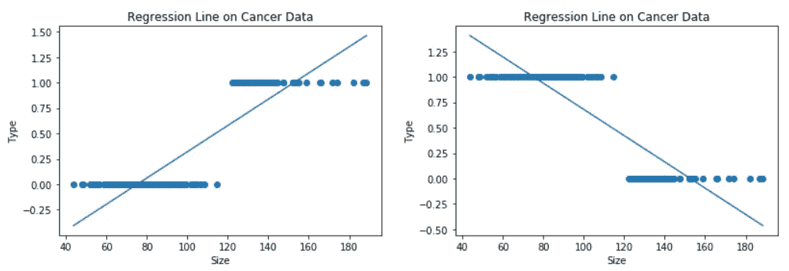
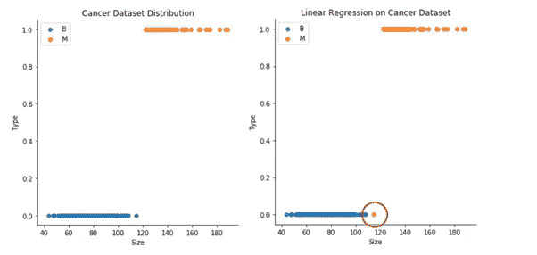
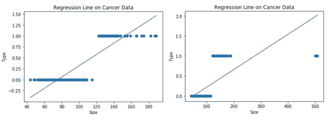
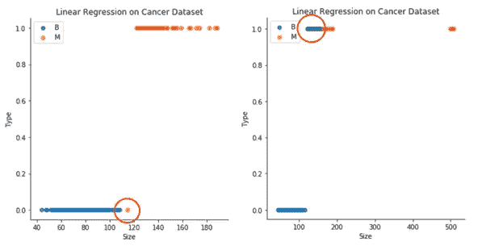
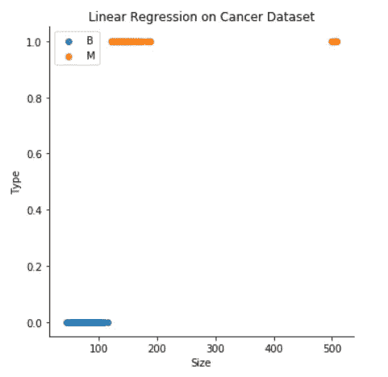

# 为什么线性回归不适用于分类-第二部分？

> 原文：<https://medium.com/analytics-vidhya/why-linear-regression-does-not-work-for-classification-part-ii-82937927d301?source=collection_archive---------13----------------------->

*完成分析。*

*我建议你在继续之前先检查一下第一部分*[](/@ka1shi/why-linear-regression-does-not-work-for-classification-part-i-97b04cab36d9)***。***

***在第一部分中，我们检查了线性回归是否适用于超过 2 类的定性响应变量。在这里，我们将检查它是否适用于二元分类？***

**这次我们将使用[乳腺癌预测数据集](https://www.kaggle.com/merishnasuwal/breast-cancer-prediction-dataset)。为了简单起见，我只考虑了肿瘤的平均周长作为数据中的唯一特征。**

**基于平均周长大小，我们将通过线性回归确定肿瘤是良性的(非癌性的)还是恶性的(癌性的)。**

**我们的数据看起来像这样:**

****

**乳腺癌数据分布(B 代表良性肿瘤，M 代表恶性肿瘤)**

**为了处理线性回归，让我们假设 B 和 M 的编码分别为 0 和 1。**

**让我们对此进行线性回归:**

**[**代号**](https://github.com/ka1shi-medium/Linear-Regression-on-Cancer-data) 。**

```
**coefficient: [0.01291051]
Intercept: -0.9710559009446079
MSE:  0.03373167568329971
R2_score: 0.747858980220586**
```

**现在，让我们选择另一种可能的编码，即 B 为 1，M 为 0，然后重新运行代码。**

```
**coefficient: [-0.01291051]
Intercept: 1.9710559009446085
MSE:  0.03373167568329972
R2_score: 0.747858980220586**
```

**两种编码的均方误差和 R 平方值完全相同。甚至系数都是相同的，只有符号不同。**

**让我们绘制两种编码的假设 h(x ):**

****

**二元分类的线性回归(左表示 B 为 0，M 为 1，右表示 B 为 1，M 为 0)**

## **所以在编码方面没有问题，就像我们在超过 2 个类别的[分类中遇到的那样](/@ka1shi/why-linear-regression-does-not-work-for-classification-part-i-97b04cab36d9)。我们可以假设其中任何一个，我们会得到相同的结果。**

**为了对任何给定的肿瘤大小 x 进行预测，如果 h(x)大于 0.5，我们预测恶性肿瘤，否则，我们预测良性肿瘤，特别是对于 B 为 0 且 M 为 1 的情况。**

**这就是我们得到的结果:**

****

**使用第一个编码通过线性回归得出的实际和预测结果(红圈表示实际结果与预测结果不同的点)**

**看起来我们已经正确地预测了每一个数据点，除了一个，但是现在让我们稍微改变一下数据。**

**让我们添加另一个具有巨大肿瘤大小的样本，并再次运行线性回归:**

****

**二元分类的线性回归(左边代表实际数据，右边代表带有一些异常值的实际数据)**

**现在 h(x)>0.5 是恶性的会看起来像这样:**

****

**阈值为 0.5 的二元分类线性回归(左侧代表实际数据，右侧代表带有一些异常值的实际数据)**

**为了继续做出正确的预测，我们需要将它改为 h(x)>0.3，但这不是算法应该工作的方式。**

****

**阈值为 0.3 的带有异常值的新数据的二元分类的线性回归**

**我们不能在每次数据更新时都改变假设。相反，假设应该从训练数据中学习它，然后对它以前没有见过的数据做出正确的预测。**

# **结论**

**综上所述，线性回归也不适合二元分类。**

**通过施加判定规则，例如当假设 h(x)>0.5 时，则肿瘤是恶性的，可以将它用作二元分类器。但这也不是对所有情况都适用。**

## **参考资料:**

**[统计学习简介](https://faculty.marshall.usc.edu/gareth-james/ISL/)**

**[机器学习](https://www.coursera.org/learn/machine-learning)吴恩达著**

**完整的代码，请查看这个 [GitHub](https://github.com/ka1shi-medium/Linear-Regression-on-Cancer-data) 链接。**

**请对任何类型的建议、纠正或批评进行评论。**

**谢谢大家！**