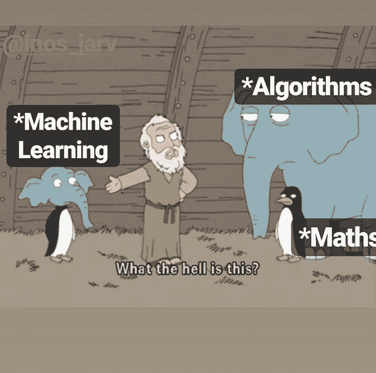
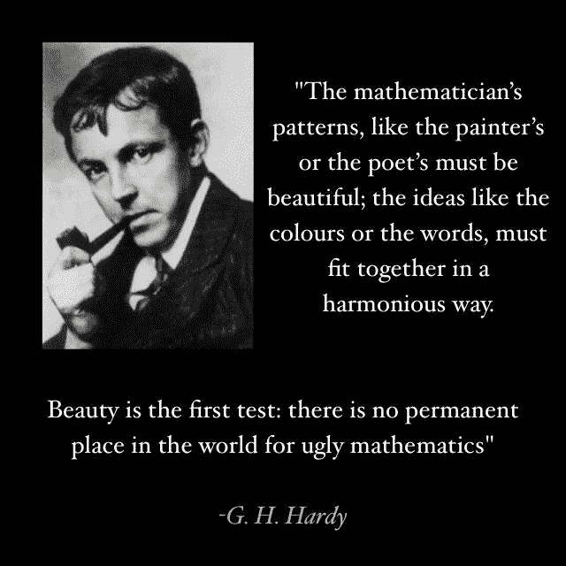

# 为什么数学家讨厌统计学和机器学习

> 原文：<https://medium.com/analytics-vidhya/why-mathematicians-hate-statistics-and-machine-learning-6f5758d13cc9?source=collection_archive---------10----------------------->

## 简短的咆哮

数学家讨厌统计学和机器学习，因为它们解决了数学家没有答案的问题。整个反向传播算法，也就是深度学习，来源于统计学和数值优化中的线性回归。它是所有不是纯数学的东西，它不是解析的，它是数值的，它不能给出精确的解，通常也不是全局优化的解，但它也给出了数学家无法解析解决的问题的答案。与现实世界中不存在的数学家无限状态机相比，它与有限状态机(即计算机)一起工作。这就是数学家讨厌它的原因。这不是数学，这是计算机科学和机器自我学习，这是失去控制，失去理解，这是工程，它实际上工作，一切实用的东西失去了它的纯粹性。

数学家追求数学本身的美，我们尊重并热爱他们的基础工作。我们真的站在巨人的肩膀上。

# 如果你欣赏我为这篇文章付出的努力，并希望看到更多，请👏这个故事，并考虑以下我的帐户。

## 我的一些比较严肃的文章，你可能会感兴趣

 [## 为模糊字符串匹配建立一个可扩展的搜索引擎

### 在模糊匹配中，我们的目标是根据字符串 A 和字符串 B 的接近程度对它们进行评分。我们想找到…

towardsdatascience.com](https://towardsdatascience.com/build-a-scalable-search-engine-for-fuzzy-string-matching-751bd09f6074)  [## 你能在网上找到的深度学习的最短介绍

### 机器学习(ML)最有前景的发展是深度学习。在 DL 中，我们建立了一个人工神经网络…

medium.com](/analytics-vidhya/the-shortest-introduction-to-deep-learning-you-will-find-on-the-web-25a9975bbe1d)  [## 兑换一美元的方法:Python 中的计数(生成函数和级数乘法)

### 先举个简单的例子:我们想知道有多少种方法可以从镍币和一角硬币中得到 20 美分。

towardsdatascience.com](https://towardsdatascience.com/ways-to-change-a-dollar-counting-in-python-generative-functions-and-series-multiplication-50aae1a167e2) 

> 在 Medium 上关注我，不要错过任何关于人工智能、机器学习、数学和创业的新帖子！ [**克里斯托夫**奥斯特塔格](https://medium.com/u/f140c5aaa3b0?source=post_page-----6f5758d13cc9--------------------------------)

 [## 克里斯托夫·奥斯特塔格培养基

### 阅读 Christoph Ostertag 在媒体上的文章。商业信息系统学生。我的兴趣包括…

medium.com](/@christoph.ostertag)