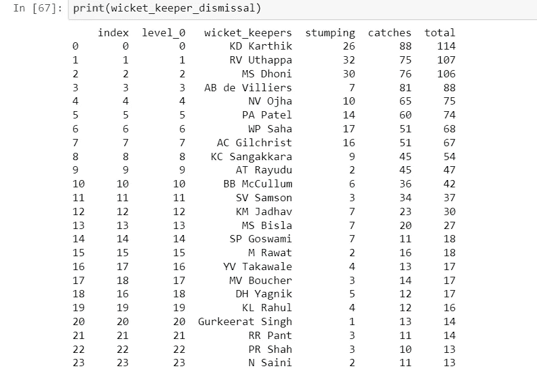

# 为什么 Dhoni 女士不是 IPL 的最佳守门员？

> 原文：<https://medium.com/analytics-vidhya/why-ms-dhoni-is-not-the-best-wicket-keeper-in-ipl-data-analysis-part-1-machine-learning-ea2331b56b29?source=collection_archive---------13----------------------->

## 第 1 部分:数据分析

IPL 是世界上最著名的联赛之一，来自世界各地的球员代表不同的城市或州一起比赛。迄今为止，IPL 发生了很多事情，无论是咬指甲的游戏还是大量的争议，无论是禁止球队还是对球员的比赛操纵指控(臭名昭著的毛巾案)，可能这就是这个国家大量关注这个联盟的原因。

首届冠军是“拉贾斯坦皇家”，上届冠军是“孟买印度人”

关于 IPL 的一些有趣的事实是:

**1。IPL 的转播权以一个巨大的₹16347.5 克罗卖给了星印网络 5 年。这意味着一个球大约值 210 万卢比。**

**2。Sachin Tendulkar 和 Virat Kohli 是 IPL 历史上仅有的两位获得最有价值球员奖的印度球员。**

**3。钦奈超级国王队是 IPL 中唯一一支从未换过队长的球队。**

作为一名机器学习工程师，这个联盟对我来说是一座金矿，因为它给了我大量的数据。我们将分析 IPL 数据集，并从中获得一些好的见解。为了便于分析，我使用了 ***Jupyter 笔记本*** 和 ***Python*** 。

# 导入必要的包和数据读取

数据集的链接在最后

# 数据一瞥

DF1

DF _ 交货

因此，我们现在有了处理数据的完整设置。我们现在将对这些数据进行一些分析。

在这一部分(第一部分)，我们将分析守门员的最大解雇。

# 第 1 部分(大多数被守门员解雇)

因此，从数据集中，我们得到了独特的解雇类型，在这里，我们正在寻找具有最大树桩和捕获量的守门员。

我们会发现每个守门员做了多少次树桩

从上面的数据框架中，我们知道有多少个守门人，因此我们可以列出所有这样的守门人。

检票口管理员名单

现在，我们可以得到守门员接球的次数，因为我们有相同的完整列表。

我们合并了两个数据框，得到了类似这样的结果。

现在我们发现一些数据条目在 catches 中是 NAN，所以第一步是用“0”填充它。第二步是将 float 类型的接球转换为 int 类型，最后找出守门员罚下的总次数。

我们得到了被守门员罚出场的总人数。

同样，让我们用某种图表来形象化我们得到的信息。让我们把 10 个守门人的解雇想象成绊倒和接球。

条形图

在这里，我们知道“Dinesh Karthik”是最好的守门员，如果我们假设守门员的质量是其被解雇的总次数。

如果我们忘记了这个假设，我们就知道谁是老板。

这是一个基于 IPL 数据的简单数据分析。

在第 1 部分中，没有什么困难或复杂的，我一直保持简单和甜蜜。我为刚刚开始“数据科学”之旅的人设计了这些部分。

在第 2 部分中，我们将了解:

# 每个城市的投掷决定如何影响游戏？