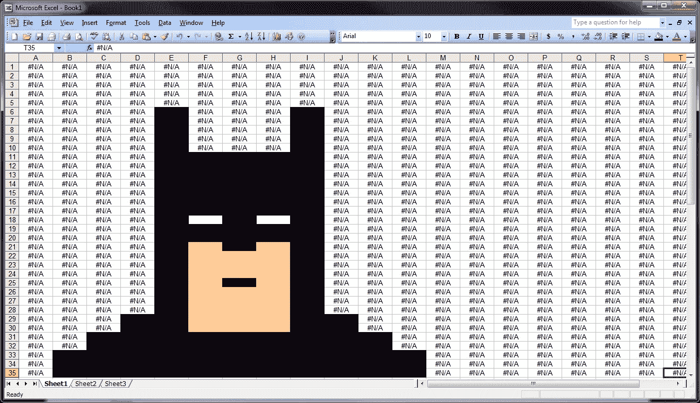
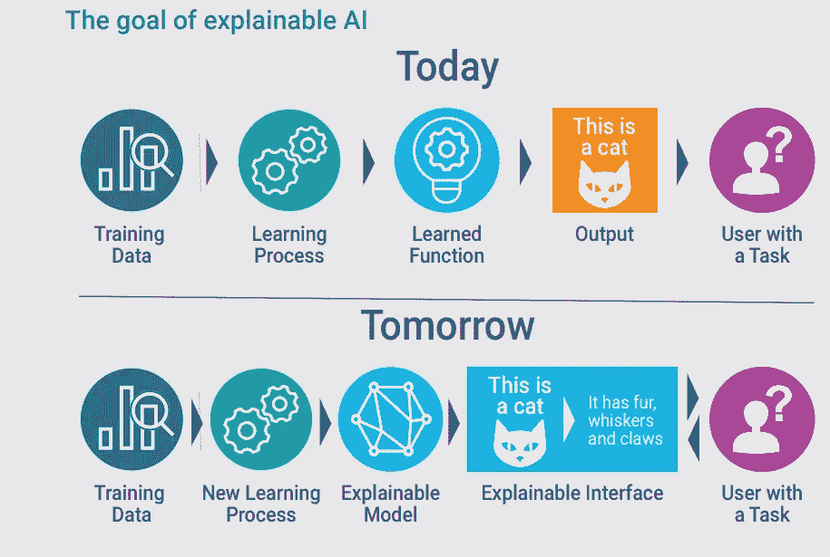
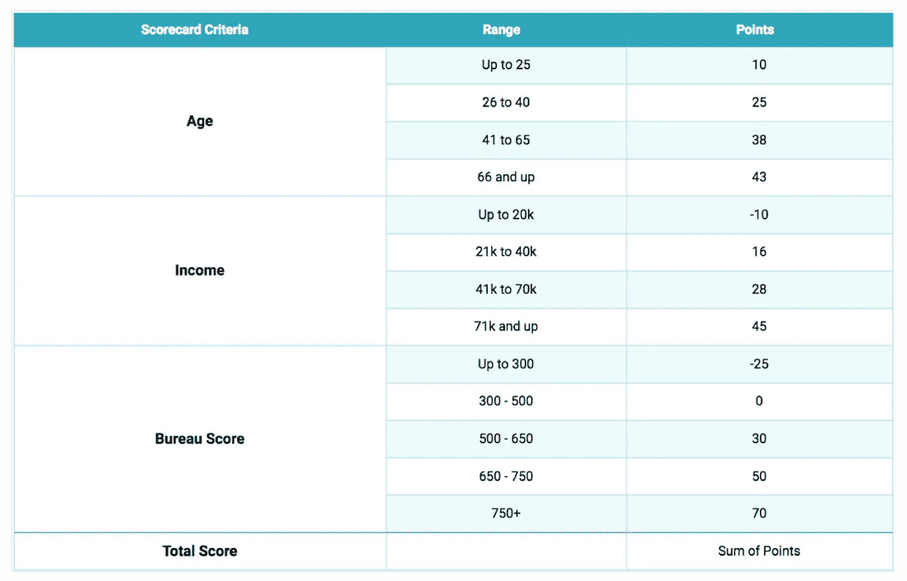
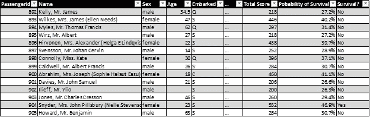

# 为什么不在 Excel 中部署一个机器学习模型？

> 原文：<https://medium.com/analytics-vidhya/why-not-deploy-a-machine-learning-model-in-excel-fc95fe4e0629?source=collection_archive---------10----------------------->

那些性感的机器学习模型通常让不太懂技术的人/公司望而生畏。不如帮他们一个忙，提供一个易于理解并且可以在他们的电子表格中使用的模型？

(来源=[https://www . Reddit . com/r/funny/comments/fvvz 5/excel _ Batman _ ftfy/](https://www.reddit.com/r/funny/comments/fvvz5/excel_batman_ftfy/))

尽管数据科学是一个专业领域，需要一定水平的专业知识，但你无法避免与技术不太先进的利益相关者互动。已经煞费苦心地解释了 p 值是什么意思，现在想象一下当你在你的神经网络中呈现前向和后向传播时你必须经历的麻烦。更糟糕的是，

> 如果他们问你为什么会得出一个特定的预测呢？

实话实说吧；我们自己甚至不知道答案，至少在大多数时候是这样。最近有人试图解释黑盒模型，比如随机森林的*树解释器*和神经网络的*石灰*。然而，缺乏对方法论的直观理解使得先进的方法在传统环境中是不利的。从根本上说，**为什么**不可能用普通的机器学习技术来显示(相关性不是因果关系)，但我们至少应该向我们的利益相关者**展示如何**。

(来源=[https://www . datanami . com/2018/05/30/opening-up-black-box-with-explable-ai/](https://www.datanami.com/2018/05/30/opening-up-black-boxes-with-explainable-ai/))

当我们等待这项技术蓬勃发展的时候，我们至少需要现在就有一些东西:一个具有良好预测准确性并且易于理解和解释的模型。

> 假设现在我理解了这个模型，但是我们的系统已经过时了。我们需要为您的模型提供新的基础设施。预算问题，诸如此类，所以也许以后再来？

这种情况并不少见，尤其是小企业或者传统行业。当涉及到新的开发时，他们缺乏系统进步有时会起到决定性的作用。升级过程极其漫长且成本高昂，但回报不会立竿见影。他们注定要被数据科学抛弃吗？

好消息来了，在一个特定的行业中，人们付出了巨大的努力来使他们的模型变得可以理解(对于审计、立法和实施)。那就是**信用评级行业**。想想你的 FICO 分数或信用卡申请表。幕后有一个机制，*一个记分卡*。现代的计分卡方法是解决上述理解和部署问题的一个很好的例子。

信用卡或贷款申请记分卡示例

记分卡背后的建模逻辑不难理解。本质上，我们找到对目标变量(贷款违约、客户流失甚至活动响应)影响最大的因素，将所有变量纳入一个**逻辑回归**模型，并将系数转换为可解释的分数。然后我们可以把所有观察结果的分数加起来进行比较。

为了让记分卡更有趣，我们可以使用 Siddiqi 的*智能信用评分* (2017)中建议的公式，将分数转换为事件发生的概率。并用概率来做我们的分类工作。我们甚至可以通过整理出最高的贡献因子得分来指明得分的原因。

> 那么，你承诺的这个“Excel 模型”开发是什么样子的呢？

为了更好地说明这种方法，我使用了来自 ka ggle(【https://www.kaggle.com/c/titanic】)的著名的 Titanic 数据集，并带着一个非常不同的目标参加了比赛:只使用 excel 进行模型部署和预测。

借鉴了信用风险建模的理念，加上因子选择和工程上的一些变化，我成功开发了一个记分卡，并完全在 Microsoft Excel 中进行了预测。

使用 Excel 应用记分卡进行预测

提交返回的分数为 0.72248，对应的准确率为 72.2%。这是肯定的，不是我最好的结果，但这是我能交给我父亲(一位退休的机械工程师)并让他做预测的唯一模型。

# 最后

这篇文章绝不是在推广非最优模型。我只是想强调一种进化的方法来解决人工智能的巨大进步。

由于规模、技能和管理结构的原因，一些市场参与者无法更快地行动。更简单的方法是创造一条路径，未来可能最终会到来。