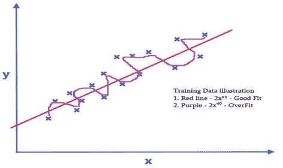
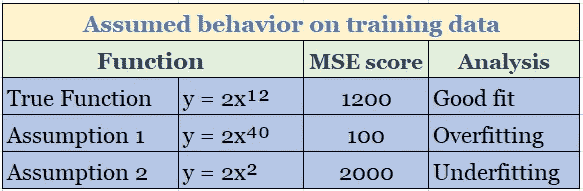
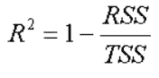
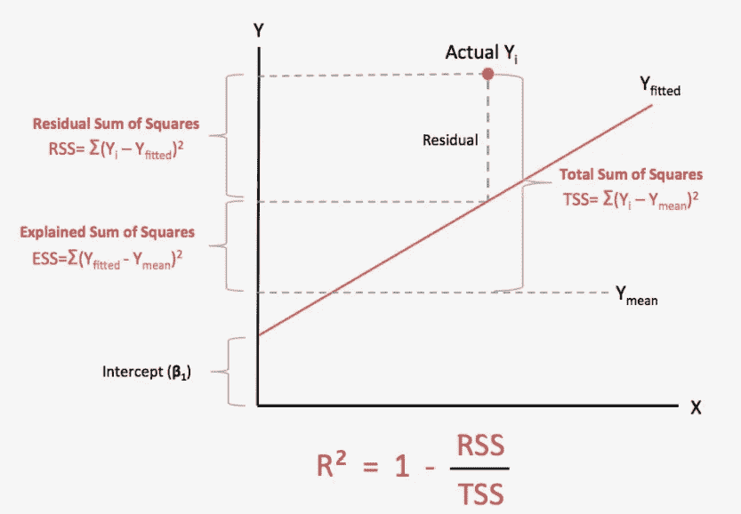
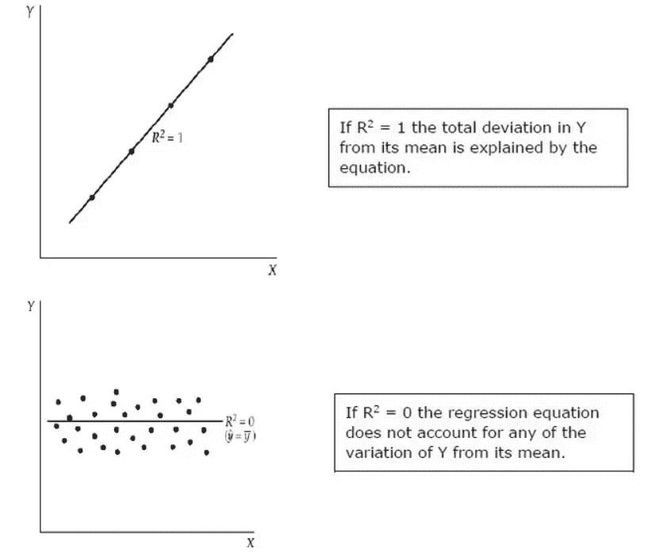
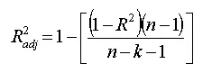

# 为什么 MSE 或 RMSE 不是一个足够好的回归指标？所有关于 R 和调整后的 R

> 原文：<https://medium.com/analytics-vidhya/why-not-mse-or-rmse-a-good-metrics-for-regression-all-about-r%C2%B2-and-adjusted-r%C2%B2-4f370ebbbe27?source=collection_archive---------10----------------------->

> 在机器学习中有一个严重的问题，即使你得到一个好成绩，你怎么知道它是一个好成绩？我们将学习用于评估回归问题的度量标准。

这篇文章将帮助你回答以下问题？

*   回归评估的好度量是什么？
*   为什么使用 MSE 和 RMSE 不是回归评估度量的好主意？
*   为什么调整后的 R 优先于 R？

## 为什么使用 MSE 或 RMSE 不是一个好主意？

让我们通过虚拟数据分析来看看。蓝点代表训练数据。现在，我在这个数据上画一条假设线，这可能是一个很好的拟合，然后选择一个更高和更低的阶函数，通过计算 MSE 分数来查看它对数据的影响。

图表与图形比较

增加函数复杂度确实会降低训练中的 MSE 分数。并且会诱使您为您的模型选择这个函数。但是等等！！你用你的测试数据验证这个模型了吗？

它在训练数据上表现不错，但在测试数据上表现不佳。这个场景被描述为过度拟合，我们试图得到一个覆盖所有点的函数。如果你试图减少功能，可能会导致不合身。

在这两种情况下，测试分数和训练分数之间的差异将非常明显，使我们很难找到一个好的拟合线。现在我们知道为什么我们的 MSE 或 r MSE 号对我们撒谎了！！

# 什么是 R 平方？

我们无法判断 MSE 或 RMSE 分数的主要原因是，因为没有范围可以帮助我们做出更好的判断。

你不知道 10 分比 1 分好吗？规模确实有帮助！！！

R 平方(R)也称为*决定系数。它定义了因变量(Y/target)的方差程度可以用自变量(X/Features)来解释。*

R 值从 0 到 1 不等。1 分是理想值，100%的变化可以用输入特征变量来解释。它提供了最佳拟合线的优点。

## **得出 R 公式**

r 是来自回归模型(SSR)的 ***残差的平方和*** 与来自平均模型(TSS)的 ***误差的平方和*** 之比，然后将其从 1 中减去。

*   **SSE :** It 是衡量我们的模型预测与观察值之间的差距。简单地说，它是实际观察值(y)和预测值(y^)之差的平方和
*   **TSS :** 它是目标变量中方差的度量。它被简单地测量为每个实际观察值(y)和目标平均值(ȳ平均值)之间的平方差的总和

承蒙:[https://twitter.com/KirkDBorne](https://twitter.com/KirkDBorne)

当 R 为 1(无任何误差的最佳拟合)和 0(不适合的模型)时:

## R 在哪里失效？-

*   r 假设每个变量都有助于解释目标的变化，这可能并不总是正确的。
*   例如，如果我们给数据增加一个新的特征(可能有用也可能没用)，模型的 R 值会增加或保持不变，但 ***永远不会减少*** 。
*   对于惩罚新增加的独立特征变量，其可能相关也可能不相关，是通过调整 R 来完成的。

## 调整后的 R 解释

*   它也类似于 R 计算自变量和因变量之间的变化。
*   但是，与 R 不同，它通过惩罚自变量来考虑新增加的特征对自变量的积极或消极影响。

让我们从数学上理解这一特点是如何适应调整后的 R。

其中:

*   ***n*** 是数据样本中的点数。
*   ***k*** 是独立特征的数量，即你的模型中变量的数量，不包括常数。

在添加额外的功能时，调整后的 R2 将通过惩罚这些额外的变量来补偿这一点。

> ***注:******调整后的 R* 值通常为正，**也可以为负**。如果您的 R2 为零，这可能会发生；**
> 
> **调整后，该值可能下降到零以下。这通常表明您的模型不适合您的数据。**
> 
> **您的模型的其他问题也可能导致零值，例如没有在您的模型中放置一个常数项。**

**我希望它有助于回答我们在文章开头定义的几个问题。敬请期待！！继续学习！！注意安全！！**

**快乐学习！！:)**

 **[## R 平方与调整后的 R 平方

### 回归模型的评价指标及其比较

medium.com](/analytics-vidhya/r-squared-vs-adjusted-r-squared-a3ebc565677b)** ** [## 线性回归 101(第二部分-指标)

### 我们上次(第 1 部分)没有讨论线性回归的基础。具体来说，我们学习了关键术语…

dziganto.github.io](https://dziganto.github.io/data%20science/linear%20regression/machine%20learning/python/Linear-Regression-101-Metrics/)  [## R 平方(R)和调整后的 R 平方

### 大家好，今天我们将讨论 R-Square 和调整的 R-Square，以便获得更多关于 R-Square 的知识

medium.com](/analytics-vidhya/r-square-r²-and-adjusted-r-square-63b77d4a6bd7)**