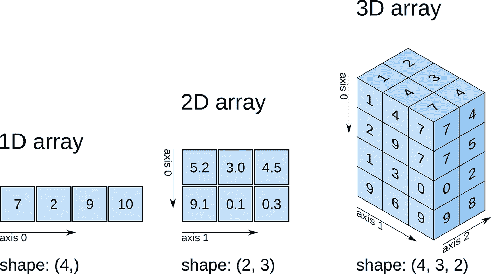
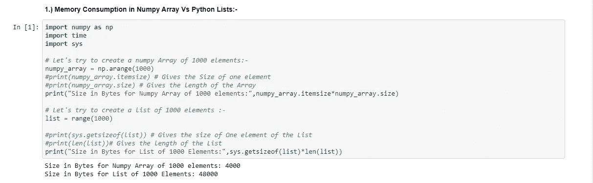
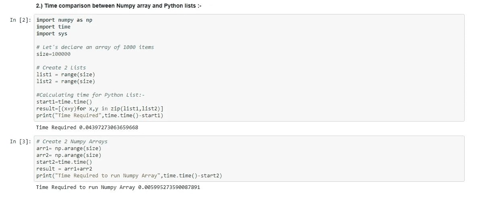
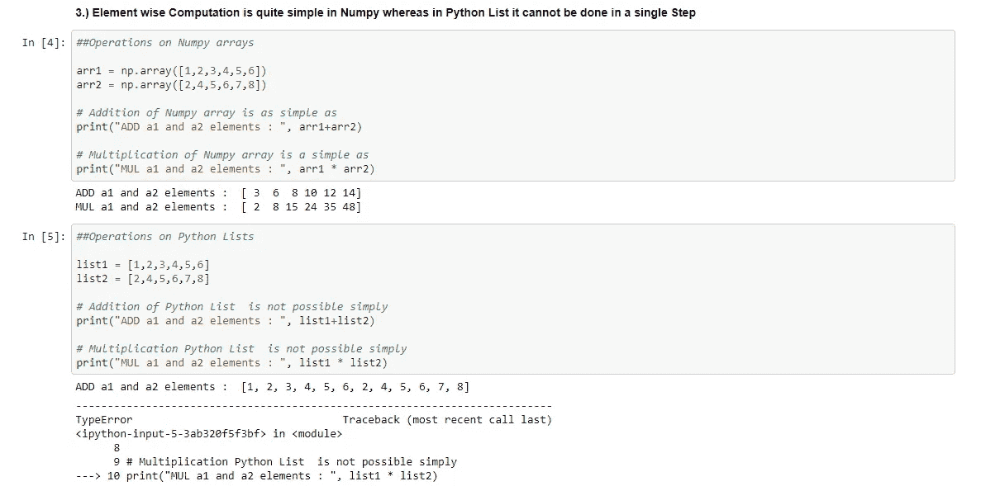

# 为什么 Numpy 数组胜过列表？

> 原文：<https://medium.com/analytics-vidhya/why-numpy-arrays-over-lists-401123b411b8?source=collection_archive---------16----------------------->

## 让我们详细了解和探索一下为什么我们不能使用 Python 列表，而是切换到 Numpy 数组来处理数据科学相关的东西。

Numpy 是多维数组

先说这个探索是怎么开始的。我们和我们的一个教练一起学习&他告诉我们 Numpy 比 Lists 更快，你不应该深入细节。

> 但是你们都知道😃我们的思维是相反的，被要求不要做的事情我们会先去做，所以这是深入讨论这个话题的动机。

***第一次尝试:-***
这没什么了不起的&我发现大多数可以在列表中执行的操作也可以在 Numpy 数组中完成。

# Python 列表和 Numpy 数组之间的相似之处:-

*   两者都是用于存储数据的数据结构。
*   在这两者中，可以进行插入、删除、追加和连接。
*   两者都是可变的
*   两者都可以被索引和迭代

***第二次尝试:*** 当我探索了两个列表& Numpy 数组如何存储在内存中时，我开始接近我的问题的答案，即**为什么 Numpy 数组比列表快？**

# Python 列表和 Numpy 数组的差异和内部存储:-

1.  )Numpy 是固定类型，存储同类数据，而 List 可以存储异类数据。
    **好处:-**
    消耗**内存少**。

2.)在遍历 Numpy 数组时不进行类型检查，而在 List 中，需要检查每个元素是否是字符串、布尔、浮点等

3.)Numpy 使用连续内存——在 List 中，信息将分散在内存块中。

**好处:-** i .)我们的计算机有 SIMD(单指令多数据)向量处理单元，当内存块彼此相邻时，这些单元可以得到有效利用。
二。)有效缓存利用率iii。)与 Python 列表相比，这使得 Numpy 更快。

[哈雷戴维森](https://unsplash.com/@harleydavidson?utm_source=medium&utm_medium=referral)在 [Unsplash](https://unsplash.com?utm_source=medium&utm_medium=referral) 上拍摄的照片

3.)列表中的逐项计算是不容易的。
**好处:-** 使用起来比较**方便。**

# 让我们用 Python 笔记本中的代码片段来理解每一个:-

> 关于代码库，请查看 GitHub 链接:- [**Python 列表 Vs Numpy 数组. ipynb**](https://github.com/bansalabhay/Python-Skill-Set/blob/master/Python%20Lists%20Vs%20Numpy%20Arrays.ipynb)

# 如果你喜欢这篇文章，请点击👏按钮背书。这将有助于其他媒体用户搜索它。

随时欢迎反馈😄