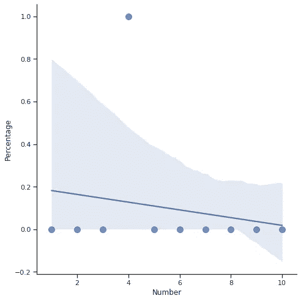
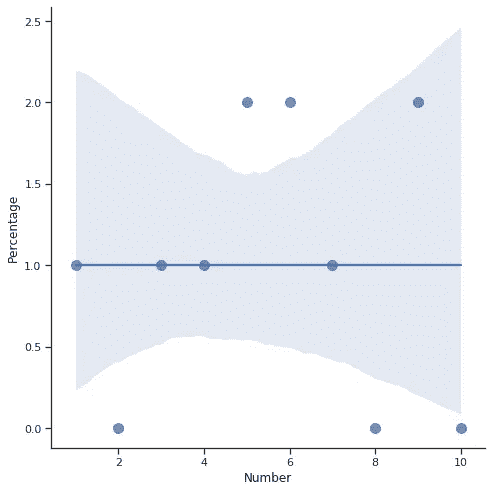
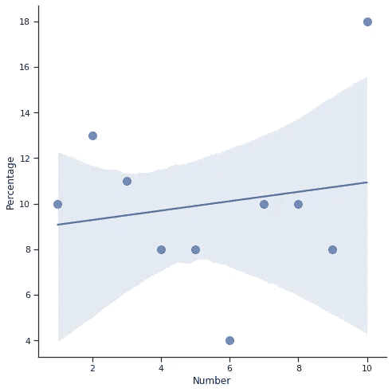
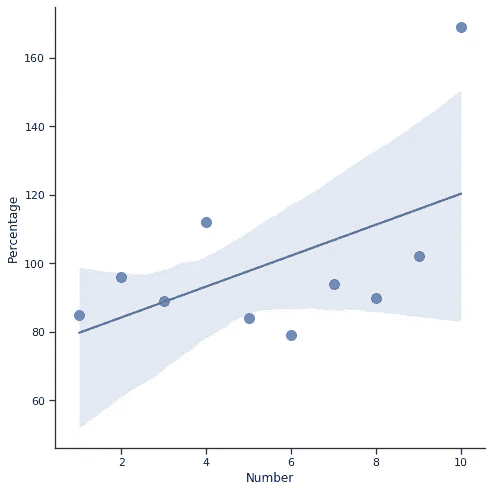
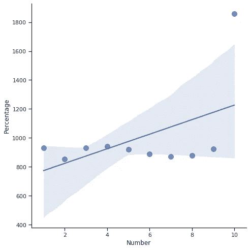
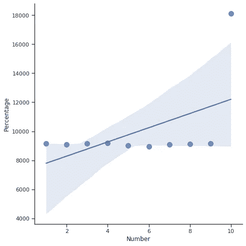
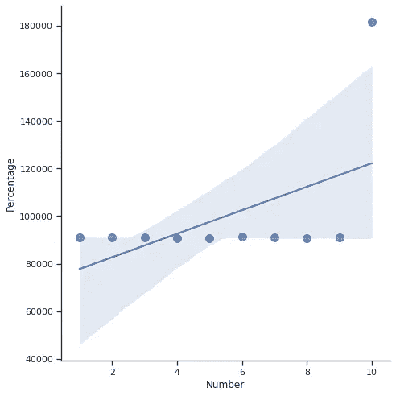
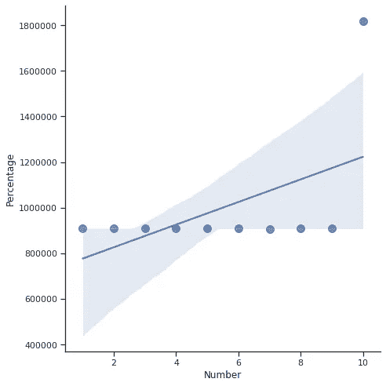
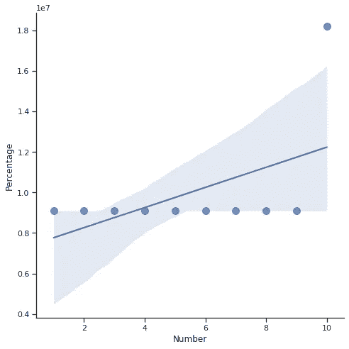

# 为什么 Python 的 randint()不是 random？

> 原文：<https://medium.com/analytics-vidhya/why-pythons-randint-isn-t-random-79f5ffa6acb3?source=collection_archive---------25----------------------->

我对计算机及其背后的代码很好奇。我喜欢确认已知的真相。大多数时候，我确认它们是真的。但这一次，似乎一个已知的事实是错误的。这篇文章将与这篇文章相关。

我用 Python 已经 2 年了。我使用了几个 Python 库。“随机”库是最有用的库之一。我从某处听说(我不记得确切的来源)如果我使用 randint 函数，我会得到随机数。如果我增加生成的数量，我会得到非常接近的数量。

我在 Google Colab 上准备了一个基本算法，可以生成从 1 到 10 的“n”次数字，并显示它们的百分比。我也用“海洋”来形象化它。这是代码和结果。

**导入库:**

```
# Import the necessary librariesimport matplotlib.pyplot as pltimport seaborn as snsimport pandas as pdimport random
```

**创建一个函数来重复计算。**

```
# Create a function to repeat processdef PrintPercentage(x):
    Array = [0] * 10
    for a in range(0,x):
         r = random.randint(0, 10)
         Array[r-1] +=1
    print(“After “+str(x)+” times generation, percentages:”)
    print(“ 1: %”+str(round(Array[0]/x*100,2)))
    print(“ 2: %”+str(round(Array[1]/x*100,2)))
    print(“ 3: %”+str(round(Array[2]/x*100,2)))
    print(“ 4: %”+str(round(Array[3]/x*100,2)))
    print(“ 5: %”+str(round(Array[4]/x*100,2)))
    print(“ 6: %”+str(round(Array[5]/x*100,2)))
    print(“ 7: %”+str(round(Array[6]/x*100,2)))
    print(“ 8: %”+str(round(Array[7]/x*100,2)))
    print(“ 9: %”+str(round(Array[8]/x*100,2)))
    print(“10: %”+str(round(Array[9]/x*100,2))) x = [1,2,3,4,5,6,7,8,9,10] y = Array data = pd.DataFrame(data={‘Number’: x, ‘Percentage’: y}) grid = sns.lmplot(‘Number’, ‘Percentage’, data, height=7, truncate=True, scatter_kws={“s”: 100}) plt.show()
```

**用 1 到 100M 次运行 randint()函数。**

```
PrintPercentage(1)PrintPercentage(10)PrintPercentage(100)PrintPercentage(1000)PrintPercentage(10000)PrintPercentage(100000)PrintPercentage(1000000)PrintPercentage(10000000)PrintPercentage(100000000)
```

**1 次生成后，百分比:**

1: %0.0

2: %0.0

3: %0.0

4: %100.0

5: %0.0

6: %0.0

7: %0.0

8: %0.0

9: %0.0

10: %0.0



**1 次生成后，百分比**

**10 次代后，百分比:**

1: %10.0

2: %0.0

3: %10.0

4: %10.0

5: %20.0

6: %20.0

7: %10.0

8: %0.0

9: %20.0

10: %0.0



**10 次生成后，百分比**

**100 代后，百分比:**

1: %10.0

2: %13.0

3: %11.0

4: %8.0

5: %8.0

6: %4.0

7: %10.0

8: %10.0

9: %8.0

10: %18.0



100 代后，百分比

【1.000 倍代后，百分比:

1: %8.5

2: %9.6

3: %8.9

4: %11.2

5: %8.4

6: %7.9

7: %9.4

8: %9.0

9: %10.2

10: %16.9



经过 1.000 次生成后，百分比

**10.000 倍代后，百分比:**

1: %9.32

2: %8.55

3: %9.32

4: %9.42

5: %9.19

6: %8.88

7: %8.71

8: %8.79

9: %9.23

10: %18.59



10.000 次生成后，百分比

**100.000 倍代后，百分比:**

1: %9.16

2: %9.08

3: %9.14

4: %9.18

5: %9.01

6: %8.94

7: %9.08

8: %9.13

9: %9.16

10: %18.12



100.000 次生成后，百分比

**1 . 000 . 000 倍代后，百分比:**

1: %9.11

2: %9.1

3: %9.09

4: %9.08

5: %9.07

6: %9.12

7: %9.09

8: %9.05

9: %9.11

10: %18.18



1.000.000 次生成后，百分比

**10 . 000 . 000 次代后，百分比:**

1: %9.09

2: %9.09

3: %9.11

4: %9.08

5: %9.08

6: %9.09

7: %9.08

8: %9.09

9: %9.1

10: %18.18



10.000.000 次生成后，百分比

**100 . 000 . 000 次生成后，百分比:**

1: %9.09

2: %9.09

3: %9.09

4: %9.09

5: %9.09

6: %9.09

7: %9.09

8: %9.09

9: %9.09

10: %18.18



100.000.000 次生成后，百分比

# 结论

正如你所看到的，当我达到 1 亿次时，所有的百分比都是一样的，除了 10。所以我不想扩大样本。 **randint()** 函数总是生成 10，比其他数多两倍。也许我做错了什么。但我想分享给专家们，问问他们的意见。你怎么想呢?是我做错了什么还是 randint() 函数不能正常工作？

代码来源:[https://colab . research . Google . com/drive/1 FX 0 TF 93 gsmmurzkygrqr 7g 5 anrpdeqdn](https://colab.research.google.com/drive/1fX0TF93GSMMuRZKygRQr7g5anRPDEQdn)

土耳其文:[https://mahiryildizan . com/Blogs/Neden-randint-rast gele-degil/](https://mahiryildizhan.com/Blogs/Neden-randint-rastgele-degil/)