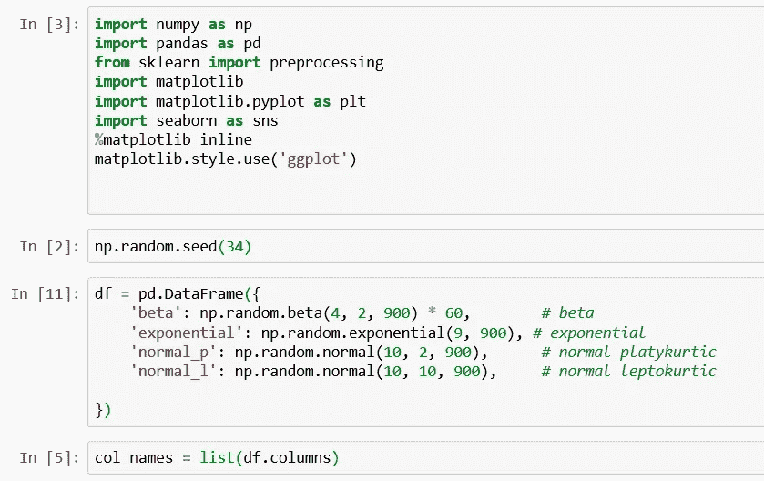
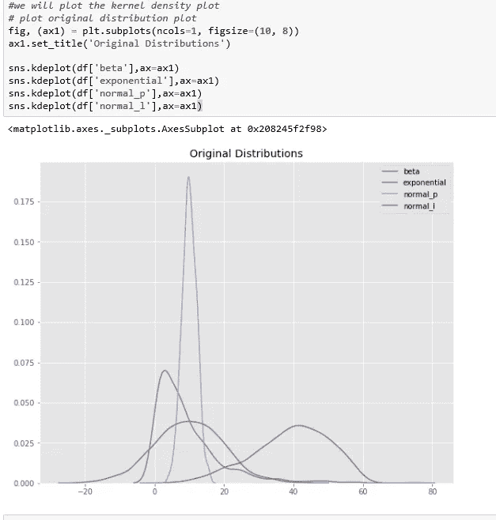
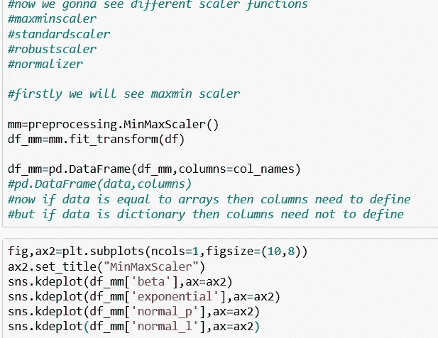
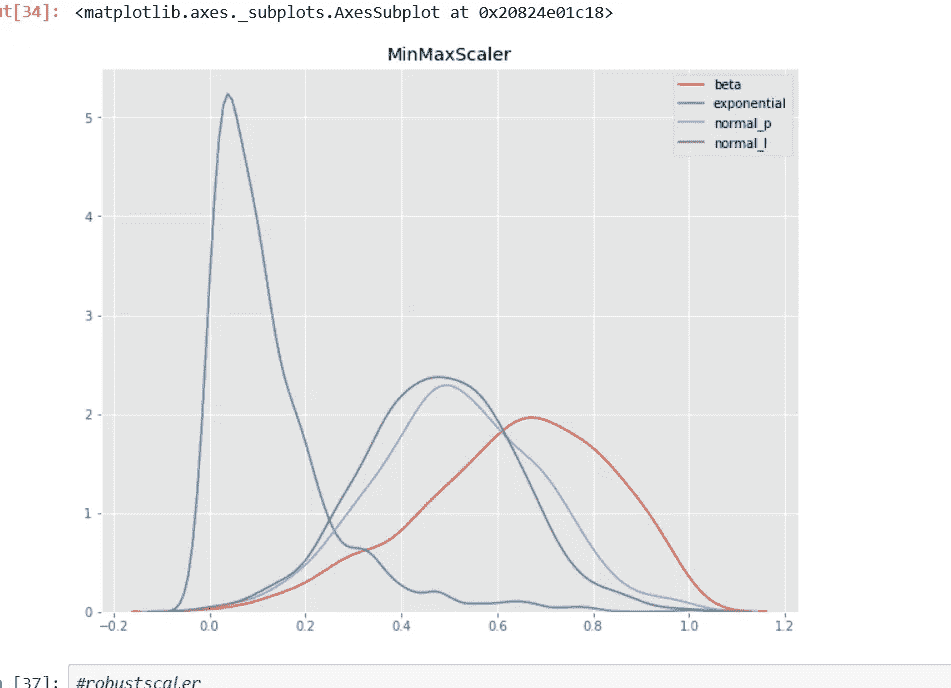
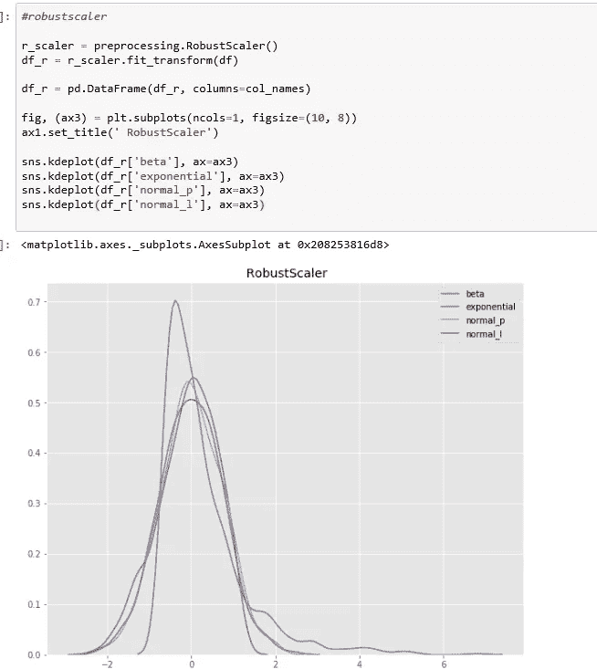
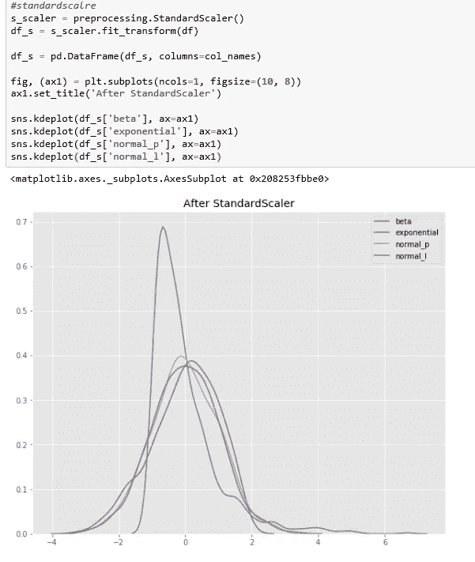
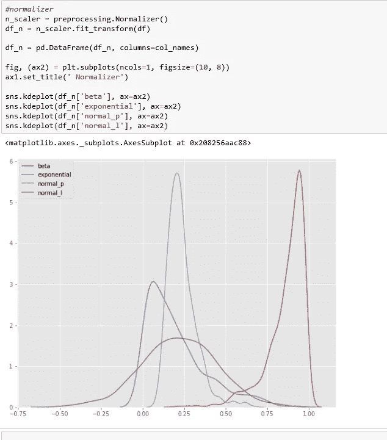

# 为什么缩放在机器学习中很重要？

> 原文：<https://medium.com/analytics-vidhya/why-scaling-is-important-in-machine-learning-aee5781d161a?source=collection_archive---------4----------------------->

当要素相对处于相似的规模且接近正态分布时，ML 算法的效果更好。

威廉·沃比在 [Unsplash](https://unsplash.com?utm_source=medium&utm_medium=referral) 上的照片

## 让我们理解规模、标准化和规范化的含义

1.  **标度**——表示改变数值范围，但不改变分布形状。范围通常设置为 0 到 1。
2.  **标准化**-这意味着改变数值，使平均值的分布标准偏差等于 1，输出将非常接近正态分布。
3.  正常化-它可以用在以上两个词中的任何一个，用这个词可能会引起混淆，所以我个人不经常用这个词。

## 为什么我们需要标准化或规范化我们的特征？

当特征相对较小或接近正态分布时，算法收敛得更快。

这种算法例子有:

1.  线性和逻辑回归
2.  k 最近邻
3.  神经网络
4.  主成分分析
5.  皱胃向左移
6.  具有径向偏差核函数的 SVM

## Scikit-Learn 库为我们提供了一些很好的选项来扩展或规范化我们的特性。

1.  ***minmax scaler()***
2.  ***robust scaler()***
3.  ***standard scaler()***
4.  ***规格化器()***

让我们做一个小的 python 项目来理解这些定标器。

## 原始资料

我创建了四个具有不同特征的发行版。这些分布是:

*   **beta** —负偏斜
*   **指数**——正偏斜
*   **正常 _p** —正常
*   **正常 _l** —正常

1

这些值都具有相对相似的比例，如下面的内核密度估计图(kdeplot)的 X 轴所示。

2

## 最小最大缩放器

[最小最大缩放器](https://scikit-learn.org/stable/modules/generated/sklearn.preprocessing.MinMaxScaler.html#sklearn.preprocessing.MinMaxScaler)减去特征中的最小值，然后除以范围。该范围是原始最大值和原始最小值之间的差值。

MinMaxScaler 保留原始分布的形状。它不会有意义地改变嵌入在原始数据中的信息。

注意，MinMaxScaler 不会降低异常值的重要性。

MinMaxScaler 返回的特征的默认范围是 0 到 1。

下面是应用 MinMaxScaler 后的 kdeplot。

3

4

## 鲁棒定标器

[RobustScaler](https://scikit-learn.org/stable/modules/generated/sklearn.preprocessing.RobustScaler.html) 通过减去中值，然后除以四分位数范围(75%值-25%值)来转换特征向量。

请注意，RobustScaler 不像 MinMaxScaler 那样将数据缩放到预定的间隔。它不符合我前面介绍的*规模*的严格定义。

请注意，应用 RobustScaler 后，各功能的范围比应用 MinMaxScaler 时更大。

相对于最小最大缩放器，如果要减少异常值的影响，请使用鲁棒缩放器。

5

## 标准缩放器

[标准缩放器](https://scikit-learn.org/stable/modules/generated/sklearn.preprocessing.StandardScaler.html)通过减去平均值然后缩放至单位方差来标准化特征。单位方差是指所有值除以标准偏差。StandardScaler 不符合我前面介绍的*标度*的严格定义。

StandardScaler 产生标准差等于 1 的分布。方差也等于 1，因为*方差=标准差的平方*。而 1 的平方= 1。

StandardScaler 使分布的平均值为 0。大约 68%的值将位于-1 和 1 之间。

6

## 标准化者

[规格化器](https://scikit-learn.org/stable/modules/generated/sklearn.preprocessing.Normalizer.html)作用于行，而不是列！我觉得这很不直观。在文档中很容易遗漏这些信息。

默认情况下，L2 归一化应用于每个观测值，以便一行中的值具有单位范数。*具有 L2 的单位范数*意味着如果每个元素被平方并求和，则总和等于 1。或者，可以应用 L1(又名出租车或曼哈顿)归一化来代替 L2 归一化。

7

## 结论

1.  使用 MinMaxScaler()如果你正在转换一个特征，它不会扭曲
2.  如果有异常值，使用 RobustScaler()，这个定标器将减少异常值的影响
3.  相对正态分布使用标准标度
4.  我不知道什么是使用 normalize 的最佳情况，如果任何一个读者知道，请评论。

## 感谢您的阅读…

# 尼舍什·戈吉亚

*   ***如果你喜欢这个，*** [***跟我来这里***](/@nishesh.kumar) ***了解更多***
*   ***有兴趣合作吗？下面就来连线一下***[***insta gram***](https://www.instagram.com/nishesh_gogia/)