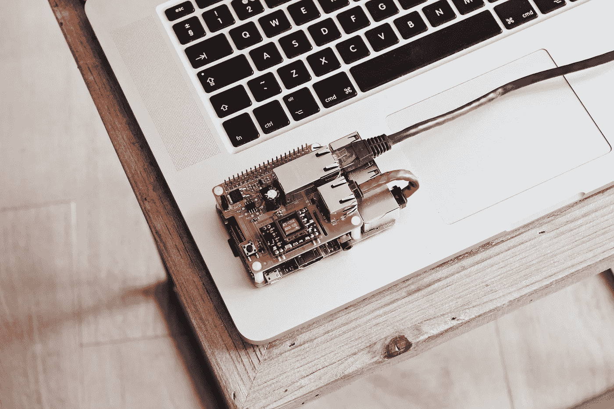

# 为什么要转向智能边缘计算-AIoT？

> 原文：<https://medium.com/analytics-vidhya/why-shift-towards-edge-computing-with-intelligence-aiot-f97f2fe1cff0?source=collection_archive---------11----------------------->

**物联网+人工智能—** 工业 4.0 的一场微妙革命。

边缘计算和物联网已经存在很长时间了，并且正在提供基于将数十亿智能设备连接到互联网并在它们之间传输、可视化和发现来自传感器数据的洞察力的解决方案。边缘计算启发我们，在边缘处理和存储数据有其自身的优势，而不是将数据来回发送到服务器进行决策和其他高级计算过程，但由于资源和功率约束的限制，早期的边缘设备必须将数据发送到中央服务器进行复杂的决策。

随着**人工智能**的出现，现在在边缘处理决策方面有了巨大的改进，或者你可以说这些设备被制造得如此强大，以至于它们可以通过应用运行在边缘设备板上的**机器学习和深度学习模型的能力来即时做出复杂的决策。只有决定或结果被保存或触发作为对网络的通知。很少有优势融合了边缘计算和智能的强大功能:**

*   ***延迟*** *:* 没有到服务器的往返。
*   ***隐私*** *:* 没有数据需要离开设备。
*   ***连接*** *:* 不需要互联网连接。
*   ***耗电*** *:* 网络连接耗电。
*   ***低成本或维护:*** 低成本硬件加速器。
*   ***执行一个动作*** :-设备可以通过分析数据来动作。

## 低预算边缘硬件加速器的发展

*   **Nvidia** -Jetson 系列 nano、TX2、Xavier 等
*   **英特尔**-英特尔 Movidius 神经计算棒
*   **谷歌**-珊瑚板，珊瑚棒
*   **覆盆子馅饼**
*   **AI 使能芯片**:高通芯片
*   **手持设备** : GPU 驱动的手机；安卓、ios

一场竞赛正在进行**构建一个 AI 使能板(GPU，TPU)** 无论是处理输入数据管道还是可能根据数据本身实时做出决策。

**物联网 vs AIoT 详解**

物联网与 AIoT 互联系统

## AI —预处理管道:

可以用一个例子来解释常规数据收集和人工智能数据采集的区别和好处。让我们以**一个基于物联网的连接系统**为例，其中一个相机设备或相机传感器**捕获相机传感器的每一帧**并将其发送到存储设置，而 **AIoT 向系统**提供智能或大脑，可以是用于对象检测、识别或分类等的机器学习或深度学习模型，以仅捕获具有一些有意义的洞察力的帧，如所需对象或其中的异常。类似地，同样的数据采集也适用于其他格式的数据，如语音、非结构化或结构化数据等

## AI —行动管道:

这是 AIoT 的关键，使整个**系统根据处理的数据主动执行**动作。例如，让我们考虑一个用于消防和建筑物维护的 AIoT 系统，因此在这种情况下，安装在建筑物中的边缘设备或传感器将向存储系统发送连续数据，存储系统进一步处理、分析，并最终**使用某种人工智能-机器学习或深度学习模型**在获得结果后采取行动。这防止了对建筑物的进一步损坏。机器设备也是如此，它们的维护成本可以降低。

## 应用程序

通过将物联网和人工智能技术结合在一起，并在现代利用它们的力量，可以使用无数的应用程序。例如，语音识别、疾病预测、自动驾驶汽车、机器人、视频分析和监控、人脸识别系统等

有多个垂直行业将在不久的将来受益，或者已经在使用这些技术。具有人工智能的物联网应用可以用于不同的行业领域，例如:

*   **农业**
*   **医疗保健**
*   **零售**
*   **安全&监控**
*   **机器人&自动化**
*   工厂和工业

人工智能和物联网的融合将使系统变得主动和智能，从而为公司节省数百万美元。例如，在工业 AIoT 设置中，如果系统可以实时预测设备的维护，那么就可以关闭设备或发出警报以防止设备损坏。在炼油厂，漏油是可以知道的。在采矿中，人工智能行动甚至可以挽救宝贵的人的生命。

## AIoT 市场趋势和增长

物联网连接的数量和收入预计都将增长。物联网市场收入份额的增加将分布在不同的行业领域，如公用事业、制造、运输和物流、汽车、医疗保健等。

资料来源:FICCI 报告

**参考文献**:

[https://www . Forbes . com/sites/janakiramsv/2019/08/12/why-aiot-is-emerging-as-the-future-of-industry-40/# 6 dcb 273 f 619 b](https://www.forbes.com/sites/janakirammsv/2019/08/12/why-aiot-is-emerging-as-the-future-of-industry-40/#6dcb273f619b)

【http://ficci.in/spdocument/23092/Future-of-IoT.pdf 