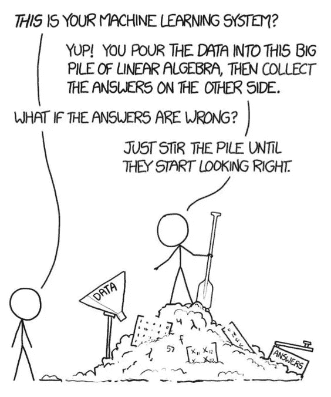
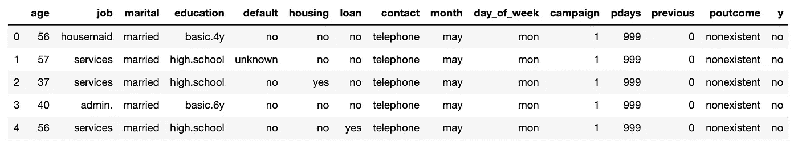
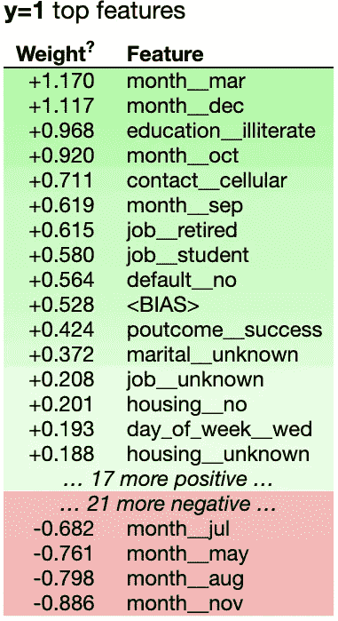
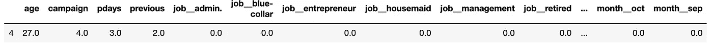
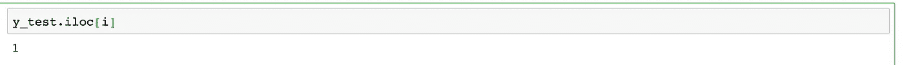
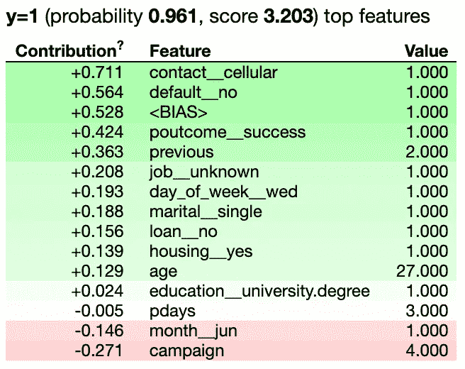
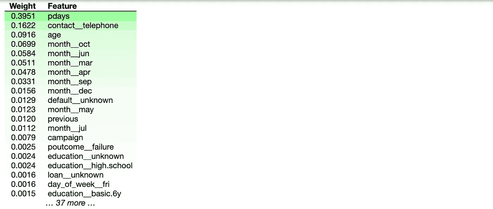
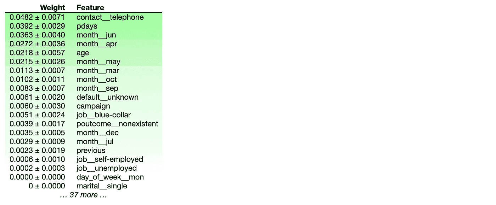

# ML 模型的可解释性:ELI5 和排列重要性

> 原文：<https://medium.com/analytics-vidhya/why-should-i-trust-your-model-bdda6be94c6f?source=collection_archive---------2----------------------->

# 介绍

尽管被广泛采用，机器学习模型仍然主要是黑箱。理解为什么做出某些预测在评估信任时非常重要，如果一个人计划根据预测采取行动，这是非常重要的。这种理解还提供了对模型的深入了解，可用于将不可信的模型或预测转换为可信的模型或预测。*如果用户不信任该模型，他们将永远不会使用它*。

目前，使用可用验证数据集的准确性度量来评估模型。然而，真实世界的数据往往有很大的不同，评估指标可能并不代表产品的目标。除了这样的度量标准之外，检查单个预测及其解释是一个有价值的解决方案。

> 模型是嵌入数学中的观点——凯西·奥尼尔

# **动机**

当我开始使用不同的数据科学模型时，我经常问自己现实世界中的输出质量(不考虑准确性指标)。大多数情况下，作为数据科学家，你得到测试数据，你不知道数据中的偏差，但你会产生一个具有高精度指标的模型。机器学习模型用于各种行业，在这些行业中，数据偏差可能会导致非常有影响力的决策。



数据科学家的生活对话

当您使用简单模型(线性或逻辑回归)时，可以解释样本数据集的结果。通常这些模型是不够的，我们最终使用深度学习模型，这些模型提供了高性能，但对大多数数据科学从业者来说是黑箱。机器学习模型现在被用于做出许多关键决策——*欺诈检测、信用评级、自动驾驶、检查病人等。*

有四个主要框架可以让我们深入了解模型预测

1.  [ELI5](https://github.com/TeamHG-Memex/eli5)
2.  [石灰](https://github.com/marcotcr/lime)
3.  [溜冰者](https://github.com/oracle/Skater)
4.  [SHAP](https://github.com/slundberg/shap)

# ELI5(解释为我 5 岁)&排列重要性

ELI5 是一个 Python 库，它允许使用统一的 API 来可视化和调试各种机器学习模型。它支持所有的 scikit-learn 算法。适合&。预测方法)。它内置了对几个 ML 框架的支持，并提供了一种解释白盒模型(线性回归、决策树)和黑盒模型(Keras、XGBoost、LightGBM)的方法。它适用于回归和分类模型。

查看分类或回归模型有两种主要方式:

1.  全局解释:检查模型参数，并试图弄清楚模型如何全局工作。
2.  局部解释:检查一个模型的单个预测，试图找出为什么模型会做出这样的决定。

对于白盒模型，它支持全局和局部解释，对于黑盒模型，它只支持全局解释。

对于(1) ELI5 提供了`[**eli5.show_weights()**](https://eli5.readthedocs.io/en/latest/autodocs/eli5.html#eli5.show_weights)`功能；对于(2)它提供了`[**eli5.show_prediction()**](https://eli5.readthedocs.io/en/latest/autodocs/eli5.html#eli5.show_prediction)`功能。

它还提供了格式器模块来生成模型解释的 HTML、JSON 和 panda 数据帧

## 演示

我们将使用银行营销数据集— [LINK](https://archive.ics.uci.edu/ml/datasets/bank+marketing) 。该数据与一家葡萄牙银行机构的直接营销活动相关。营销活动以电话为基础。通常，为了了解产品(银行定期存款)是否认购(“是”)或不认购(“否”)，需要与同一客户进行多次联系。

在笔记本中，我解释了如何将 ELI5 与逻辑回归、决策树以及排列重要性概念结合使用

## 数据分析

```
df = pd.read_csv("bank.csv")df.head()
```



我在笔记本上详细描述了运行不同算法所需的预处理步骤。

## 使用 Eli5 获得全局和局部特征的重要性

## 1.逻辑回归

在数据处理之后，我们可以使用 GridSearch 参数来训练我们的模型。

```
# Logistic Regression
lr_model = LogisticRegression(class_weight="balanced",random_state=42)gs = GridSearchCV(lr_model, {"C": [1., 1.3, 1.5]}, n_jobs=-1, cv=5, scoring="balanced_accuracy")
gs.fit(X_train, y_train)
```

我们得到 0.70 的平衡准确度分数。没什么印象。现在，我们将使用 ELI5 来了解盒子内部，并了解它的工作原理。导入 eli5 并使用`show_weights`来可视化你的模型的重量(全局解释)。

```
import eli5eli5.show_weights(lr_model, feature_names=all_features)
```



分配给特征的权重描述

该表给出了与每个特性相关的权重(与逻辑回归给出的现成权重相同)。值告诉我们某个特征对预测的平均影响程度，符号告诉我们影响的方向。在这种情况下，如果营销活动在三月份进行，那么潜在客户订阅该计划的可能性就会大大增加。营销团队在三月份做了一些不同的事情吗？还是潜在客户更有可能在 3 月份订阅？这是一个要问营销团队的问题，取决于答案，这个发现可能有用，也可能没用。

我们也可以用‘Eli 5’来解释一个特定的预测，让我们在测试数据中挑选一行(局部解释):

```
i = 4
X_test.iloc[[i]]
```



客户的详细信息



所选客户已订阅

活动结束后，我们的潜在客户认购了定期存款。让我们看看我们的模型会预测什么，以及我们如何向领域专家解释它。

```
eli5.show_prediction(lr_model, X_test.iloc[i], feature_names=all_features, show_feature_values=True)
```



每个特征对预测的贡献。

对于这个预测，看起来最重要的因素是通过电话联系了潜在客户(`contact__cellular` ==1)，并且没有违约(`default__no` ==1)。这些信息可以与领域专家共享，以理解为什么这些特性很重要。贡献是权重*列值。

2 **。决策树**

```
dt_model = DecisionTreeClassifier(class_weight="balanced")eli5.show_weights(dt_model, feature_names=all_features )
```



与逻辑回归相比，这种解释价值较低。它只是给出了特征重要性，只是给了我这些特征相对于彼此有多重要的幅度，而不是方向。没有红色的值。“pdays”似乎是一个重要的功能，但我不知道减少或增加它会对模型产生什么影响。

通常，对于基于树的模型，ELI5 不做任何特殊处理，而是使用我们在上一节中讨论的现成的特性重要性计算方法。默认情况下，使用“增益”，这是该功能在树中使用时的平均增益。

**ELI5 排列模型**

置换模型是理解黑盒模型的一种方式。它只适用于全局解释。作为输出，它给出的权重值类似于默认情况下通过算法获得的要素重要性，这显示了要素之间的相对重要性。

**概念**

对于每个功能:

1.  打乱所提供数据集中的值
2.  使用修改后数据集上的模型生成预测
3.  计算与洗牌前相比准确度的下降

比较单独随机播放每个特征对准确性的影响。

如果打乱某个特征的值会增加模型误差，则该特征是“重要的”，因为在这种情况下，模型依赖于该特征进行预测。如果对某个特征的值进行调整后模型误差保持不变，则该特征“不重要”，因为在这种情况下，模型会忽略该特征进行预测。

```
from eli5.sklearn import PermutationImportanceperm = PermutationImportance(dt_model, scoring="balanced_accuracy")perm.fit(X_test, y_test)eli5.show_weights(perm, feature_names=all_features)
```

在上面的代码中，我们创建了一个新的`PermutationImportance`实例，它采用我们训练好的模型来解释和评分方法。使用`eli5`的`show_weigths`调用排列重要对象&上的`fit`。这将绘制新功能的重要性:



特征重要性

它将洗牌的次数，并作为输出平均重要性和标准差。它没有给出特征影响模型的方向，只是显示了特征的幅度。当你在新数据上使用你的模型来预测某人是否会同意你的计划时，最重要的是你是否通过电话联系了那个人。你不是在看模型在学习时最重视什么，而是从现在开始，它将如何根据所学的知识来重视特性。

尽管所有模型都提供了自己的方法来计算权重或特性重要性，但 ELI5 提供了一个统一的 API 来访问特性重要性信息。这使得比较模型变得有点容易

ELI5 为 XGBoost 和大多数 scikit-learn 树集成提供了该算法的独立实现，这无疑是朝着模型不可知解释的方向发展，但不像 LIME 那样纯粹是模型不可知的。

本文使用的代码可以在 [**my GitHub**](https://github.com/mayur29/Machine-Learning-Model-Interpretation) 上获得。

在以后的系列文章中，我将介绍模型解释技术。

如果你对 ELI5 有任何问题，请告诉我，我很乐意帮忙。如果你想收到我的博客更新，请在 [Medium](/@sand.mayur) 或 [LinkedIn](https://www.linkedin.com/in/mayursand/) 上关注我！