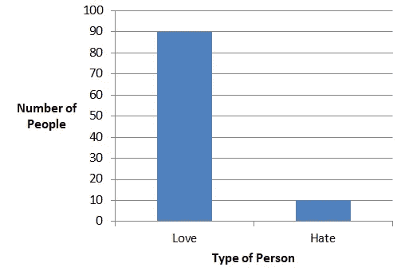
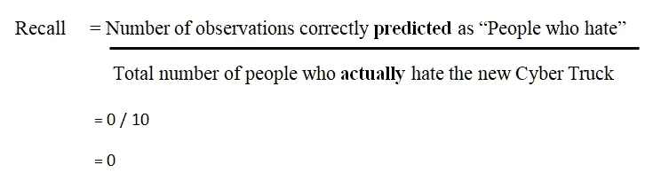
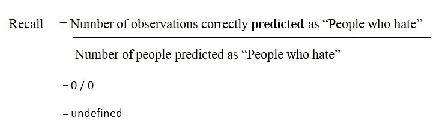
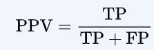
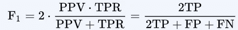

# 为什么要警惕不平衡数据集？

> 原文：<https://medium.com/analytics-vidhya/why-should-we-be-wary-of-unbalanced-dataset-1fade12bd6f2?source=collection_archive---------15----------------------->

通常，当我们冒险使用数据解决一些现实世界的问题时，我们会被不平衡的数据集所震惊。但这真的是个问题吗？让我们找出答案。

**什么是不平衡数据集？**

一个不平衡的数据集对于不同类别的变量(我们希望预测的)没有相同数量的观察值。

让我们考虑一个二进制类分类的例子来理解这一点。

*(将一个元素分类为 2 组中的一组)

假设 100 个人中，有 90 个人喜欢新的特斯拉赛博卡车。但是，10 个人没有。

在这个例子中，我们需要预测其值的变量是“人的类型”。

因此，如果我们基于上述数据训练一个 ML 模型，并基于“准确性”的度量来计算我们的模型的性能，它很可能会产生错误的结果。为什么？

**这是因为如果我们只是预测 100 个人都喜欢新的特斯拉赛博卡车(甚至不使用任何算法)，正确分类的观察结果的准确率将是 90%，这是非常高的。**

准确度=正确分类的观察值数量/观察值总数

因此，有必要对不平衡数据集进行处理，以建立正确的模型来解决问题。

**我们该如何处理上述不平衡数据集的问题？**

1.  **使用“准确性”之外的指标来理解有问题**

我们假设“讨厌 CyberTruck 的人”是正类，“讨厌 CyberTruck 的人”是负类。

*   **召回率/真阳性率(TPR)——**该指标侧重于针对特定类别做出的预测，而不考虑其他类别。所以，在上面的例子中，对“讨厌”网络卡车的人的回忆是

*   **精度/阳性预测值(PPV)**

在被算法分类为阳性的观察值中，有多少实际上被正确分类了。

*   **F1 得分—** 精确度和召回率的加权平均值(调和平均值)

**2。对数据集进行重采样**

*   过采样少数民族阶层(讨厌网络卡车的人)
*   对大多数阶层(喜欢网络卡车的人)采样不足

在过采样之前，将我们的数据集分成训练和测试数据集是一个好主意。这有助于避免在训练和测试数据集中出现相同的观察结果。如果不这样做，它会使模型记住特定的数据点，并最终导致对测试数据的过度拟合和不良概括，

**3。选择另一种算法**

决策树在不平衡数据集上表现很好，因为它们通过 if/else 问题的层次结构进行学习。这实际上可以有力地帮助处理这两个类。

**4。合成样本生成**

这类似于过采样技术。

例如， [imblearn 的](https://imbalanced-learn.readthedocs.io/en/stable/index.html) SMOTE 或合成少数过采样技术可用于相同目的。SMOTE 使用最近邻算法来生成可用于训练模型的新的合成数据。