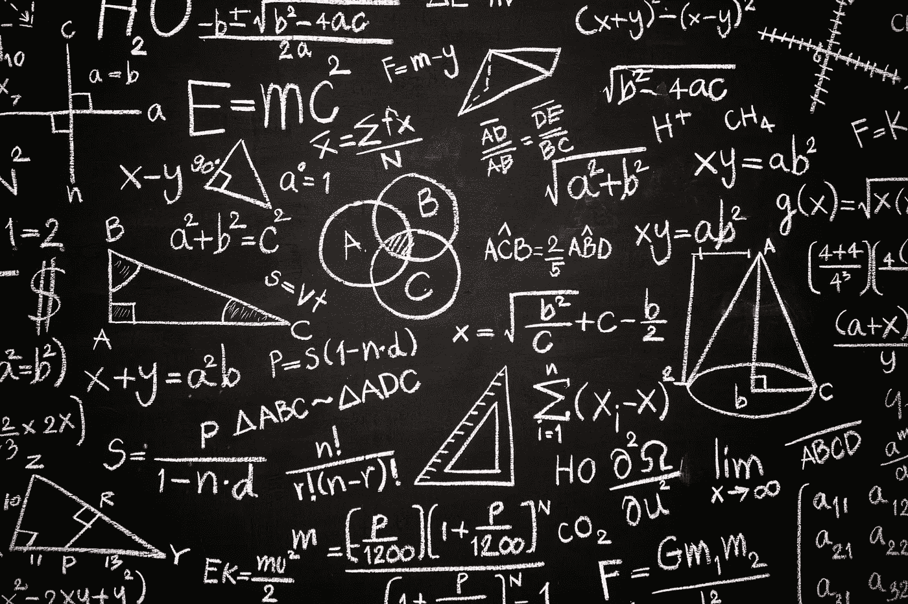

# 为什么要一直用 Numpy？

> 原文：<https://medium.com/analytics-vidhya/why-should-you-always-use-numpy-c4adece8a870?source=collection_archive---------11----------------------->



由 jcomp/Freepik.com 设计

数据科学和大数据密切相关，因为数据量巨大，伟大的数据科学见解才有可能实现。

当学习 Python 进行数据科学时，我们首先介绍的两个库是 ***Pandas*** 和 ***Numpy。***

## 为什么使用 Numpy 如此重要？

Numpy 比其他方法更好，因为它在后台使用 C 语言，C 是一种更高效、更快的低级语言。

## 例子

*   **创建一个平方函数(n * n)；** 4.5 秒 28.5 毫秒
*   **创建一个平方函数(n * * 2)；**7.2 秒 72.1 毫秒
*   ***用列表理解；3.93 秒 32.1 毫秒***
*   ***同图()；4.84 秒 46.8 毫秒***
*   ***同 NumPy63.5 毫秒 392 秒***
*   ***用 NumPy 并转换成列表。1.68 秒 16.1 毫秒***

*首先，创建一个样本:*

```
*import numpy as np#Create a sample with 20 mio. from 0 to 100
sample = np.random.randint(0, 100, 20000000)*
```

*   ***创建一个平方函数(n * n)；***

```
*#Creating a square iterative function (n**2)
def square_f(numbers):
    square = []
    for num in numbers:
        square.append(num * num)
    return square%timeit square_f(sample)*
```

*每循环 4.5 秒 28.5 毫秒(平均标准偏差戴夫。7 次运行，每次 1 个循环)*

*   ***创建一个平方函数(n * * 2)；***

```
*#Creating a square iterative function (n**2)
def square_f2(numbers):
    square = []
    for num in numbers:
        square.append(num ** 2)
    return square%timeit square_f2(sample)*
```

*每循环 7.2 秒 72.1 毫秒(平均标准时间戴夫。7 次运行，每次 1 个循环)*

*如上图， ***n*n*** 比 ***n**2*** 快 1.6 倍。*

*   ***用列表领悟；***

```
*#With list comprehension
def square_comprehension(numbers):
    return [num ** num for num in numbers]%timeit square_comprehension(sample)*
```

*每循环 3.93 秒 32.1 毫秒(平均标准时间戴夫。7 次运行，每次 1 个循环)*

*   ***同图()；***

```
*#With map()
def square_map(numbers):
    return list(map(lambda num: num * num, numbers))%timeit square_map(sample)*
```

*4.84 秒 46.8 毫秒(平均标准差戴夫。7 次运行，每次 1 个循环)*

*   ***同 Numpy***

```
*#With NumPy
%timeit np.power(sample,2)*
```

*每循环 63.5 毫秒 392 秒(平均标准时间戴夫。7 次运行，每次 10 个循环)*

*   ***用 NumPy 并转换成列表；***

```
*#With NumPy and converting to list
%timeit list(np.power(sample,2))*
```

*每循环 1.68 秒 16.1 毫秒(平均标准时间戴夫。7 次运行，每次 1 个循环)*

# *结论*

*如上所述，计算平方数最快的 3 种方法是:*

1.  *numpy(63.5 毫秒)*
2.  *Numpy 转换为列表(1.68 秒)*
3.  *列表理解(3.93 秒)*

*Numpy 比列表理解快 61 倍，但是有时我们需要使用这个值作为列表。即使作为一个列表，Numpy 方法也比其他方法至少快 2，34。当它用于大量数据时，这些微小的调整会产生很大的影响。*

*这些数值是我在配有英特尔 i7、16gb 内存的电脑上获得的。*

*试着做自己，试着做其他的比较，比如在**熊猫**中`.iloc[]`、`.loc[]`和`.query()`的表现差异。*

*请在评论中告诉你得到了什么结果。*