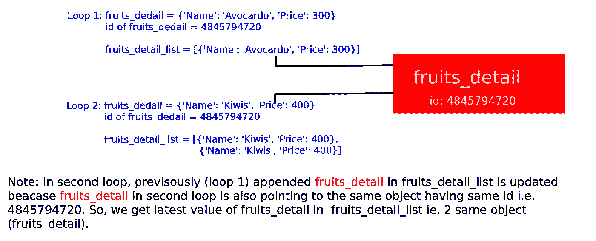

# 为什么要知道“在 python 中，一切都是对象”？

> 原文：<https://medium.com/analytics-vidhya/why-should-you-know-in-python-everything-is-an-object-6a140c0b9293?source=collection_archive---------7----------------------->

我通常更喜欢阅读书籍，而不是视频教程。在我开始学习 python 的时候，我在许多教科书中遇到过这样一句话——“在 python 中，一切都是对象”。这类似于我编码和思考 python 的方式。

***在进入本帖之前，让我们先了解一下 python 中的对象。***

Python 中的一切都是对象，几乎一切都有属性和方法。所有函数都有一个内置属性`__doc__`，它返回函数源代码中定义的文档字符串。sys 模块是一个具有名为 path 的属性的对象。诸如此类。

在不同的编程语言中,“对象”有许多定义。一些语言大师说所有的对象都必须有属性和/或方法。其余的说对象是可子类化的(意味着你可以继承它们)。

然而，在 python 中，定义没有这么严格。python 中的一些对象既没有对象也没有方法。python 与其他语言的另一个显著区别是 python 中的所有对象都不是子类。

总而言之，python 中的任何东西或者你在 python 中创建的任何东西都可以赋给一个变量，并可以作为参数传递给任何可调用的对象(比如函数/类)。因为这个属性，Python 也被称为**一级对象。**

**插图:**

```
# create a list
alist = [3, 5, 7, 8]# lets create another list using same list
blist = alist# Now print both valuesprint("Before perfoming any operations:")
print("alist: ", alist)
print("blist: ", blist)# Its time to do some operation on these list. lets append new object in list
alist.append(23)# again print both valuesprint("After append operation")
print("alist: ", alist)
print("blist: ", blist)
```

输出

```
Before performing any operations:
alist: [3, 5, 7, 8]
blist: [3, 5, 7, 8]After append operation:
alist: [3, 5, 7, 8, 33]
blist: [3, 5, 7, 8, 33]
```

注意我们在“列表”列表上做的操作和在两个(列表，列表)列表上的结果。尽管我们对“list”对象进行了操作，但我们发现它在“blist”上也附加了值 23(在 python 中它本身称为 int object)。

这个结果促使我思考 python 实际上是如何工作的。经过一个小的研究，我知道这是因为“在 python 中，一切都是对象”。让我通过在前面示例中添加几行代码来阐明这一点:

```
print("ID of alist: ", id(alist))
print("ID of blist: ", id(blist))Outputs:
ID of alist: 4844897928
ID of blist: 4844897928
```

你注意到两个列表有相同的 id 吗？是的，这是了解“python 中的一切都是对象”的第一步

***让我用我们反复实施的真实例子来介绍这些东西。***

示例:

```
fruits = ["Avocardo", "Kiwis"]
prices = [300, 400]fruits_detail = {}fruits_detail_list = []for fruit, price in zip(fruits, prices):
    fruits_detail["Name"] = fruit
    fruits_detail["Price"] = price
    fruits_detail_list.append(fruits_detail)print("List of fruits details: ")
print(fruits_detail_list)
```

问题:**你的预期产量是多少？**

可能的预期答案:

> 水果详情列表:
> 
> *[{"Name": "* 牛油果*，"价格":300}，{"Name ":"猕猴桃"，"价格":400}]*

问:**你的实际产量是多少？**

回答:

> 水果详情列表:
> 
> *[{ "姓名":"奇异果"，"价格":400}，{ "姓名":"奇异果"，"价格":400}]*

在我的编程生涯中，当我面对这个问题时，我花了 5 个多小时来解决它。在某些情况下，我甚至改变主意跳过它，尝试其他东西来实现目标。但多亏了我当时做出的决定。我决定找出上面这段代码中的错误。是的，最后我知道这是我愚蠢的错误和大错误。

然后我意识到**为什么要知道“在 python 中，一切都是对象”？**

是的，这个问题的主要咒语/解决方案就是我在这篇文章标题中提到的那句话，即*为什么你应该知道“在 python 中，一切都是对象”？*

让我们深入研究一下上述问题。

```
fruits = ["Avocardo", "Kiwis"]
prices = [300, 400]
fruits_detail = {}fruits_detail_list = []print("Information of fruits_detail inside for loop")for fruit, price in zip(fruits, prices):
    fruits_detail["Name"] = fruit
    fruits_detail["Price"] = price
    print("fruits_detail in each loop: ", fruits_detail)
    print("fruits_detail id: ", id(fruits_detail))
    fruits_detail_list.append(fruits_detail)
print("--------------------------------")print("List of fruits details: ")
print("fruits_detail_list": fruits_detail_list)
print("fruits_detail id: ", id(fruits_detail))
```

输出:

> 循环内水果 _ 明细信息各循环内水果 _ 明细:{ '姓名':'牛油果'，'价格':300}
> 水果 _ 明细 id: 4845794720
> 各循环内水果 _ 明细:{ '姓名':'奇异果'，'价格':400}
> 水果 _ 明细 id:4845794720
> ——————————————————————————————————
> 水果明细列表:
> 水果

**以上输出的要点:**

1.  在每个循环中，我们为 ***水果 _ 细节*** *对象，即*获取唯一值

{ '名称':'鳄梨'，'价格':300}和{ '名称':'猕猴桃'，'价格':400}

2.同样在所有循环中， ***水果 _ 细节*** *对象的 id 是相同的，即* 4845794720

3.但是当我们打印***fruits _ detail _ list***的结果时，追加在***fruits _ detail _ list***中的***fruits _ detail***具有唯一值(从第 1 点开始)的对象并没有打印其内部的唯一值。

*水果 _ 细节 _ 列表:[{ '姓名':'猕猴桃'，'价格':400}，{ '姓名':'猕猴桃'，'价格':400}]*

我们还可以在 for 循环后看到 **fruits_detail** 的 id，与 for 循环中的 id 相同。

## 上述示例中的问题:

追加的对象即 ***水果 _ 细节*** 实际上一点也不唯一。它只是更新同一个对象和 ***水果 _ 细节 _ 列表*** 只是简单地指向更新的 ***水果 _ 细节*** 在其结果。



图一。描述输出

# 如何解决这个问题？

从上面的讨论中，我们知道追加相同的对象会导致意外的输出(最后更新的输出已经在输出中看到)。参考上图。

为了解决这个问题，我们可以在一个循环中创建新对象，并简单复制这个对象( ***fruits_detail*** )。并且比在 ***水果 _ 明细 _ 列表*** 中追加新对象给我 ***水果 _ 明细 _ 列表*** 中的唯一值。这是因为，在每个循环中，新的对象将被创建，这意味着新创建的对象将拥有新的 object_id。

最终代码:

```
fruits_detail = {}fruits_detail_list = []print("Information of fruits_detail inside for loop")for fruit, price in zip(fruits, prices):
    temp_fruits_detail = fruits_detail.copy() #shallow copy
    temp_fruits_detail["Name"] = fruit
    temp_fruits_detail["Price"] = price
    print("fruits_detail in each loop: ", temp_fruits_detail)
    print("fruits_detail id: ", id(temp_fruits_detail))
    fruits_detail_list.append(temp_fruits_detail)
print("--------------------------------")print("List of fruits details: ")
print("fruits_detail_list: ", fruits_detail_list)
```

输出:

> 循环
> 内的水果 _ 详细信息每个循环中的水果 _ 详细信息:{ '名称':'牛油果'，'价格':300}
> 水果 _ 详细信息 id: 4845867944
> 每个循环中的水果 _ 详细信息:{ '名称':'猕猴桃'，'价格':400}
> 水果 _ 详细信息 id:4844859752
> ——————————————————————————————
> 水果详细信息列表:【详细信息

是的，我们得到了期望的输出。

# 结论

这篇文章的主旨是了解什么是 python 中的对象，以及它在 python 解释器中的行为。您应该始终记住，无论何时使用任何对象创建新容器，都要确保原始对象(您用来创建新容器的对象)没有在整个代码中被更新。如果需要更新你的对象，我建议你创建一个临时对象作为原始对象的副本(你也可以选择 shallpw 或 deep copy ),这样原始对象的改变就不会影响新创建的容器对象。