# 为什么社会距离对抗击冠状病毒很重要——对 R

> 原文：<https://medium.com/analytics-vidhya/why-social-distancing-is-important-to-fight-corona-virus-a-network-analysis-of-corona-virus-in-r-b82bc2fb4952?source=collection_archive---------25----------------------->

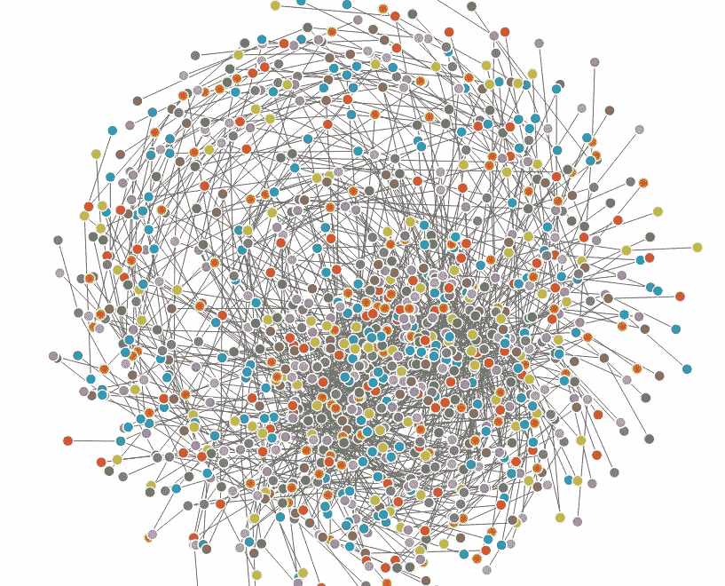

电晕链— 1 到 1000

电晕病毒已经成为全世界人类的噩梦。从中国武汉出发的病毒已经传播到几乎所有国家。

在人类历史上，人类从未面临过如此多的生命威胁，原因是到目前为止似乎还没有任何药物或疫苗可以在病毒进入人体时起到抵抗作用。

我曾经尝试用 networkD3 包在 R 中做一个小的可视化。

你可以在这里阅读更多关于 **networkD3** package [。根据 cran](https://www.rdocumentation.org/packages/networkD3/versions/0.4/topics/forceNetwork) [网站](https://cran.r-project.org/web/packages/networkD3/networkD3.pdf)，这个包从‘R’创建‘D3’‘JavaScript’网络，树，树状图和桑基图。您可以用这个包创建不同类型的网络图。

您可以使用 **simpleNetwork** 函数创建简单的 java 脚本强制定向网络图。您必须显示**源**和**目标**节点，它会为您完成这项工作。你将得到一个带有源和目的地的移动网络图。也可以用鼠标拖动节点。

但是 **simpleNetwork** 不会用不同的颜色显示节点，如果你想的话。由于电晕从一个人传播到另一个人，所以我想展示一些类似的东西。所以我决定用 **forceNetwork** 函数。使用这个函数，你可以用不同的颜色显示节点，显示源节点和目标节点，你可以对它们进行分组等等。

这是 cran 网站上提到的完整的 forceNetwork 功能。你可以在前面的链接中看到完整的细节。

```
*forceNetwork(Links, Nodes, Source, Target, Value, NodeID, Nodesize, Group, height = NULL, width = NULL, 
colourScale = JS(“d3.scaleOrdinal(d3.schemeCategory20);”), 
fontSize = 7, fontFamily = “serif”, linkDistance = 50, 
linkWidth = JS(“function(d) { return Math.sqrt(d.value); }”), radiusCalculation = JS(“ Math.sqrt(d.nodesize)+6”), charge = -30, linkColour = “#666”, opacity = 0.6, zoom = FALSE, legend = FALSE, arrows = FALSE, bounded = FALSE, opacityNoHover = 0, clickAction = NULL)*
```

**forceNetwork** 函数需要两个数据集。一个数据集具有**源节点、目标节点**和连接两个节点的线的**宽度**，另一个数据集具有**名称、id** 和**组**。第二个数据集中的 **id** 与第一个数据集中的**源**节点或**目标**节点相同。第二数据集中的**组**表示 **id** 属于哪个**组**。**组**参数有助于给节点着色。

cran 网站示例中给出的数据集使用了[悲惨世界](https://en.wikipedia.org/wiki/Les_Mis%C3%A9rables_(2012_film))电影数据集。你一定听过[苏珊·波伊尔](https://en.wikipedia.org/wiki/Susan_Boyle)的歌曲【T2 我曾有梦，她在《英国达人》中演唱这首歌后一夜成名。这首歌来自同一部电影。我觉得这首歌很激励人。

我通过创建两个数据集作为**节点**和**边**来创建自己的数据集。我的意图是展示一个冠状病毒感染者如何用冠状病毒感染另外两个人，后者又感染另外四个人，如此循环往复。我在我的数据集中使用了大约 1000 个数据点，并将它们分成 500 组。

所以让我们从 r 开始编码。

确保你下载了包 **networkD3。**

让我们调用库 **networkD3** ，设置我们的工作目录并读取两个文件。

```
library(networkD3)setwd(“D:/Harish/R practice projects/Corona”)edges <- read.csv(“edges22.csv”, header = T)
nodes <- read.csv(“nodes22.csv”, header = T)
```

看看数据集中有什么。

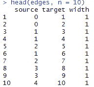

边缘数据集

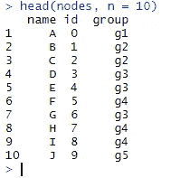

节点数据集

让我们用名为 **A、B、C** 和 **D** 的四个人来运行代码。

```
edges1 <- head(edges, n = 2)
nodes1 <- head(nodes, n = 4)
forceNetwork(Links = edges1, Nodes = nodes1, 
 Source = “source”,
 Target = “target”,
 fontSize = 16,
 NodeID =”name”, 
 Group = “group”, Value = “width”, opacity = 5.0, zoom = TRUE,
 arrows = TRUE, 
 colourScale = JS(“d3.scaleOrdinal(d3.schemeCategory10);”))
```

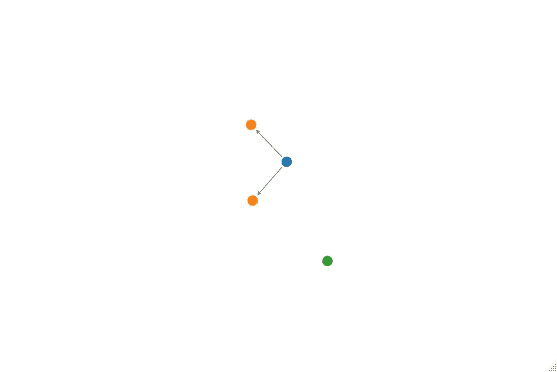

情节 1

在上面的图(图 1)中， **A** (蓝色)已经感染了 **B** (橙色)和 **C** (橙色)。 **D** (绿色)正在四处漫游。让我们看看 **D** 是否保持社交距离。

我把 **edges1** 里的 n 改成了 3，看到现在 **D** 运行下面代码后也感染了(见剧情 2)。

```
edges1 <- head(edges, n = 3)
nodes1 <- head(nodes, n = 4)
forceNetwork(Links = edges1, Nodes = nodes1, 
 Source = “source”,
 Target = “target”,
 fontSize = 16,
 NodeID =”name”, 
 Group = “group”, Value = “width”, opacity = 5.0, zoom = TRUE,
 arrows = TRUE, 
 colourScale = JS(“d3.scaleOrdinal(d3.schemeCategory10);”))
```

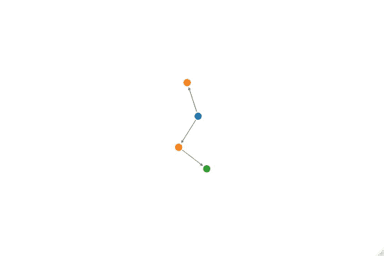

情节 2

让我们进一步将 **edges1** 和 **nodes1** 数据集中的 n 值分别增加到 5 和 10。看看我们在代码下面运行时会发生什么。

```
edges1 <- head(edges, n = 5)
nodes1 <- head(nodes, n = 10)
forceNetwork(Links = edges1, Nodes = nodes1, 
 Source = “source”,
 Target = “target”,
 fontSize = 16,
 NodeID =”name”, 
 Group = “group”, Value = “width”, opacity = 5.0, zoom = TRUE,
 arrows = TRUE, 
 colourScale = JS(“d3.scaleOrdinal(d3.schemeCategory10);”))
```

**A** (蓝色)感染了 **B** (橙色)和 **C** (橙色)。 **B** 进一步感染了 **E** (绿色)和 **D** (绿色)。 **C** (橙色)进一步感染了 **F** (红色)。 **H** (红色) **I** (红色) **J** (紫色) **G** (绿色)正在四处漫游。

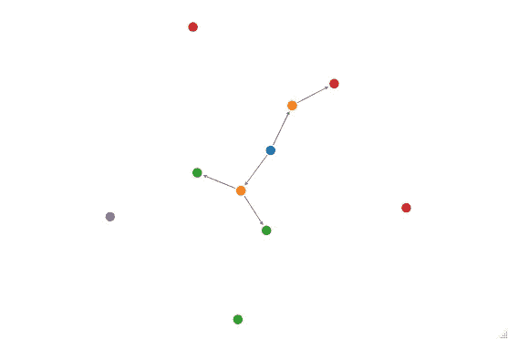

情节 3

万一 **H，I，J** 和 **G** 也是漫不经心，自由自在的闲逛呢？我在下面的代码中进一步增加了 n 计数。请看(下面的图 4)现在 **H** (红色) **I** (红色) **J** (紫色)和 **G** (绿色)也被感染了。

```
edges1 <- head(edges, n = 10)
nodes1 <- head(nodes, n = 15)
forceNetwork(Links = edges1, Nodes = nodes1, 
 Source = “source”,
 Target = “target”,
 fontSize = 16,
 NodeID =”name”, 
 Group = “group”, Value = “width”, opacity = 5.0, zoom = TRUE,
 arrows = TRUE, 
 colourScale = JS(“d3.scaleOrdinal(d3.schemeCategory10);”))
```

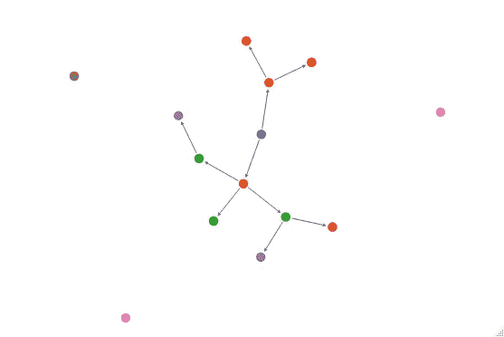

情节 4

我将计数分别增加到 40 和 100。现在看看下图(图 5)中发生了什么。

```
edges1 <- head(edges, n = 40)
nodes1 <- head(nodes, n = 100)
forceNetwork(Links = edges1, Nodes = nodes1, 
 Source = “source”,
 Target = “target”,
 fontSize = 16,
 NodeID =”name”, 
 Group = “group”, Value = “width”, opacity = 5.0, zoom = TRUE,
 arrows = TRUE, 
 colourScale = JS(“d3.scaleOrdinal(d3.schemeCategory10);”))
```

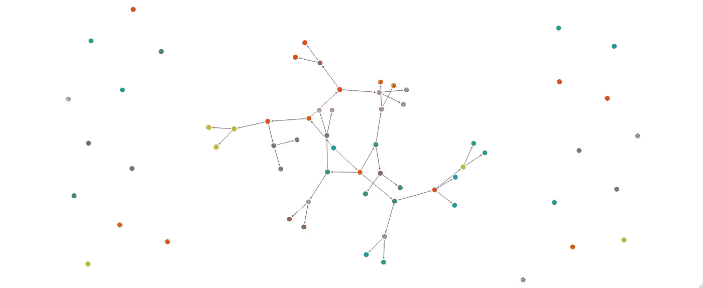

地块 5

我将计数增加到 500，看看这个链是如何爆炸的(图 6)。

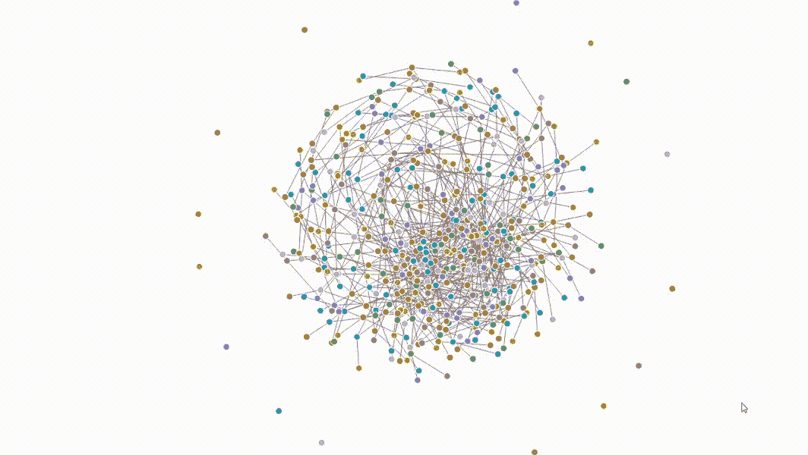

地块 6

我将计数增加到 700 以上，看看它如何进一步爆炸(图 7)。人们没有保持社会距离并为此付出代价。

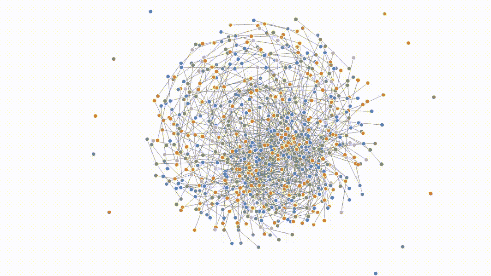

情节 7

我将两个数据集的所有数据点放在一起，在下面的图 8 中看到了 1000 个数据点的完全展开。

```
library(networkD3)setwd(“D:/Harish/R practice projects/Corona”)edges <- read.csv(“edges22.csv”, header = T)
nodes <- read.csv(“nodes22.csv”, header = T)head(edges, n = 10)head(nodes, n = 10)#edges1 <- head(edges, n = 40)
#nodes1 <- head(nodes, n = 100)forceNetwork(Links = edges, Nodes = nodes, 
 Source = “source”,
 Target = “target”,
 fontSize = 16,
 NodeID =”name”, 
 Group = “group”, Value = “width”, opacity = 5.0, zoom = TRUE,
 arrows = TRUE, 
 colourScale = JS(“d3.scaleOrdinal(d3.schemeCategory10);”))
```

这是最终的图，有整整 1000 个数据点。

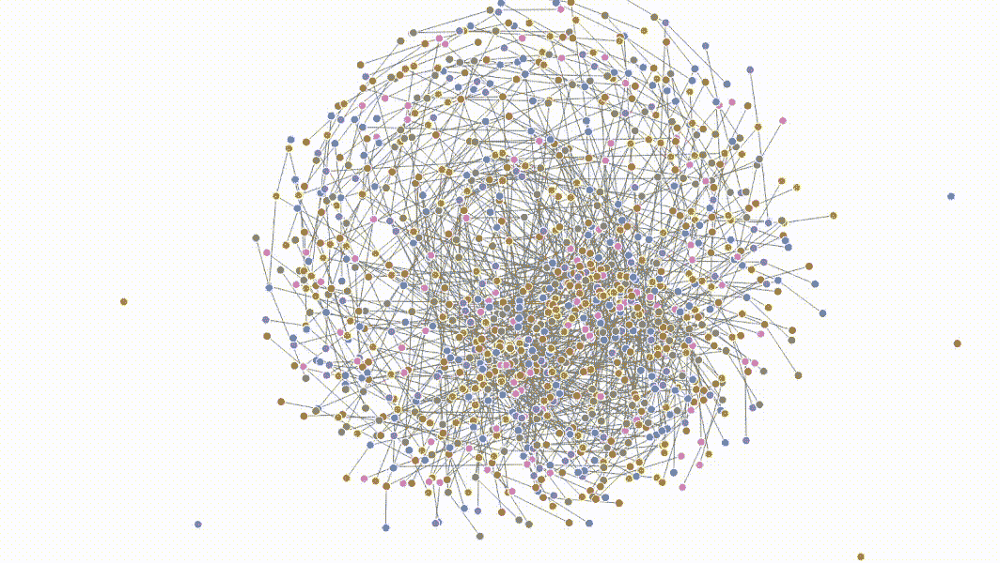

地块 8

所以很多人付出了不保持社交距离的代价。

希望你喜欢我的文章。我已经给出了一个用有限数据点进行 R 的网络分析的基本思路。您可以用更多的想法和数据点来进一步改进代码。

如果你喜欢，请鼓掌。

看看我其他关于 Medium.com 的文章

[https://medium . com/analytics-vid hya/flight-of-corona-a-visualization-journey-round-the-earth-in-r-Fe 7d 82 a 41 b 1？source = friends _ link&sk = 1a 954 c 9730 FD 30331 c 71 c 95 e 0 e 7 BC 9 fc](/analytics-vidhya/flight-of-corona-a-visualization-journey-around-the-earth-in-r-fe7d82a41b1?source=friends_link&sk=1a954c9730fd30331c71c95e0e7bc9fc)

[人寿保险中的数据科学使用案例](/analytics-vidhya/data-science-use-cases-in-life-insurance-8cfbfd8b2fff?source=friends_link&sk=0fcd29f1cc96bbc73f5696b69c1e1929)

[](/analytics-vidhya/election-visualization-with-r-8b790250d889) [## 选举可视化与 R

### 你曾经在电视频道上观看选举结果吗？激动人心，戏剧性和动作是无与伦比的。是否…

medium.com](/analytics-vidhya/election-visualization-with-r-8b790250d889) [](/analytics-vidhya/create-beautiful-visualization-of-data-in-trelliscopejs-package-in-r-c67879c55864) [## 用 R 语言在 TrelliscopeJS 包中创建漂亮的可视化数据

### 对于那些希望生动展示数据的人来说，这是一次很好的学习体验

medium.com](/analytics-vidhya/create-beautiful-visualization-of-data-in-trelliscopejs-package-in-r-c67879c55864) 

在这里看我的数据科学[数学](https://www.instagram.com/artofhary/)艺术

在 Linkedln [此处](https://www.linkedin.com/in/harish-nagpal-8696529/)与我联系。