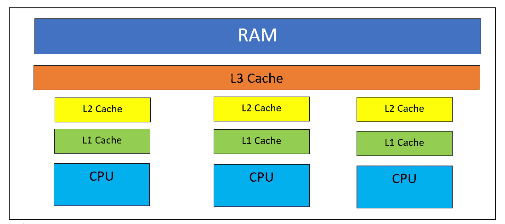

# 为什么 Spark 比 MapReduce 快？

> 原文：<https://medium.com/analytics-vidhya/why-spark-quicker-than-mapreduce-175e2ba684eb?source=collection_archive---------24----------------------->

哈雷戴维森的照片

> MapReduce-MapReduce 是一种处理大型数据的技术，由 Map + Reduce 组成。即使框架不是 Hadoop，也可以使用这种技术或算法。这个处理所有集群节点的 MapReduce 算法可以用 Java 编写。这个处理所有集群节点的算法 API 已经由 Hadoop 编写了。除了用于处理的 MapReduce 算法，Hadoop 还提供了用于存储的集群。

***Spark 比 MapReduce 快的各种原因:***

1.  Spark 在处理过程中使用 RAM 存储中间数据，而 MapReduce 使用磁盘存储中间数据。
2.  Spark 非常高效地使用底层硬件缓存。除了 RAM，Spark 还高效地使用了 L1、L2 和 L3 缓存，它们比 RAM 更接近 CPU。

**项目钨**

3.Spark 使用内部 Catalyst Optimizer 来优化查询的物理和逻辑计划。

4.Spark 使用谓词下推。

5.Spark 有自己的垃圾收集机制，而不是使用内置的 JAVA 垃圾收集器。

6.Spark 使用自己的字节码生成器，而不是内置的 JAVA 生成器。最终的字节码总是在 JRE 环境中执行。

7.Spark 使用 RDD、转换和动作的概念进行数据转换，而 MapReduce 没有。

8.Spark 有自己专用的序列化器和反序列化器，使它更加高效。

**Spark 的其他好处:-**

1.  支持 SQL 上下文、Spark ML、Spark 流和 GraphX。
2.  可以用 Scala、Java、Python、r 之类的任何语言编写。
3.  支持各种文件格式，如 Avro，ORC，拼花，Json，csv。

请分享你的想法和建议。

问候

阿比。