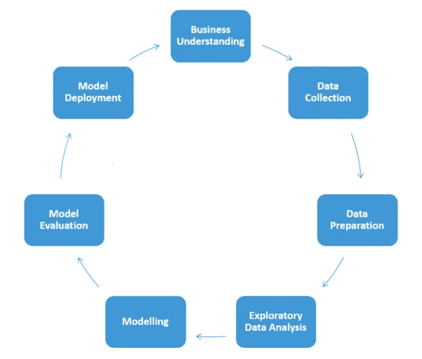
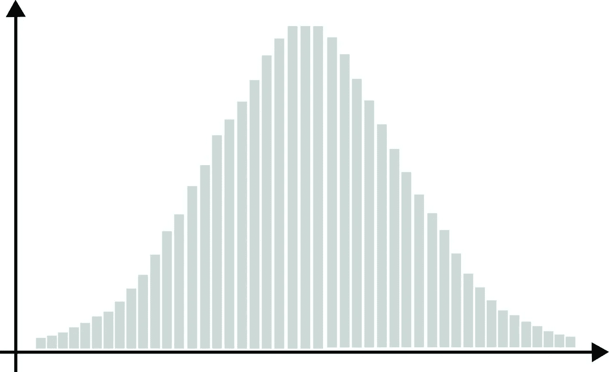
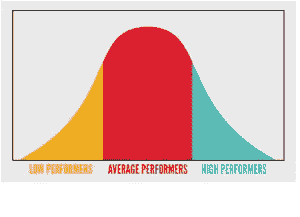

# 为什么统计学是数据科学的一部分？

> 原文：<https://medium.com/analytics-vidhya/why-statistics-is-piece-of-a-data-science-pie-27e4c4b15d0?source=collection_archive---------26----------------------->

众所周知，统计学是成为数据科学家所需的行业知识之一。在这个博客中，我将写下一些同样的事情。

我想从《富爸爸穷爸爸》一书中我最喜欢的一句话开始，这是一本关于个人理财、投资、商业等的非虚构的书。虽然这与统计学无关，但我把这一点与统计学联系起来。

它在这里

# 数字不是数字，而是数字在告诉你什么。就像文字一样。不是文字，而是文字告诉你的故事。

对我来说，上面的话给了什么是统计的水晶般清晰的解释？

正如我们都遇到过的短语机器学习和深度学习是数据驱动的技术。因为我们知道数据是运转这些强劲引擎的润滑油。

任何数据科学项目的流程都是，

图片来源:谷歌

从流程来看，我们可以说模型最终依赖于数据。我们从 Kaggle 和其他互联网资源下载的数据总是干净的，不需要太多的数据准备技术。但实际上，数据不会是那样的。数据准备部分承担了 40%的工作。在这里，统计扮演着英雄的角色。

数据科学中一些最常用的统计技术是从名义变量或序数变量到数字数据的转换，用平均值、中值、相应的众数填充缺失值，卡方检验、ANOVA 检验、z 检验等。还有一些 python 库，你可以在不给出公式的情况下实现这些技术。

在这里，我不会深究各种统计技术和理论。相反，我将讲述为什么数据科学模型必须依赖于一个英雄(统计技术)**(或正态分布)。**

****

**钟形曲线**

****为什么需要钟形曲线？****

**👉钟形曲线的中点给出了给定数据的平均值，标准差给出了数据与整个数据的平均值相差多少。**

**👉如果钟形曲线较宽，则表明标准偏差较大，反过来，表明数据与数据的平均值相差较大。**

**👉另一方面，如果曲线较高且较细，表明标准偏差较小，则我们知道大多数数据点位于数据的平均值附近。**

**从以上几点，我们来了解一下曲线数据的离差。如果它是钟形的，那么您的数据非常适合模型开发。如果没有，你必须以这种方式转换数据。在这样做的时候，我们必须在不改变数据的实际重要性的情况下减少数据的分散。又来一个英雄正常化。在对数据进行归一化的同时，会给出钟形曲线。通过这样做，我们的模型结果将不会偏向任何特定的值。**

****为什么叫正态分布？****

**因为这是我们日常生活中常见的事情。比如我们拿一个班学生的考试成绩。80%以上，40%以下的分数低。更多的数值在 40-80 分之间。这象征着钟形曲线的数据分布。这个故事在于许多实时的例子，如人的身高，智商水平等。**

****

**希望这能帮助像我一样从书本或各种来源学习这些概念，但不知道这些是如何和在哪里工作的人。**

**谢谢，**

**巴格瓦蒂·普里亚**