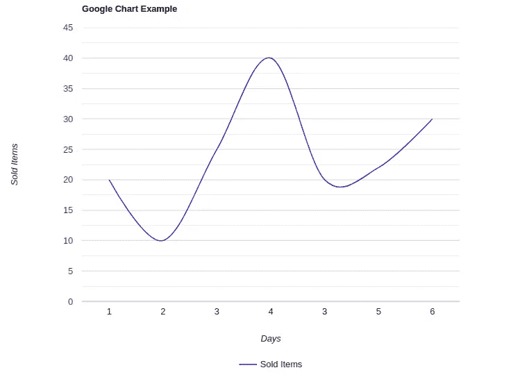

# 为什么要用 Google Chart 代替 Matplotlib？

> 原文：<https://medium.com/analytics-vidhya/why-to-replace-matplotlib-with-google-chart-b8ef3017607d?source=collection_archive---------19----------------------->

马库斯·温克勒在 [Unsplash](https://unsplash.com?utm_source=medium&utm_medium=referral) 上的照片

大多数 Python 用户习惯用 Matplotlib 表示数据。

> *“Matplotlib 是一个全面的库，用于在 Python 中创建静态、动画和交互式可视化效果。”*

**Matplotlib** 顾名思义来源于 *Matlab* ，所以语法也很相似。然而，这是因为需要用几行代码来表示 Python 环境中的数据。 **pyplot API** 用于创建图形，一切都与 matplotlib 库的集成一起工作。当数据由 Python 脚本生成并且需要在单台机器上即时表示时，使用 Matplotlib 是最简单的方法。

但是，在某些情况下，有必要以静态甚至动态的方式在网页中显示结果。这样，与观众的交互也变得容易了，因为观众只需从他的浏览器访问某个域。将 Matplotlib 集成到用 HTML 编写的页面中是可以实现的，但是有一个更好的替代方案，它被称为 **Google Chart** 。

> " *Google Charts 是一种交互式网络服务，可以根据用户提供的信息创建图形图表。用户提供嵌入在网页中的以 JavaScript 表达的数据和格式规范；作为响应，该服务发送图表的图像。*

Web 服务是一个能够让机器通过 HTTP 协议进行通信的应用程序。为此，正如我们之前所说的，使用 Google Chart，您可以通过 HTML 页面向任何人提供可视化效果。
因此，Matplotlib 和 Google Chart 需要达到相同的目标(数据的表示)，只是方式不同。事实上，Matplotlib 是一个库，它使用 Python 语言，而 Google Chart 是一个 web 服务，它使用 JavaScript 语言。有人会知道如何建立一个 HTML 页面，通过 JavaScript 和 Google Chart 表示 Python 中产生的数据。嗯，两种技术之间的“中介”*将是 **Flask** ，这是一个 Python 库，允许你以非常简单的方式启动 Web 服务。这是我的选择，但是您可以自由地使用任何其他工具来拥有 Python 中的 web 服务。*

> *Flask 是用 Python 编写的微型 web 框架，之所以被归类为微型框架，是因为它不需要特定的工具或库*

*由于 Flask 使用起来非常简单，我们先来看看如何配置它来托管一个 HTML 页面，然后看看如何使用 Google Chart 来表示数据。*

*首先，我们需要从 Flask 库中导入 **Flask** 和 r **ender_template** 类。*

*接下来，我们创建一个 Flask 类的*实例*。第一个参数是应用程序的*模块*或*包*的名称。这是必需的，以便 Flask 知道在哪里寻找*模板*、*静态*、*文件*等等。*

*然后我们使用函数 **route()** 作为*装饰器*来告诉 Flask 什么 URL 应该触发我们的函数。因此，我们定义了一个具有任意名称的函数，该函数必须包含要传输到 html 页面的数据，以表示将出现在子文件夹 **"/templates"** 中的数据和页面名称。 **render_template()** 函数正是从已定义的函数返回的内容，它将 HTML 页面和用于表示的数据作为参数。*

*最后，我们还使用 **app.run()** 命令在每次运行代码时启动 web 服务会话。*

*这是我们拥有的全部代码:*

*那 **"results.html"** 文件呢？在 Flask 中，每个 HTML 页面都必须在名为**“templates”**的子文件夹中，这个子文件夹与主脚本放在同一个文件夹中。我们的 HTML 页面可能有这样的形式:*

*如您所见，整个 JavaScript 代码非常直观。我们根据我们想要表示的内容定义一个函数，在我们的例子中是一个*图表*到 **drawChart()** 。
在函数中，定义了两个变量，它们将成为 **chart.draw()** 函数的参数。这两个变量是:
**1。“data”**:Python 产生的数据，通过 Flask 传递给 HTML 页面。
2**。【选项】**:装饰和数据将如何在页面上显示。*

*最后，如果我们尝试执行代码，我们会得到这个表达式:*

**

*我们可以说，它看起来比 Matplotlib 更优雅，最重要的是，它可以很容易地与他人分享。*

*因此，通过这篇简短的指南，我们关注了 Google Chart 的潜力，尤其是如果它与 Python 集成的话。我确信有许多其他的方法来表示你的数据，但是到目前为止，这对我来说是非常有用和舒适的。*

***参考文献:***

*[1] [Matplotlib 文档](https://matplotlib.org/contents.html)*

*[2] [谷歌图表文档](https://developers.google.com/chart)*

*[3] [烧瓶文件](https://flask.palletsprojects.com/en/1.1.x/)*

*[4] [网络服务维基百科](https://it.wikipedia.org/wiki/Web_service)*