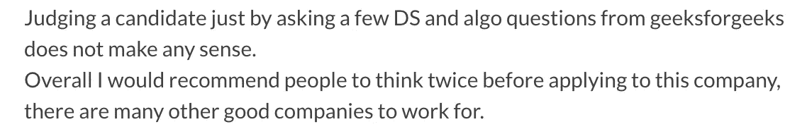
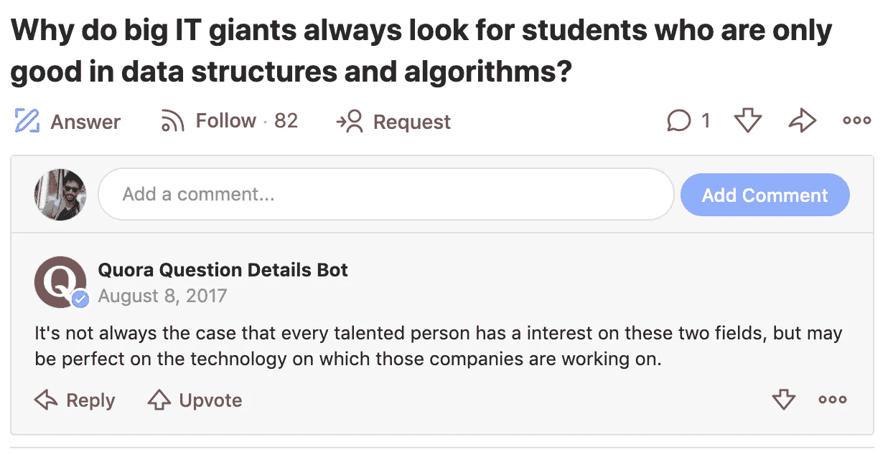
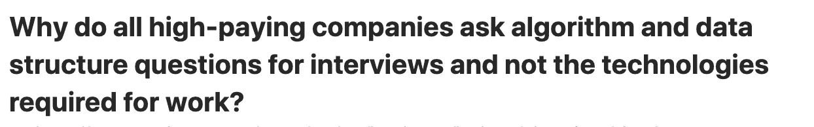

# 为什么顶级科技公司关注数据结构、算法和问题解决。有道理吗？

> 原文：<https://medium.com/analytics-vidhya/why-top-tech-companies-focus-on-data-structures-algorithms-and-problem-solving-is-it-justified-e73b386876a2?source=collection_archive---------4----------------------->


马库斯·斯皮斯克在 [Unsplash](https://unsplash.com/s/photos/algorithms?utm_source=unsplash&utm_medium=referral&utm_content=creditCopyText) 上的照片

为什么顶级公司在面试中如此强调数据结构和基于算法的问题，而不是直接问应聘者简历上写了什么？我很多来自各个公司的同事/朋友都会问这个问题。他们有自己的理由认为这是不公正的。其中一些是:

> **1。**我是‘N’年经验丰富的家伙，一个有家室的男人，他们怎么能指望我解决一个二叉树问题呢！我不再是一个新的工程师了。
> 
> **2。我是一名 Java/Android/iOS/JS 开发人员，问这些问题是对上帝的亵渎，也是愚蠢的行为。**
> 
> **3。我从未在实际工作中使用过 DS 和算法，我知道我将来也不会使用它们。他们为什么要问这个？**
> 
> **4。仅仅问 leetcode 和 geekforgeeks 的一些问题是愚蠢的，任何人都可以在面试官面前大声说出答案。有什么大不了的。他们没有测试我的真实知识。**

嗯..很公平！但是我深入挖掘了一下，我在网上遇到了一些面试的经历。它们看起来像这样。



候选人对 XYZ 公司流程的看法



我曾经参加过一次面试，给了一个候选人一个双向链表的问题，他回来后说*“我在想这是一个 android 开发者的面试”*。我当时想的确是这样！

一个晴朗的日子，我正在参加 SDE-3 的面试，我问了一个关于生产者-消费者问题的 java 问题。*候选人回来说，我擅长 android，但不太擅长 Java。我就像…*


迷茫！

两种思想流派之间存在巨大的分歧。*我的想法偏向一边，我也没意见。* **据我所知，询问 DS 和算法是一个被证明有效的招聘方式之一。**

“我不是说只有 DS 和 algo。”在一家以解决日常复杂问题为己任的公司里，我相信没有比这更好的方法来判断一个候选人解决问题的能力了。

候选人希望面试官问一些与他们正在研究的技术堆栈和框架相关的问题，但请注意，这绝对不是判断候选人 PS 能力的好方法。今天出现的框架是如此的抽象，以至于作为一个工程师使用它们并不需要任何能力。你只需要亲自动手，你会做得很好。很少有人会看一看框架的内部。如果面试官问及候选人声称自己擅长的框架的实施，许多人仍会不及格，并抱怨这一过程。搜索一些技术方面的面试问题，你会得到成百上千的问题。它可以在没有任何把握的情况下在几天内被抢走。

> 当你想进入一所好的工程学院时，你必须通过入学考试，根据学院的可信度，入学考试会有一些与物理/化学/数学相关的令人困惑的问题。他们没有问像你的董事会考试那样的问题。要进入 MBA 学院，你需要参加 QA-DI 和 LA，这两个课程有高中的教学大纲，但问题是以不同的方式扭曲的。你不会问这个问题，为什么我要解决时间和速度的问题，或者为什么我要让这个复杂表达式的剩余部分成为一个 MBA 学生。同样，判断一个软件工程师的能力，你根本不能问他框架相关的问题。你无法区分能力高的人和能力低的人。基本上它会给你假阳性。我的观点将开始变得更有意义，继续阅读。

从一家正在大规模解决真正大问题的顶尖公司的角度来思考。它应该从工程师身上寻找什么？

1.  他应该能够分析复杂的问题，并使用 DS 和算法的知识来找到问题的逻辑解决方案。
2.  **用他选择的语言将这个逻辑解决方案转换成干净的代码。***
3.  **他应该对计算机系统有透彻的理解，并了解他所工作的框架的内部结构。***
4.  他应该在你招聘的技术领域有相关经验。
5.  总的来说，他应该很适合这家公司。

我会把这些分别提出来。

很多人还是会争论，DS 和 algo 在实际工作中没有用。这完全正确。但是，当你看到一个擅长这些的人的日常解决方案时，他对数据结构和算法的理解将会反映在这项工作中。从 leetcode 中获取解决方案和代码并不容易。如果你有疑问，忘记所有的问题，试着记住 50 个解决方案及其运行时的复杂性，然后回来找我。

> “擅长数据结构和算法是一种生活方式，它将反映在你的日常工作中。”

我想讨论一些候选人的抱怨，这些抱怨与我之前大胆提出的观点有关。

1.  **用他选择的语言将这种逻辑解决方案转换为干净的代码:**我遇到过许多候选人，他们告诉我，我不会编写代码，但我会为问题编写伪代码/逻辑，或者代码可能是语法错误的。*我非常生气*。我不是要求你写一个复杂的匿名类或者一些复杂的 API，你必须担心语法。我只是要求你写一个函数，它接受一个数组，得到所有和为 k 的数组对，除了一些变量之外，它不会有任何东西，比如循环，if，whiles 等等。如果一个候选人这样说，对我来说有 50%的可能性是否定的，除非他表现出一些特殊的技能，但这在大多数情况下是不存在的。许多优秀的公司，如 google、apple 等，都希望你在纯文本编辑器中编写逻辑和语法正确的代码。他们还希望你使用正确的命名和缩进。当没有给候选人任何复杂的 API，而这些 API 的返回类型和参数又记不住时，这个要求并不过分。体现了你写代码的流畅性。
2.  **他应该对计算机系统有透彻的理解，并了解他所工作的框架的内部知识:**当我们在需要稳定的系统上工作时，performant 应该在高并发性下没有错误，应该在低内存条件下工作。从事该代码工作的人应该了解系统的内部。以便他能够做出实施或设计决策。我举个例子。

```
**public class SharedResource {
private long number = 0L;****SharedResource() { number = 20L; }****public long get**() {
   return number;
}}
```

它看起来像一个简单的类，跨线程共享，但容易出错。我不会进入细节，但它需要你知道 CPU *字撕裂，和可见性保证。这段代码在 32 位机器上可能会表现得很奇怪。它也有其他问题，但这不是这篇文章的议程。*

现在，回到正题。如果你在 java 面试中问了上面的问题，你认为有多少人会正确回答这个问题？很少对吗？是啊！这正是那些顶级公司所寻求的，他们能够对人们如何使用技术产生影响，并能够规模化思考！

干杯。

如果你喜欢你所读的，那么鼓掌吧！

