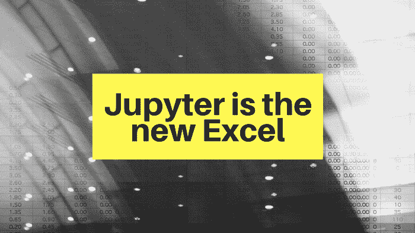
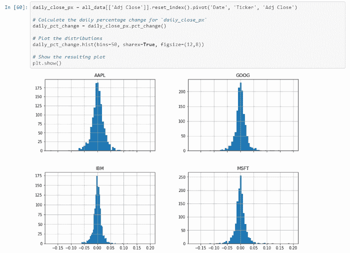
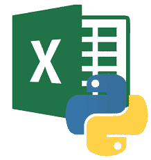

# 为什么交易者和金融专业人士需要学习 Python

> 原文：<https://medium.com/analytics-vidhya/why-traders-and-finance-professionals-need-to-learn-python-582e57e32531?source=collection_archive---------32----------------------->

# Jupyter 是新的 Excel

如果你是一个交易者或者你在金融服务行业工作，Excel 是你的面包和黄油；你可以分析价格和其他分笔成交点数据，评估你的交易组合，计算风险值，进行回溯测试等等。你是数据透视表、公式、图表甚至 VBA 和 PowerQuery 的专家。你可以快速处理一个解决方案，但是在你意识到之前，你的电子表格会扩展成几十个标签、几千行和意大利面 VBA——所以它的可读性和可维护性已经荡然无存。当你敢按 F9 键刷新结果时，你可以拿一杯茶，然后再等一会儿(如果你的电脑在这期间没有崩溃的话)！

👉🏻*听起来很熟悉？你可能正在热情地点头。*

尽管电子表格很有用，但它不能提供你所寻求的所有答案。让我们来看看是什么让 Excel 流行起来，它在哪些地方出了问题，但最重要的是，为什么您应该开始使用 Jupyter 笔记本作为一种替代的强大的分析工具。

# 超越天堂

几个因素使得 Excel 如此有价值，最值得注意的是它简单而强大的反应式计算模型和内置函数。电子表格就像一块空白的画布，“业余程序员”可以在上面使用 Excel 的专有语言(如公式和 VBA)编写代码。

Blanks 部署了广泛的 IT 系统来运行业务关键流程，然而，电子表格形式的[影子 IT](https://en.wikipedia.org/wiki/Shadow_IT) 却出现了爆炸式增长，它们补充了这些核心系统，并作为新业务计划的默认工具。由于企业系统不够灵活，无法适应动态金融环境中所需的快速上市时间，Excel 的出现填补了这一空白！

虽然很方便，但这是正确的方法吗？

> Excel 在企业中的角色需要重新定义！

# Excel 地狱

试图使用电子表格对大量数据进行高级、快速的分析，是使用了错误的工具。

以下是 Excel 高级用户面临的一些问题:

*   级联错误:Excel 因错误沿着一列向下传播，然后在整个电子表格中传播而臭名昭著，从而产生了一个雪球，变成了雪崩式的麻烦。可怕的是，有些人看不见，直到为时已晚。[有几个案例已经被公之于众](https://www.teampay.co/insights/biggest-excel-mistakes-of-all-time/)，这些案例中出现了巨大的成本问题。
*   可伸缩性:Excel 对它可以容纳的行数和列数有限制，但是随着数据集以指数速度增长，电子表格很快就会耗尽内存或占用大部分 CPU。当这种情况发生时，数据损坏的风险就会大大增加。
*   性能:在复杂的工作簿中，更改一个数字会影响数百次重复计算，Excel 需要时间来解决每个问题。当达到一定大小时，它不仅会降低电子表格本身的速度，还会影响任何其他需要内存空间的应用程序的性能。
*   测试:几乎不可能测试一个电子表格的正确性，然后证明随后的更改没有破坏其他任何东西。
*   可追溯性/调试:通常一个甚至很小的变化都会严重破坏您复杂的公式，使其极难识别和修复。
*   全包:数据和计算都包含在 Excel 文件中，并在本地计算机上运行。这意味着协作受到约束，使版本控制成为一场噩梦。此外，数据是基于最新刷新的静态数据，而不是随着条件的变化而实时更新。

> 所有这些问题在几十年前就已经被传统软件解决了。

最后但同样重要的是:

*   运营风险:所有电子表格开始都是小规模/快速修复的计算，但有些会变成永久性的企业级解决方案。它们为许多业务流程提供支持，但由于缺乏对整个环境谱系的了解，许多财务、运营和监管流程的完整性受到了威胁。

★如果你想了解更多关于终端用户计算(EUC)风险的信息，[这是一篇非常好的文章](https://www.clusterseven.com/resource-library/what-is-euc-risk/)。

# 各位编码员好；再见交易者

传统上，银行将量化交易团队分为量化交易员和量化开发人员。前者想出交易的点子，后者把这些点子转化成可执行的代码。当作为一个交易者，你也是一个熟练的编码者，这种分离不再需要，这给了你一个竞争优势:不仅银行希望优化他们的成本，因此你可以在冗余中生存，而且你可以将你自己的交易模型付诸行动，并利用这一时间优势为你谋利。能够自动化平凡的任务是如此的解放和编码，事实上，是如此的有创造性！

这也很大程度上是一代人的事情，因为越来越多的初级交易员已经掌握了 uni 的编程技能，所以如果你想保持你的就业能力，你需要参与进来。

# 如何使用 Python 和 Jupyter 笔记本

那么，对于那些发现 Excel 有局限性(如果不是过时的话)的交易员和金融专业人士，有什么解决方案呢？

> 学习 Python，用 Jupyter 笔记本做容器！

# 计算机编程语言

Python 相当容易学习并且用途广泛，因此在金融界越来越受欢迎。现在，除了 Excel，它还是许多定量角色的先决条件。它没有 C++(或 Java)那么复杂，这意味着:❶的学习曲线没有那么陡峭，❷完成一项任务所需的代码量也少了 1/5 或 1/10。

Python 越来越受欢迎，这从大量支持交易者所需的几乎所有东西的库可以看出:

*   读取、写入、清洁、按摩、切片/切块数据
*   数学、统计和时间序列
*   金融分析:交易和量化金融、市场数据分析、股票/衍生品市场分析、彭博数据访问、执行引擎、回溯测试、风险分析等
*   机器学习管道(例如预测市场价格)
*   绘图和漂亮/交互式可视化
*   SQL 支持
*   发送电子邮件
*   网络报废(例如网上市场价格)
*   任务自动化/调度
*   Excel 集成(如果你真的那么喜欢 Excel 的话)

❗️ *在这里* *(不挂靠)找到一个简明的库概要* [*。*](https://financetrain.com/best-python-librariespackages-finance-financial-data-scientists)

# 朱皮特

同样，Jupyter Notebook 是一个基于 web 的计算环境，它使您能够创作文档，包括:实时代码、图表、小部件、丰富的叙述性文本(包括链接、等式等)、图片等。更具体地说，您可以:

*   在浏览器中编辑代码，具有自动语法突出显示、缩进和制表符补全/自检功能。
*   从浏览器运行代码，并将计算结果附加到生成它们的代码中。

它们提供了一个包罗万象的、独立的计算记录，因此，它们可以代替 Excel 作为实时数据分析平台。

礼貌: [Python for Finance 教程](https://github.com/datacamp/datacamp-community-tutorials/blob/master/Python%20Finance%20Tutorial%20For%20Beginners/Python%20For%20Finance%20Beginners%20Tutorial.ipynb)

# 最佳地点

所以你可能会想:

👉🏻*我还会使用 Excel 吗？当然……*

在以下使用案例中，电子表格仍然是您的最佳选择:

*   正确性和准确性不是首要的
*   数据不太大(即不需要可扩展性)
*   不需要实时更新
*   使用 Excel 作为草稿栏快速构建原型
*   不需要长期维护。

你需要的是一些允许快速开发，验证正确性和可扩展性，同时保持与 Excel 相同的反应模型。而这正是 Jupyter 笔记本所提供的！

> 不，Excel 没有过时，但是 Jupyter 笔记本是更好的数据分析工具！

尽管我在“Excel 地狱”一节中明确提到了使用 Python/Jupyter 组合优于 Excel 的一些实质性优势，或者暗示了作为反例，但我在这里收集了其中的 10 大优势:

✔️强大的数据处理功能— *它毕竟是数据科学家的工具箱！* ✔️Advanced 可视化功能— *不再有无聊的图表！*

✔️更好的用户体验

✔️大数据集处理— *不再崩溃！*

✔️性能管理— *充分利用多处理技术*

✔️测试驱动开发— *思考质量！*

✔️开源可访问性—“*它有一个库！”*

✔️误差可追溯性

✔️更容易自动化

✔️自我记录— *不要低估它的价值！*

# 从哪里开始

我意识到刚开始接触这一领域可能会令人生畏，但编程不是学习语言的语法，而是使用正确的语言和工具来连接您的大脑以解决问题:在我们的例子中，Python 和 Jupyter:

这里有两个很好的资源可以帮助你开始(非附属):

*   想想 Python: [免费电子书下载](http://greenteapress.com/thinkpython2/html/index.html)
*   Jupyter 笔记本初学者:[在线教程](https://www.dataquest.io/blog/jupyter-notebook-tutorial)。

关键的一点是:

> 保持相关性！

很难想象没有电子表格的公司世界！

银行开始发现 Python 是其关键工作负载的 Excel 的替代方案。巴克莱银行最近因为努力教他们的交易员编码而成为头条新闻。我认为你也应该遵循这个范例，你不会失望的！

让 Excel 做 Excel 擅长的事情，把分析和自动化搬到 Python 和 Jupyter 笔记本里。

> 有一个动态和交互式分析的快乐世界在等着你！

感谢阅读！