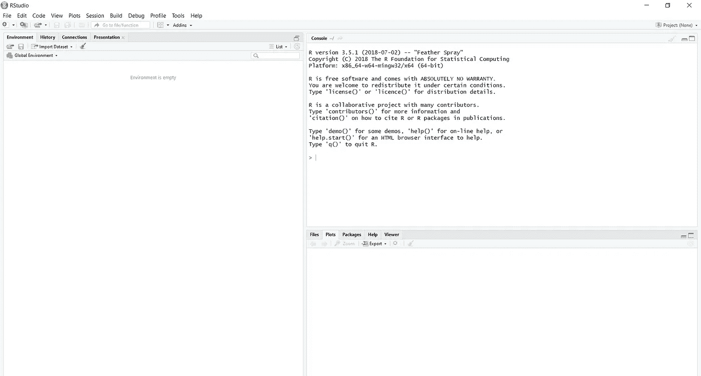
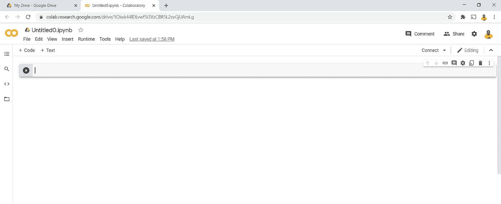

# 为什么后起之秀分析师喜欢 Python 胜过 R

> 原文：<https://medium.com/analytics-vidhya/why-up-and-coming-analyst-love-python-over-r-1a322dacf93f?source=collection_archive---------27----------------------->

## 在分析领域，人们一直在努力决定使用哪种语言来描述数据科学。

Markus Spiske 在 Unsplash 上的照片(左)|活动发起人在 [Unsplash 上的照片](https://unsplash.com?utm_source=medium&utm_medium=referral)(右)

任何分析项目中的大多数常见实践都是相似的，尤其是在对数据集的基本理解方面，如查看数据集、识别变量类型、缺失值、数据集维度等。在任一种语言中，这些都是默认可以做的事情，不需要任何额外的模块或包。

当然，不同版本和不同语言的语法会有所不同。然而，它有或多或少相同的模式。python 和 R 的使用方式也非常相似，我们为特定功能导入了某些模块，如 python 中的 pandas 或 selenium 或 R 中的 dplyr。每个模块都有特定的用途，例如，在数据可视化中，我们有 python 中的 matplotlib 或 R 中的 ggplot。

使用 R 有很多优点，比如:

*   最常用于 R-Studio
*   易于使用，有大量不同功能的库
*   现成的教程
*   可用于不同的领域和实践
*   广泛用于回归、预测、数据挖掘

作者照片

像任何其他编程语言一样，Python 有自己的优点

*   可以以不同的方式跨所有平台使用，如 Anaconda Navigator、Python Shell、Comand Prompt、Google Collab 等。
*   对语言有传统的编程方法；int，float，print
*   可用于各种功能，如脚本编写、网页抓取、回归、机器学习、人工智能、可视化
*   一个庞大的 python 用户社区，提供易于使用的程序和教程
*   大部分是在大学和课堂上在线或面对面教授的
*   由于它的灵活性和易于使用的格式，这也是它的装甲方便的优势
*   它也可以用于跨语言编程；嵌入式 C 或 SQL

总的来说，它对于不需要处理大数据或复杂的跨多功能应用程序的正常使用情况更方便。