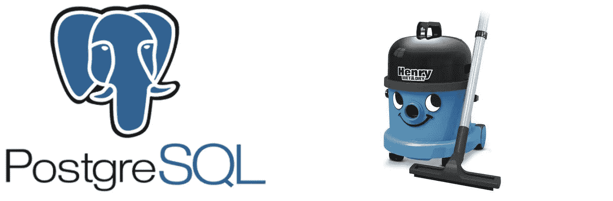

# 为什么对 PostgreSQL 数据库使用 autovacuum

> 原文：<https://medium.com/analytics-vidhya/why-use-autovacuum-for-postgresql-database-8cdd3c2253bd?source=collection_archive---------9----------------------->

## 了解数据库自动清空的重要性以及如何正确设置



作为数据库开发人员或管理员，您总是希望数据库处于最佳状态并提供最佳性能。我们经常面临这样一种情况，当我们觉得我们的数据库没有达到预期的性能并且有点慢时，我们经常选择从 RDBMS 切换到 NoSQL 数据库来克服这一点，但是这不是最终的解决方案。这里我们忽略了一点:当数据库变得越来越老时，就会产生*膨胀*。膨胀是由于数据库删除和更新操作产生的死元组造成的。当我们对数据库表的行执行删除或更新操作时，实际上我们认为这些操作后的旧数据永远消失了，但它们仍然作为死元组保留在数据库中，除非被清除。这可能会导致数据库中的几个问题。除了消耗额外的未使用空间之外，这还会降低查询速度。这就是真空发挥作用的时候。

[真空](https://www.postgresql.org/docs/9.5/routine-vacuuming.html)基本上是清理这些死元组的过程，如果不加处理，这些死元组可能会导致膨胀。真空可以通过某种命令手动完成，但我们感兴趣的是一个名为 [auto-vacuum](https://www.postgresql.org/docs/9.6/runtime-config-autovacuum.html) 的守护程序，它会在需要时自动触发，使我们的生活更加轻松。但是，这里有一个陷阱，需要正确设置参数，以便它可以开箱即用。在本文中，我们将关注以下主题:

1.  **检查与自动真空相关的参数**
2.  **为正确设置自动吸尘而进行的更改**

1.  **检查与自动真空相关的参数**

在继续之前，我们应该了解一些与自动吸尘相关的事情。

a.检查数据库表中每个表的死元组(行)数:

```
SELECT 
 relname AS table_name,
 n_live_tup AS live_tuples,
 n_dead_tup AS dead_tuples
FROM pg_stat_user_tables;
```

上面的查询将给出相应表中死亡和存活元组的数量。如果死元组的数量非常高，那么很可能 vacuum 从未在您的数据库中运行过，您就有大麻烦了。

b.检查数据库表中上次真空和自动真空运行的时间:

```
SELECT 
 relname AS table_name,
 last_vacuum,
 last_autovacuum
FROM pg_stat_user_tables;
```

使用这个查询，您将获得数据库中 vacuum 状态的更大图像。如果您发现`last_autovacuum`已经运行了很长时间，那么您需要调整您的参数，我们将在下一节讨论。
注意:`last_vacuum`是给定表格中最后一次手动真空运行时的时间戳。

c.检查自动真空是否打开，尽管默认情况下它是打开的:

```
SELECT name, setting FROM pg_settings WHERE name='autovacuum';
```

d.检查与自动真空相关的配置文件中设置的参数值:

```
show autovacuum_vacuum_scale_factor;
show autovacuum_vacuum_threshold;
```

只要运行这个并检查值。我们将在下一节详细讨论这些参数。

2.**为正确设置自动真空需做的更改**

现在，我们已经在数据库表中检查了 autovacuum 的状态，是时候计算和设置正确的值了，这样 autovacuum 才能正常工作。简而言之，让我们了解一些与自动真空相关的参数:

a.***auto VACUUM _ VACUUM _ scale _ factor:****指定当决定是否触发真空时，添加到 autovacuum_vacuum_threshold 的表格大小的一部分。默认值为 0.2(表格大小的 20%)。*

*b.***auto VACUUM _ VACUUM _ threshold:***指定在任何一个表中触发真空所需的更新或删除元组的最小数量。默认值是 50 个元组。*

*c.***auto vacuum _ max _ workers:***指定可同时运行的自动真空处理(除了自动真空启动程序)的最大数量。默认值为三。*

*对于每个表，可以触发自动真空的阈值计算如下:*

```
*vacuum_threshold = autovacuum_vacuum_threshold + autovacuum_vacuum_scale_factor * number of tuples in given table*
```

*这个参数的默认值对于测试环境来说可能已经足够好了，但是对于膨胀可能很高的生产环境来说，这是完全无效的。如果没有更改这些默认值，autovacuum 可能也不会运行一次。只有当给定表中死元组的数量超过从上面的表达式计算出的`vacuum_threshold`值时，才会触发自动清空。因此，如果您有一个包含一百万行的表，并且 autovacuum_vacuum_threshold 和 autovacuum_vacuum_scale_factor 设置为 50 和 0.2，那么只有当该表中的死元组超过 200k 时，才会触发 autovacuum。*

*让我们检查一下这些参数的值会给出更好的结果，并以最有效的方式运行自动吸尘:*

*您可以在 postgres 的配置文件中更改这些参数，即`postgresql.conf`，或者使用以下类型的查询，根据不同表的大小和更新操作的频率为不同的表设置不同的值:*

```
*ALTER TABLE <tablename>
  SET autovacuum_vacuum_scale_factor = 0.01;*
```

*一旦你设置了正确的值，监控它并迭代直到你找到一个完美的值。您可以使用我在本文前面提到的查询来检查 autovacuum 是否为每个表运行，以及它上次运行的时间。*

*我希望这篇文章对你有用。感谢阅读。欢迎评论和建议。*