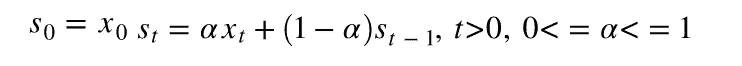
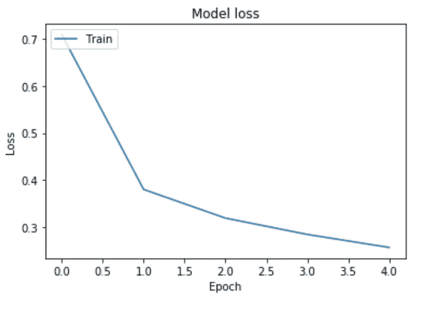
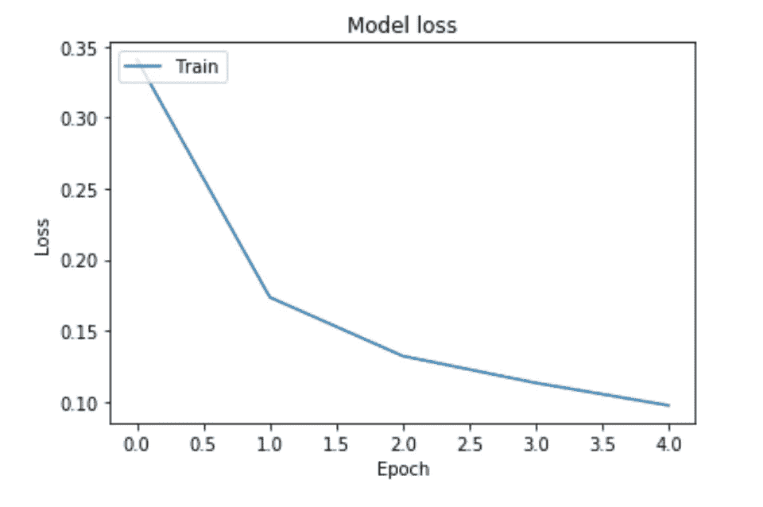

# 为什么要用动量优化

> 原文：<https://medium.com/analytics-vidhya/why-use-the-momentum-optimizer-with-minimal-code-example-8f5d93c33a53?source=collection_archive---------2----------------------->

在这篇文章中，我们将解释什么是动量，以及为什么动量是对随机梯度下降的一个简单而容易的改进。我们还在 MNIST 数据集上展示了一个最小的代码示例，其中添加动量提高了模型的准确性和训练损失。

# 1.指数平滑(或指数加权平均值)

当查看有噪声的时间序列数据时，例如 tensorboard 中的训练/验证误差图，您可能会经常注意到原始值通常非常有噪声。通常，你可以在图表中看到一个趋势。当您对原始图形值进行一些平滑处理时，这些趋势通常会变得更加明显。

指数平滑是向数据添加平滑的最简单方法之一。

**指数平滑公式:**



图 1:指数平滑

在上面的等式中，动量指定了我们想要的平滑量。动量的典型值是 0.9。从这个等式中，我们可以看到时间步长 t 处的值考虑了时间步长(t-1)和之前的先前值。先前时间步长的权重呈指数下降，因此最近的时间步长影响最大。

# 2.动量优化器

动量优化器在优化损失函数时使用相同的等式。在这种情况下，指数平滑被称为动量，它允许优化程序保持以前时间步长的速度和轨迹，以影响当前时间步长。

```
from __future__ import absolute_import, division, print_function, unicode_literals
# Install Tensorflow
import tensorflow as tfmnist = tf.keras.datasets.mnist(x_train, y_train), (x_test, y_test) = mnist.load_data()
x_train, x_test = x_train / 255.0, x_test / 255.0
```

# 没有动量的例子

从上面的图表中，我们可以看到，在第一个历元之后，训练损失达到. 4。经过 5 个历元后，准确率达到 94%左右。这个结果提供了一个基线结果，我们可以用它来比较增加动量对随机梯度下降的影响。

```
import matplotlib.pyplot as pltmodel = tf.keras.models.Sequential([
    tf.keras.layers.Flatten(input_shape=(28, 28)),
    tf.keras.layers.Dense(128, activation='relu'),
    tf.keras.layers.Dropout(0.2),
    tf.keras.layers.Dense(10, activation='softmax')
])sgd = tf.keras.optimizers.SGD(lr=0.01, decay=1e-6, momentum=0.0, nesterov=True)
model.compile(optimizer=sgd,
              loss='sparse_categorical_crossentropy',
              metrics=['accuracy'])history = model.fit(x_train, y_train, epochs=5)
model.evaluate(x_test, y_test, verbose=2)# Plot training & validation accuracy values
plt.plot(history.history['acc'])
plt.title('Model accuracy')
plt.ylabel('Accuracy')
plt.xlabel('Epoch')
plt.legend(['Train', 'Test'], loc='upper left')
plt.show()# Plot training & validation loss values
plt.plot(history.history['loss'])
plt.title('Model loss')
plt.ylabel('Loss')
plt.xlabel('Epoch')
plt.legend(['Train', 'Test'], loc='upper left')
plt.show()
```



图 2:没有动量的训练损失曲线

# 有动量的例子

在一个时期之后，优化器能够达到大约 0.17 的损失。5 个时期后的最终准确度约为 97%。从这个实验可以看出，动量优化器在这个问题中优化模型的速度更快，效果更好。这个实验是一种快速的方法，可以看出动量是一种改进标准随机梯度下降的简单而快速的方法，用于优化神经网络模型。

```
import matplotlib.pyplot as pltmodel = tf.keras.models.Sequential([
    tf.keras.layers.Flatten(input_shape=(28, 28)),
    tf.keras.layers.Dense(128, activation='relu'),
    tf.keras.layers.Dropout(0.2),
    tf.keras.layers.Dense(10, activation='softmax')
])sgd = tf.keras.optimizers.SGD(lr=0.01, decay=1e-6, momentum=0.9, nesterov=True)
model.compile(optimizer=sgd,
              loss='sparse_categorical_crossentropy',
              metrics=['accuracy'])history = model.fit(x_train, y_train, epochs=5)
model.evaluate(x_test, y_test, verbose=2)# Plot training & validation accuracy values
plt.plot(history.history['acc'])
plt.title('Model accuracy')
plt.ylabel('Accuracy')
plt.xlabel('Epoch')
plt.legend(['Train', 'Test'], loc='upper left')
plt.show()# Plot training & validation loss values
plt.plot(history.history['loss'])
plt.title('Model loss')
plt.ylabel('Loss')
plt.xlabel('Epoch')
plt.legend(['Train', 'Test'], loc='upper left')
plt.show()
```



图 3:带动量的训练损失曲线

# 结论

在这篇文章中，我们解释了什么是动量，以及为什么它是对随机梯度下降的简单改进。我们还给出一个最小的代码示例，展示动量如何在深度学习模型中提高准确性和训练损失。

# 资源

[Tensorflow 初学者快速入门](https://www.tensorflow.org/tutorials/quickstart/beginner)