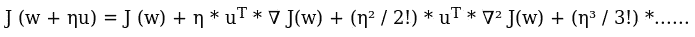

# 为什么我们在梯度下降中与梯度方向相反？？

> 原文：<https://medium.com/analytics-vidhya/why-we-move-opposite-to-gradients-in-gradient-descent-9077b9aa68e4?source=collection_archive---------4----------------------->

**梯度下降**是一种寻找函数最小值的迭代优化算法。为了使用梯度下降找到函数的局部最小值，我们采取与函数在当前点的梯度的负值成比例的步骤。换句话说，我们的运动方向与梯度方向相反。你有没有想过为什么只有方向相反？为什么不是梯度方向？？？

在这里，我们将试图从数学上证明为什么我们朝着与梯度相反的方向运动。

首先让我们试着理解梯度。梯度是由函数对变量的偏导数组成的向量。假设我们的函数看起来像 J(w，b) = w + b，那么 J(w，b)对 w 和 b 的偏导数是

因此，梯度是这些偏导数的向量，如下所示:

现在让我们试着找出达到最小值的最佳运动方向。我们可以使用**泰勒级数**得出这个结果。泰勒级数将函数表示为无穷多个项的总和，这些项是根据函数在单个点的导数值计算得出的。

[来源](http://mathworld.wolfram.com/TaylorSeries.html)

如果 J(w)是当前成本值，并且我们在权重 w 中执行较小的更新η*u，则新的损失将是 J(w + η*u)。这里η是这个函数的学习率超参数泰勒级数将看起来像:

由于η非常小，η之后的值将非常接近于零。因此我们可以忽略它们。因此，上述等式变为:

新的损失 J(w + η*u)应该理想地小于先前的损失 J(w)。因此，上述值应该小于零，即

我们知道两个向量的点积是向量间夹角的余弦。即 a.b = |a||b|cos(θ)。用这个等式，我们得到

其中β是 u 和梯度之间的角度。我们知道 cos θ的值介于-1 和 1 之间。因此，上述等式也将位于

假设分母等于 k，我们得到 k = || u || * || ∇ J(w) ||。或者

我们希望损失差为负或最小。由于 k 为正，当 cos(β)为负时，损耗差将为负。当β为 180 度时，k*cos(β)的最小值。即 u 与坡度之间的角度应为 180 度。这意味着我们应该在与坡度成 180 度或与坡度相反的方向上移动，以最大限度地减少损失。

我希望你们都已经找到了我们开始时提出的问题的答案。非常感谢你的阅读。

[深度学习—NPTEL by Mitesh Khapra
https://www.youtube.com/watch?v=giZD8yzXEZ4&list = plyqspqzte 6m 9 gcgajvqbc 68 hk _ JKGBAYT&index = 22](https://www.youtube.com/watch?v=giZD8yzXEZ4&list=PLyqSpQzTE6M9gCgajvQbc68Hk_JKGBAYT&index=22)